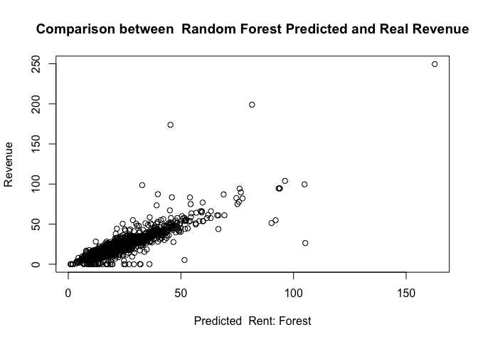
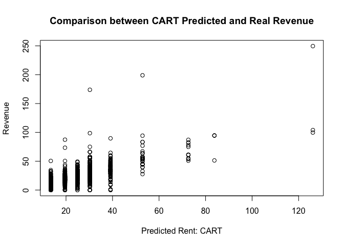
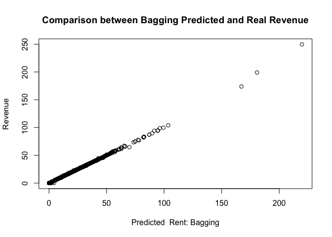
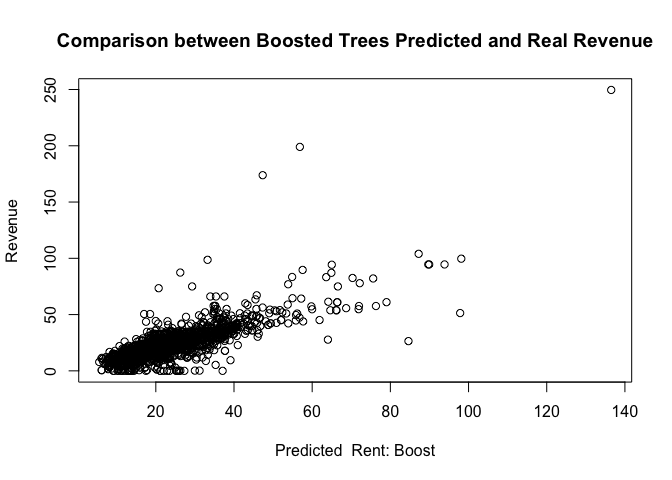
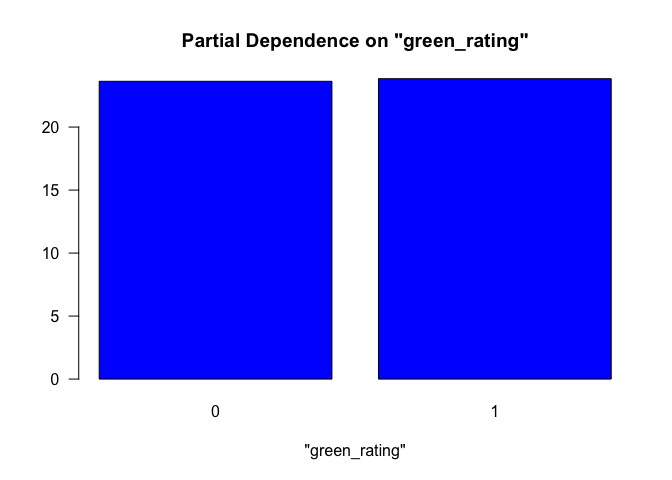
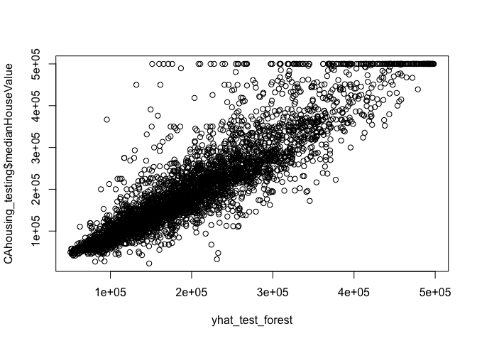
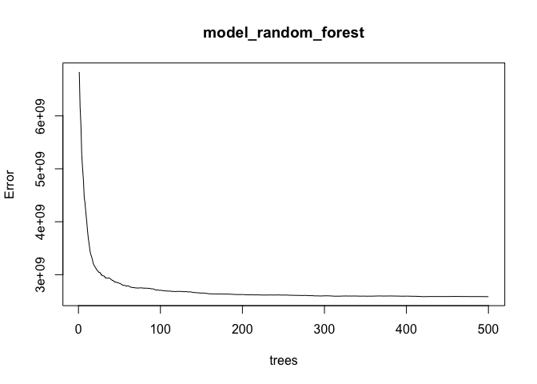
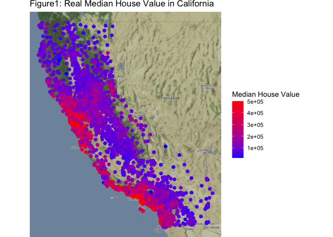
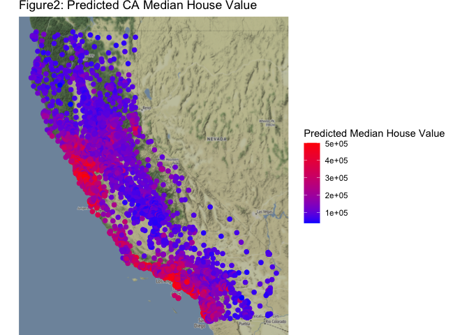
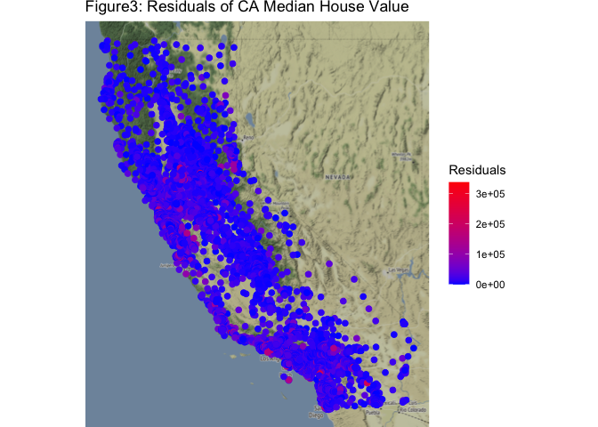

AUTHOR: Jyun-Yu Cheng

Yiji Gao

# Question 3 : Predictive model building: green certification

Our goal for this problem: find the best predictive model. The revenue
per square foot per calendar year and use this model to quantify the
average change in rental income per square foot(whether in absolute or
percentage terms) associated with green certification.

Step description Step1. Build many models Step2. Model selection(compare
the RMSE of every model and choose the best model) Step3. write the
report tells that why you choose this method, modeling choice and
conclusion

**Step 1 : Build the model** # Step 1-1: Seperate the dataset into the
training-set and testing-set

    ## Start:  AIC=29148.16
    ## revenue ~ (CS_PropertyID + cluster + size + empl_gr + Rent + 
    ##     leasing_rate + stories + age + renovated + class_a + class_b + 
    ##     LEED + Energystar + green_rating + net + amenities + cd_total_07 + 
    ##     hd_total07 + total_dd_07 + Precipitation + Gas_Costs + Electricity_Costs + 
    ##     City_Market_Rent) - cluster - CS_PropertyID - LEED - Rent - 
    ##     leasing_rate - cd_total_07 - hd_total07
    ## 
    ##                                      Df Sum of Sq     RSS   AIC
    ## + size:City_Market_Rent               1     30227  626546 28855
    ## + size:Electricity_Costs              1     24600  632173 28911
    ## + stories:City_Market_Rent            1     16437  640336 28992
    ## + stories:Electricity_Costs           1      9920  646853 29055
    ## + class_a:City_Market_Rent            1      9327  647446 29061
    ## + amenities:City_Market_Rent          1      5173  651600 29101
    ## + class_b:City_Market_Rent            1      5114  651660 29101
    ## + age:City_Market_Rent                1      3999  652774 29112
    ## + size:total_dd_07                    1      3977  652797 29112
    ## + class_a:Electricity_Costs           1      3487  653286 29117
    ## + amenities:Electricity_Costs         1      3367  653406 29118
    ## + empl_gr:Electricity_Costs           1      2203  654570 29129
    ## + class_b:Electricity_Costs           1      1989  654784 29131
    ## + stories:total_dd_07                 1      1908  654865 29132
    ## + stories:renovated                   1      1893  654880 29132
    ## + Electricity_Costs:City_Market_Rent  1      1817  654957 29133
    ## + size:amenities                      1      1713  655061 29134
    ## + total_dd_07:Precipitation           1      1139  655634 29139
    ## + green_rating:amenities              1      1077  655697 29140
    ## + size:renovated                      1      1073  655700 29140
    ## + size:net                            1      1041  655732 29140
    ## + Energystar:amenities                1      1038  655735 29140
    ## + size:Energystar                     1       925  655848 29141
    ## + size:green_rating                   1       924  655849 29141
    ## + renovated:Precipitation             1       898  655875 29142
    ## + net:Gas_Costs                       1       851  655922 29142
    ## + stories:amenities                   1       846  655927 29142
    ## + size:Gas_Costs                      1       829  655944 29142
    ## + age:Electricity_Costs               1       812  655962 29142
    ## + class_a:total_dd_07                 1       796  655977 29143
    ## + amenities:total_dd_07               1       702  656072 29143
    ## + size:stories                        1       689  656084 29144
    ## + stories:green_rating                1       676  656097 29144
    ## + size:class_b                        1       662  656111 29144
    ## + empl_gr:Gas_Costs                   1       646  656127 29144
    ## + stories:Energystar                  1       642  656131 29144
    ## + Energystar:City_Market_Rent         1       638  656135 29144
    ## + amenities:Gas_Costs                 1       632  656141 29144
    ## + stories:net                         1       614  656159 29144
    ## + class_a:amenities                   1       596  656177 29144
    ## + empl_gr:total_dd_07                 1       588  656186 29145
    ## + green_rating:City_Market_Rent       1       581  656192 29145
    ## + class_b:total_dd_07                 1       580  656194 29145
    ## + renovated:class_a                   1       576  656198 29145
    ## + age:class_b                         1       568  656205 29145
    ## + age:renovated                       1       543  656230 29145
    ## + empl_gr:class_a                     1       541  656232 29145
    ## + net:Electricity_Costs               1       540  656233 29145
    ## + renovated:Electricity_Costs         1       479  656294 29146
    ## + class_a:Gas_Costs                   1       477  656296 29146
    ## + empl_gr:class_b                     1       425  656348 29146
    ## + Energystar:Electricity_Costs        1       421  656352 29146
    ## - Precipitation                       1         1  656774 29146
    ## - green_rating                        1        12  656785 29146
    ## - Energystar                          1        19  656792 29146
    ## + age:class_a                         1       398  656376 29146
    ## - renovated                           1        30  656804 29146
    ## - stories                             1        32  656805 29146
    ## + Gas_Costs:City_Market_Rent          1       387  656386 29146
    ## + green_rating:Electricity_Costs      1       373  656400 29147
    ## + stories:Gas_Costs                   1       369  656404 29147
    ## + amenities:Precipitation             1       310  656463 29147
    ## + class_b:amenities                   1       303  656470 29147
    ## + stories:age                         1       301  656472 29147
    ## + empl_gr:amenities                   1       289  656484 29147
    ## + net:Precipitation                   1       279  656495 29148
    ## + empl_gr:green_rating                1       272  656501 29148
    ## + empl_gr:Energystar                  1       272  656501 29148
    ## + renovated:amenities                 1       254  656519 29148
    ## + Precipitation:Electricity_Costs     1       246  656527 29148
    ## + stories:class_a                     1       228  656545 29148
    ## - empl_gr                             1       206  656979 29148
    ## <none>                                             656773 29148
    ## + age:Precipitation                   1       197  656576 29148
    ## - age                                 1       224  656997 29148
    ## + Energystar:total_dd_07              1       181  656593 29148
    ## + total_dd_07:City_Market_Rent        1       170  656603 29149
    ## + age:net                             1       166  656607 29149
    ## + renovated:total_dd_07               1       156  656617 29149
    ## + age:green_rating                    1       154  656619 29149
    ## + size:class_a                        1       149  656624 29149
    ## + net:amenities                       1       141  656632 29149
    ## + Energystar:Precipitation            1       129  656644 29149
    ## + renovated:net                       1       126  656647 29149
    ## + green_rating:total_dd_07            1       121  656652 29149
    ## + green_rating:Precipitation          1       103  656671 29149
    ## + age:Energystar                      1        97  656677 29149
    ## + empl_gr:Precipitation               1        93  656680 29149
    ## + class_a:green_rating                1        77  656696 29149
    ## + class_a:net                         1        76  656698 29149
    ## + age:amenities                       1        74  656699 29149
    ## + empl_gr:City_Market_Rent            1        74  656699 29149
    ## + class_b:net                         1        56  656717 29150
    ## + stories:Precipitation               1        48  656725 29150
    ## + net:total_dd_07                     1        45  656728 29150
    ## + class_a:Energystar                  1        45  656728 29150
    ## + size:Precipitation                  1        42  656731 29150
    ## + renovated:City_Market_Rent          1        35  656738 29150
    ## + renovated:class_b                   1        34  656740 29150
    ## + Precipitation:City_Market_Rent      1        30  656743 29150
    ## + Precipitation:Gas_Costs             1        29  656744 29150
    ## + class_a:Precipitation               1        28  656746 29150
    ## + total_dd_07:Gas_Costs               1        27  656746 29150
    ## + class_b:green_rating                1        23  656750 29150
    ## + stories:class_b                     1        19  656754 29150
    ## + green_rating:Gas_Costs              1        19  656754 29150
    ## + total_dd_07:Electricity_Costs       1        19  656754 29150
    ## + empl_gr:age                         1        16  656758 29150
    ## + Energystar:Gas_Costs                1        15  656758 29150
    ## + class_b:Precipitation               1        14  656759 29150
    ## + empl_gr:renovated                   1        11  656762 29150
    ## + class_b:Energystar                  1         8  656765 29150
    ## + empl_gr:net                         1         7  656766 29150
    ## + renovated:Energystar                1         6  656768 29150
    ## + size:age                            1         5  656768 29150
    ## + Gas_Costs:Electricity_Costs         1         3  656770 29150
    ## + renovated:green_rating              1         1  656772 29150
    ## + renovated:Gas_Costs                 1         1  656772 29150
    ## + size:empl_gr                        1         1  656772 29150
    ## + green_rating:net                    1         0  656773 29150
    ## + age:Gas_Costs                       1         0  656773 29150
    ## + age:total_dd_07                     1         0  656773 29150
    ## + Energystar:net                      1         0  656773 29150
    ## + empl_gr:stories                     1         0  656773 29150
    ## + net:City_Market_Rent                1         0  656773 29150
    ## + class_b:Gas_Costs                   1         0  656773 29150
    ## - Gas_Costs                           1       650  657423 29152
    ## - net                                 1       956  657729 29155
    ## - Electricity_Costs                   1      1540  658313 29161
    ## - amenities                           1      2285  659058 29168
    ## - total_dd_07                         1      2438  659212 29169
    ## - class_b                             1      4811  661584 29192
    ## - size                                1      7654  664428 29219
    ## - class_a                             1      9149  665922 29233
    ## - City_Market_Rent                    1    404332 1061105 32147
    ## 
    ## Step:  AIC=28855.4
    ## revenue ~ size + empl_gr + stories + age + renovated + class_a + 
    ##     class_b + Energystar + green_rating + net + amenities + total_dd_07 + 
    ##     Precipitation + Gas_Costs + Electricity_Costs + City_Market_Rent + 
    ##     size:City_Market_Rent
    ## 
    ##                                      Df Sum of Sq    RSS   AIC
    ## + total_dd_07:City_Market_Rent        1    2028.8 624518 28837
    ## + size:Precipitation                  1    1688.4 624858 28840
    ## + empl_gr:Electricity_Costs           1    1666.0 624880 28841
    ## + size:amenities                      1    1634.6 624912 28841
    ## + size:stories                        1    1446.6 625100 28843
    ## + Precipitation:City_Market_Rent      1    1332.6 625214 28844
    ## + age:City_Market_Rent                1    1257.6 625289 28845
    ## + size:Electricity_Costs              1    1226.7 625320 28845
    ## + stories:class_a                     1    1218.6 625328 28845
    ## + stories:Precipitation               1    1070.8 625476 28847
    ## + green_rating:amenities              1     933.1 625613 28848
    ## + Energystar:amenities                1     918.0 625628 28848
    ## + size:class_a                        1     817.9 625728 28849
    ## + empl_gr:total_dd_07                 1     776.8 625770 28850
    ## + empl_gr:class_a                     1     768.1 625778 28850
    ## + stories:amenities                   1     744.6 625802 28850
    ## + amenities:Gas_Costs                 1     670.4 625876 28851
    ## + renovated:Precipitation             1     618.8 625928 28851
    ## + total_dd_07:Electricity_Costs       1     600.2 625946 28851
    ## + net:Gas_Costs                       1     575.7 625971 28852
    ## + empl_gr:class_b                     1     569.2 625977 28852
    ## + stories:class_b                     1     551.9 625994 28852
    ## + class_a:amenities                   1     535.1 626011 28852
    ## + class_a:Precipitation               1     514.9 626031 28852
    ## + stories:renovated                   1     479.0 626067 28853
    ## + size:total_dd_07                    1     465.6 626081 28853
    ## + amenities:Precipitation             1     424.8 626122 28853
    ## + amenities:Electricity_Costs         1     389.9 626156 28854
    ## - green_rating                        1      16.6 626563 28854
    ## - Energystar                          1      19.1 626565 28854
    ## + age:renovated                       1     368.6 626178 28854
    ## + class_b:amenities                   1     360.5 626186 28854
    ## + size:Energystar                     1     350.2 626196 28854
    ## + class_a:City_Market_Rent            1     346.0 626200 28854
    ## + empl_gr:amenities                   1     336.3 626210 28854
    ## + renovated:Electricity_Costs         1     332.5 626214 28854
    ## + class_a:Gas_Costs                   1     332.1 626214 28854
    ## - Gas_Costs                           1      81.5 626628 28854
    ## + class_b:City_Market_Rent            1     309.1 626237 28854
    ## + net:total_dd_07                     1     307.9 626238 28854
    ## + size:green_rating                   1     305.6 626241 28854
    ## + empl_gr:Gas_Costs                   1     296.0 626250 28854
    ## + stories:City_Market_Rent            1     284.3 626262 28855
    ## - renovated                           1     119.2 626666 28855
    ## + empl_gr:Energystar                  1     274.7 626272 28855
    ## + empl_gr:green_rating                1     272.1 626274 28855
    ## + renovated:class_a                   1     258.1 626288 28855
    ## + stories:Energystar                  1     254.7 626292 28855
    ## + class_b:total_dd_07                 1     244.5 626302 28855
    ## + stories:green_rating                1     240.7 626306 28855
    ## - Electricity_Costs                   1     162.7 626709 28855
    ## + renovated:total_dd_07               1     231.6 626315 28855
    ## + Energystar:Electricity_Costs        1     226.1 626320 28855
    ## + empl_gr:City_Market_Rent            1     225.6 626321 28855
    ## + size:class_b                        1     221.5 626325 28855
    ## + Precipitation:Electricity_Costs     1     213.3 626333 28855
    ## + class_b:Precipitation               1     204.4 626342 28855
    ## <none>                                            626546 28855
    ## + empl_gr:Precipitation               1     198.3 626348 28855
    ## + net:City_Market_Rent                1     195.7 626351 28855
    ## + green_rating:Electricity_Costs      1     186.3 626360 28856
    ## + class_a:total_dd_07                 1     185.9 626360 28856
    ## + net:Electricity_Costs               1     179.7 626367 28856
    ## + class_a:Electricity_Costs           1     179.0 626367 28856
    ## + age:total_dd_07                     1     178.5 626368 28856
    ## + stories:Electricity_Costs           1     177.6 626369 28856
    ## + class_b:Electricity_Costs           1     175.0 626371 28856
    ## + Electricity_Costs:City_Market_Rent  1     166.5 626380 28856
    ## + size:empl_gr                        1     161.7 626385 28856
    ## + Energystar:City_Market_Rent         1     152.0 626394 28856
    ## + age:green_rating                    1     139.4 626407 28856
    ## + Precipitation:Gas_Costs             1     139.0 626407 28856
    ## - Precipitation                       1     263.2 626810 28856
    ## + green_rating:City_Market_Rent       1     132.0 626414 28856
    ## + renovated:amenities                 1     114.4 626432 28856
    ## + stories:total_dd_07                 1     112.9 626433 28856
    ## + age:net                             1     108.4 626438 28856
    ## + Gas_Costs:City_Market_Rent          1     107.5 626439 28856
    ## + net:Precipitation                   1     107.1 626439 28856
    ## + Energystar:Precipitation            1     103.4 626443 28856
    ## + age:Precipitation                   1      98.6 626448 28856
    ## + age:Energystar                      1      95.5 626451 28856
    ## + age:class_b                         1      94.5 626452 28856
    ## + stories:Gas_Costs                   1      74.3 626472 28857
    ## + green_rating:Precipitation          1      73.8 626473 28857
    ## + amenities:total_dd_07               1      68.1 626478 28857
    ## + total_dd_07:Precipitation           1      67.0 626479 28857
    ## + size:age                            1      59.1 626487 28857
    ## + total_dd_07:Gas_Costs               1      58.3 626488 28857
    ## + size:net                            1      56.0 626490 28857
    ## + amenities:City_Market_Rent          1      54.5 626492 28857
    ## - net                                 1     350.0 626896 28857
    ## + age:Electricity_Costs               1      46.5 626500 28857
    ## + Gas_Costs:Electricity_Costs         1      45.9 626500 28857
    ## + renovated:City_Market_Rent          1      44.5 626502 28857
    ## + empl_gr:age                         1      43.5 626503 28857
    ## + Energystar:total_dd_07              1      39.3 626507 28857
    ## + class_b:Gas_Costs                   1      30.9 626515 28857
    ## + empl_gr:net                         1      28.1 626518 28857
    ## + net:amenities                       1      25.5 626521 28857
    ## + empl_gr:stories                     1      22.6 626524 28857
    ## + class_a:green_rating                1      21.9 626524 28857
    ## - stories                             1     383.6 626930 28857
    ## + renovated:Energystar                1      14.7 626532 28857
    ## + empl_gr:renovated                   1      13.9 626532 28857
    ## + green_rating:total_dd_07            1      13.1 626533 28857
    ## + age:Gas_Costs                       1      12.3 626534 28857
    ## + renovated:class_b                   1      12.2 626534 28857
    ## + size:Gas_Costs                      1      12.2 626534 28857
    ## + green_rating:Gas_Costs              1      12.1 626534 28857
    ## + stories:net                         1      11.0 626535 28857
    ## + Energystar:Gas_Costs                1      10.3 626536 28857
    ## + class_a:Energystar                  1      10.0 626536 28857
    ## + age:class_a                         1       8.9 626537 28857
    ## + renovated:Gas_Costs                 1       6.9 626539 28857
    ## + age:amenities                       1       6.9 626539 28857
    ## + renovated:net                       1       3.2 626543 28857
    ## + Energystar:net                      1       2.5 626544 28857
    ## + stories:age                         1       2.5 626544 28857
    ## + green_rating:net                    1       2.1 626544 28857
    ## + class_a:net                         1       1.6 626545 28857
    ## + class_b:Energystar                  1       0.7 626546 28857
    ## + class_b:green_rating                1       0.4 626546 28857
    ## + size:renovated                      1       0.2 626546 28857
    ## + renovated:green_rating              1       0.1 626546 28857
    ## + class_b:net                         1       0.1 626546 28857
    ## - empl_gr                             1     456.6 627003 28858
    ## - age                                 1     580.1 627126 28859
    ## - total_dd_07                         1     592.6 627139 28859
    ## - amenities                           1    2368.0 628914 28877
    ## - class_b                             1    4703.2 631250 28900
    ## - class_a                             1    7972.8 634519 28932
    ## - size:City_Market_Rent               1   30226.8 656773 29148
    ## 
    ## Step:  AIC=28837.11
    ## revenue ~ size + empl_gr + stories + age + renovated + class_a + 
    ##     class_b + Energystar + green_rating + net + amenities + total_dd_07 + 
    ##     Precipitation + Gas_Costs + Electricity_Costs + City_Market_Rent + 
    ##     size:City_Market_Rent + total_dd_07:City_Market_Rent
    ## 
    ##                                      Df Sum of Sq    RSS   AIC
    ## + empl_gr:Electricity_Costs           1      2209 622308 28817
    ## + size:Precipitation                  1      1697 622820 28822
    ## + size:amenities                      1      1663 622855 28822
    ## + size:stories                        1      1484 623034 28824
    ## + size:Electricity_Costs              1      1331 623187 28826
    ## + stories:class_a                     1      1113 623405 28828
    ## + stories:Precipitation               1      1041 623477 28829
    ## + green_rating:amenities              1       985 623532 28829
    ## + Energystar:amenities                1       983 623534 28829
    ## + empl_gr:class_a                     1       863 623655 28830
    ## + amenities:Gas_Costs                 1       832 623685 28831
    ## + size:class_a                        1       774 623744 28831
    ## + stories:amenities                   1       752 623766 28832
    ## + total_dd_07:Precipitation           1       665 623853 28832
    ## + empl_gr:class_b                     1       639 623878 28833
    ## + size:total_dd_07                    1       614 623904 28833
    ## + age:City_Market_Rent                1       570 623948 28833
    ## + empl_gr:total_dd_07                 1       565 623953 28834
    ## + class_a:amenities                   1       551 623966 28834
    ## + stories:renovated                   1       495 624023 28834
    ## + stories:class_b                     1       470 624048 28834
    ## + net:Gas_Costs                       1       464 624054 28834
    ## + amenities:Precipitation             1       448 624070 28835
    ## + renovated:Precipitation             1       408 624109 28835
    ## + class_b:amenities                   1       388 624130 28835
    ## - Energystar                          1        15 624533 28835
    ## + class_a:Precipitation               1       381 624136 28835
    ## - green_rating                        1        18 624536 28835
    ## - Precipitation                       1        19 624537 28835
    ## + age:total_dd_07                     1       374 624144 28835
    ## + empl_gr:Gas_Costs                   1       370 624148 28835
    ## + empl_gr:amenities                   1       355 624163 28836
    ## + class_a:Gas_Costs                   1       350 624168 28836
    ## + amenities:Electricity_Costs         1       346 624172 28836
    ## + age:renovated                       1       342 624176 28836
    ## + empl_gr:Precipitation               1       328 624190 28836
    ## - empl_gr                             1        79 624596 28836
    ## + stories:Electricity_Costs           1       318 624200 28836
    ## - renovated                           1        89 624607 28836
    ## + size:Energystar                     1       303 624214 28836
    ## + empl_gr:Energystar                  1       296 624221 28836
    ## + empl_gr:green_rating                1       295 624223 28836
    ## + size:green_rating                   1       262 624255 28836
    ## + net:total_dd_07                     1       245 624273 28837
    ## + renovated:Electricity_Costs         1       245 624273 28837
    ## + empl_gr:City_Market_Rent            1       232 624286 28837
    ## + Gas_Costs:City_Market_Rent          1       231 624286 28837
    ## + stories:Energystar                  1       220 624297 28837
    ## + renovated:class_a                   1       214 624303 28837
    ## + stories:total_dd_07                 1       213 624304 28837
    ## + stories:green_rating                1       207 624310 28837
    ## <none>                                            624518 28837
    ## + size:class_b                        1       190 624327 28837
    ## + Gas_Costs:Electricity_Costs         1       180 624338 28837
    ## + net:Electricity_Costs               1       174 624343 28837
    ## + size:empl_gr                        1       162 624356 28838
    ## + class_b:Precipitation               1       152 624365 28838
    ## + Energystar:Electricity_Costs        1       143 624374 28838
    ## + age:green_rating                    1       139 624379 28838
    ## - Gas_Costs                           1       271 624788 28838
    ## + class_b:total_dd_07                 1       129 624389 28838
    ## + age:class_b                         1       122 624396 28838
    ## + class_a:City_Market_Rent            1       116 624401 28838
    ## + Energystar:Precipitation            1       115 624402 28838
    ## + class_b:City_Market_Rent            1       114 624403 28838
    ## + green_rating:Electricity_Costs      1       113 624405 28838
    ## + net:City_Market_Rent                1       108 624410 28838
    ## + age:Energystar                      1       107 624411 28838
    ## + renovated:amenities                 1       106 624412 28838
    ## + age:net                             1        96 624422 28838
    ## + class_b:Electricity_Costs           1        95 624423 28838
    ## + renovated:total_dd_07               1        90 624427 28838
    ## + green_rating:Precipitation          1        88 624430 28838
    ## + empl_gr:age                         1        85 624433 28838
    ## - net                                 1       323 624840 28838
    ## + amenities:total_dd_07               1        76 624442 28838
    ## + class_a:Electricity_Costs           1        75 624442 28838
    ## + net:Precipitation                   1        74 624444 28838
    ## + Precipitation:Gas_Costs             1        73 624445 28838
    ## + age:Precipitation                   1        67 624451 28838
    ## + size:age                            1        61 624456 28838
    ## + class_a:total_dd_07                 1        61 624457 28838
    ## + stories:City_Market_Rent            1        51 624466 28839
    ## + size:net                            1        51 624467 28839
    ## + stories:Gas_Costs                   1        46 624472 28839
    ## + class_a:green_rating                1        34 624484 28839
    ## + class_b:Gas_Costs                   1        29 624489 28839
    ## + total_dd_07:Gas_Costs               1        27 624491 28839
    ## + Energystar:total_dd_07              1        23 624494 28839
    ## + Energystar:City_Market_Rent         1        23 624494 28839
    ## + net:amenities                       1        22 624496 28839
    ## + class_a:Energystar                  1        22 624496 28839
    ## + renovated:Energystar                1        21 624497 28839
    ## + green_rating:City_Market_Rent       1        19 624499 28839
    ## + renovated:City_Market_Rent          1        18 624500 28839
    ## + empl_gr:renovated                   1        17 624501 28839
    ## + age:amenities                       1        14 624504 28839
    ## + age:Gas_Costs                       1        14 624504 28839
    ## + Precipitation:City_Market_Rent      1        14 624504 28839
    ## + empl_gr:net                         1        14 624504 28839
    ## + empl_gr:stories                     1        12 624505 28839
    ## + size:Gas_Costs                      1        12 624505 28839
    ## + amenities:City_Market_Rent          1        12 624506 28839
    ## + renovated:Gas_Costs                 1        11 624506 28839
    ## + Precipitation:Electricity_Costs     1        11 624507 28839
    ## + Electricity_Costs:City_Market_Rent  1        11 624507 28839
    ## + stories:net                         1        10 624507 28839
    ## + green_rating:Gas_Costs              1         9 624509 28839
    ## + Energystar:Gas_Costs                1         8 624509 28839
    ## + renovated:class_b                   1         7 624510 28839
    ## + green_rating:net                    1         6 624512 28839
    ## + Energystar:net                      1         5 624512 28839
    ## + green_rating:total_dd_07            1         5 624512 28839
    ## + stories:age                         1         3 624515 28839
    ## + class_b:green_rating                1         3 624515 28839
    ## + renovated:net                       1         2 624515 28839
    ## + age:Electricity_Costs               1         2 624516 28839
    ## + renovated:green_rating              1         1 624516 28839
    ## + total_dd_07:Electricity_Costs       1         1 624517 28839
    ## + size:renovated                      1         0 624517 28839
    ## + class_b:net                         1         0 624517 28839
    ## + class_b:Energystar                  1         0 624517 28839
    ## + age:class_a                         1         0 624518 28839
    ## + class_a:net                         1         0 624518 28839
    ## - stories                             1       487 625004 28840
    ## - Electricity_Costs                   1       551 625069 28841
    ## - age                                 1       694 625212 28842
    ## - total_dd_07:City_Market_Rent        1      2029 626546 28855
    ## - amenities                           1      2571 627088 28861
    ## - class_b                             1      4735 629253 28882
    ## - class_a                             1      7594 632112 28911
    ## - size:City_Market_Rent               1     32085 656603 29148
    ## 
    ## Step:  AIC=28816.94
    ## revenue ~ size + empl_gr + stories + age + renovated + class_a + 
    ##     class_b + Energystar + green_rating + net + amenities + total_dd_07 + 
    ##     Precipitation + Gas_Costs + Electricity_Costs + City_Market_Rent + 
    ##     size:City_Market_Rent + total_dd_07:City_Market_Rent + empl_gr:Electricity_Costs
    ## 
    ##                                      Df Sum of Sq    RSS   AIC
    ## + size:Precipitation                  1      1948 620360 28799
    ## + size:amenities                      1      1635 620674 28802
    ## + size:stories                        1      1555 620754 28803
    ## + size:Electricity_Costs              1      1313 620995 28806
    ## + stories:Precipitation               1      1163 621146 28807
    ## + stories:class_a                     1      1155 621153 28807
    ## + Energystar:amenities                1       904 621404 28810
    ## + green_rating:amenities              1       899 621409 28810
    ## + size:class_a                        1       794 621515 28811
    ## + stories:amenities                   1       769 621539 28811
    ## + class_a:amenities                   1       673 621635 28812
    ## + size:total_dd_07                    1       663 621646 28812
    ## + age:City_Market_Rent                1       640 621668 28812
    ## + amenities:Gas_Costs                 1       634 621674 28813
    ## + empl_gr:class_a                     1       604 621705 28813
    ## + empl_gr:class_b                     1       588 621721 28813
    ## + empl_gr:Precipitation               1       558 621750 28813
    ## + net:Gas_Costs                       1       510 621798 28814
    ## + stories:class_b                     1       465 621843 28814
    ## + stories:renovated                   1       463 621845 28814
    ## + amenities:Precipitation             1       462 621846 28814
    ## + size:empl_gr                        1       426 621883 28815
    ## + empl_gr:Energystar                  1       407 621901 28815
    ## + empl_gr:green_rating                1       406 621902 28815
    ## + class_b:amenities                   1       405 621903 28815
    ## - Precipitation                       1         1 622309 28815
    ## - Energystar                          1        15 622324 28815
    ## - green_rating                        1        16 622324 28815
    ## + class_a:Gas_Costs                   1       371 621937 28815
    ## + class_a:Precipitation               1       362 621946 28815
    ## + renovated:Precipitation             1       339 621969 28816
    ## + stories:Electricity_Costs           1       339 621970 28816
    ## + amenities:Electricity_Costs         1       333 621976 28816
    ## + age:renovated                       1       324 621984 28816
    ## + age:total_dd_07                     1       321 621987 28816
    ## + size:Energystar                     1       289 622019 28816
    ## + net:total_dd_07                     1       283 622025 28816
    ## + empl_gr:amenities                   1       268 622040 28816
    ## + total_dd_07:Precipitation           1       262 622046 28816
    ## - renovated                           1       146 622454 28816
    ## + size:green_rating                   1       242 622066 28816
    ## + renovated:Electricity_Costs         1       234 622074 28817
    ## + stories:total_dd_07                 1       222 622086 28817
    ## + stories:Energystar                  1       222 622087 28817
    ## + renovated:class_a                   1       220 622088 28817
    ## + stories:green_rating                1       202 622107 28817
    ## <none>                                            622308 28817
    ## + class_b:Precipitation               1       198 622110 28817
    ## + size:class_b                        1       197 622111 28817
    ## + Energystar:Precipitation            1       195 622113 28817
    ## + net:Electricity_Costs               1       184 622124 28817
    ## + Gas_Costs:City_Market_Rent          1       170 622138 28817
    ## + class_b:total_dd_07                 1       165 622144 28817
    ## + green_rating:Precipitation          1       160 622148 28817
    ## + age:green_rating                    1       147 622161 28818
    ## + age:class_b                         1       143 622165 28818
    ## + net:City_Market_Rent                1       140 622168 28818
    ## + Energystar:Electricity_Costs        1       140 622168 28818
    ## + amenities:total_dd_07               1       136 622172 28818
    ## - net                                 1       273 622581 28818
    ## + class_b:City_Market_Rent            1       124 622184 28818
    ## + class_b:Electricity_Costs           1       119 622189 28818
    ## + age:Energystar                      1       119 622189 28818
    ## + empl_gr:stories                     1       118 622190 28818
    ## + class_a:total_dd_07                 1       115 622193 28818
    ## + class_a:City_Market_Rent            1       110 622199 28818
    ## + class_a:Electricity_Costs           1       109 622200 28818
    ## + green_rating:Electricity_Costs      1       106 622202 28818
    ## + renovated:amenities                 1        98 622211 28818
    ## + net:Precipitation                   1        93 622215 28818
    ## + renovated:total_dd_07               1        92 622216 28818
    ## + age:net                             1        89 622220 28818
    ## + empl_gr:net                         1        85 622223 28818
    ## + empl_gr:total_dd_07                 1        85 622224 28818
    ## + stories:City_Market_Rent            1        74 622235 28818
    ## + stories:Gas_Costs                   1        65 622244 28818
    ## + age:Precipitation                   1        58 622250 28818
    ## + size:age                            1        52 622256 28818
    ## + Energystar:City_Market_Rent         1        52 622256 28818
    ## + green_rating:City_Market_Rent       1        47 622261 28818
    ## + total_dd_07:Electricity_Costs       1        46 622262 28818
    ## + size:net                            1        41 622268 28818
    ## + Gas_Costs:Electricity_Costs         1        31 622277 28819
    ## + empl_gr:City_Market_Rent            1        28 622281 28819
    ## - Gas_Costs                           1       371 622679 28819
    ## + class_b:Gas_Costs                   1        26 622282 28819
    ## + renovated:Gas_Costs                 1        25 622283 28819
    ## + age:Gas_Costs                       1        25 622283 28819
    ## + renovated:Energystar                1        20 622288 28819
    ## + Energystar:total_dd_07              1        20 622288 28819
    ## + Electricity_Costs:City_Market_Rent  1        18 622290 28819
    ## + class_a:green_rating                1        15 622293 28819
    ## + Precipitation:Electricity_Costs     1        13 622295 28819
    ## + renovated:City_Market_Rent          1        11 622297 28819
    ## + net:amenities                       1        11 622298 28819
    ## + green_rating:net                    1         9 622300 28819
    ## + class_a:Energystar                  1         8 622300 28819
    ## + Energystar:net                      1         8 622300 28819
    ## + Precipitation:Gas_Costs             1         8 622300 28819
    ## + renovated:class_b                   1         6 622302 28819
    ## + age:amenities                       1         6 622302 28819
    ## + green_rating:Gas_Costs              1         6 622302 28819
    ## + Energystar:Gas_Costs                1         5 622304 28819
    ## + size:Gas_Costs                      1         4 622304 28819
    ## + stories:net                         1         4 622305 28819
    ## + amenities:City_Market_Rent          1         4 622305 28819
    ## + green_rating:total_dd_07            1         3 622305 28819
    ## + empl_gr:age                         1         3 622305 28819
    ## + empl_gr:Gas_Costs                   1         2 622306 28819
    ## + class_b:net                         1         2 622306 28819
    ## + size:renovated                      1         2 622307 28819
    ## + total_dd_07:Gas_Costs               1         1 622307 28819
    ## + class_a:net                         1         1 622307 28819
    ## + renovated:green_rating              1         1 622307 28819
    ## + renovated:net                       1         1 622308 28819
    ## + class_b:green_rating                1         1 622308 28819
    ## + stories:age                         1         0 622308 28819
    ## + empl_gr:renovated                   1         0 622308 28819
    ## + class_b:Energystar                  1         0 622308 28819
    ## + Precipitation:City_Market_Rent      1         0 622308 28819
    ## + age:Electricity_Costs               1         0 622308 28819
    ## + age:class_a                         1         0 622308 28819
    ## - stories                             1       459 622767 28820
    ## - age                                 1       863 623171 28824
    ## - empl_gr:Electricity_Costs           1      2209 624518 28837
    ## - total_dd_07:City_Market_Rent        1      2572 624880 28841
    ## - amenities                           1      2969 625278 28845
    ## - class_b                             1      4462 626770 28860
    ## - class_a                             1      7365 629673 28888
    ## - size:City_Market_Rent               1     31883 654191 29128
    ## 
    ## Step:  AIC=28799.33
    ## revenue ~ size + empl_gr + stories + age + renovated + class_a + 
    ##     class_b + Energystar + green_rating + net + amenities + total_dd_07 + 
    ##     Precipitation + Gas_Costs + Electricity_Costs + City_Market_Rent + 
    ##     size:City_Market_Rent + total_dd_07:City_Market_Rent + empl_gr:Electricity_Costs + 
    ##     size:Precipitation
    ## 
    ##                                      Df Sum of Sq    RSS   AIC
    ## + size:amenities                      1      1380 618981 28787
    ## + size:Gas_Costs                      1      1211 619150 28789
    ## + size:stories                        1      1160 619200 28790
    ## + stories:class_a                     1      1153 619207 28790
    ## + amenities:Gas_Costs                 1      1116 619244 28790
    ## + class_a:Gas_Costs                   1      1004 619357 28791
    ## + Energystar:amenities                1       990 619370 28791
    ## + green_rating:amenities              1       970 619391 28792
    ## + stories:Gas_Costs                   1       968 619392 28792
    ## + size:class_a                        1       856 619504 28793
    ## + class_a:amenities                   1       725 619635 28794
    ## + stories:amenities                   1       688 619673 28794
    ## + net:Gas_Costs                       1       636 619725 28795
    ## + age:total_dd_07                     1       513 619847 28796
    ## + empl_gr:class_b                     1       510 619850 28796
    ## + age:City_Market_Rent                1       503 619857 28796
    ## + size:Energystar                     1       503 619858 28796
    ## + class_b:amenities                   1       472 619889 28797
    ## + stories:class_b                     1       471 619889 28797
    ## + empl_gr:Precipitation               1       470 619890 28797
    ## + empl_gr:class_a                     1       462 619899 28797
    ## + stories:renovated                   1       422 619939 28797
    ## + size:green_rating                   1       403 619957 28797
    ## - green_rating                        1        12 620373 28798
    ## - Energystar                          1        13 620374 28798
    ## + stories:Energystar                  1       368 619993 28798
    ## + empl_gr:Energystar                  1       337 620024 28798
    ## + empl_gr:green_rating                1       336 620024 28798
    ## + age:renovated                       1       323 620038 28798
    ## + stories:green_rating                1       317 620043 28798
    ## + net:total_dd_07                     1       289 620071 28798
    ## - renovated                           1       117 620477 28798
    ## + renovated:Precipitation             1       279 620081 28798
    ## + size:Electricity_Costs              1       274 620086 28799
    ## - stories                             1       148 620508 28799
    ## + size:class_b                        1       242 620119 28799
    ## + net:Precipitation                   1       229 620132 28799
    ## + net:Electricity_Costs               1       217 620143 28799
    ## <none>                                            620360 28799
    ## + renovated:class_a                   1       186 620175 28800
    ## + empl_gr:amenities                   1       184 620176 28800
    ## + age:Gas_Costs                       1       159 620201 28800
    ## + renovated:Electricity_Costs         1       159 620202 28800
    ## + age:class_b                         1       157 620203 28800
    ## + stories:City_Market_Rent            1       144 620216 28800
    ## + age:green_rating                    1       141 620219 28800
    ## + class_b:City_Market_Rent            1       135 620226 28800
    ## + size:empl_gr                        1       129 620231 28800
    ## + total_dd_07:Precipitation           1       127 620233 28800
    ## + amenities:Electricity_Costs         1       124 620237 28800
    ## + age:Energystar                      1       123 620237 28800
    ## + Energystar:Electricity_Costs        1       109 620251 28800
    ## + age:net                             1       107 620253 28800
    ## + size:net                            1       106 620254 28800
    ## + net:City_Market_Rent                1        94 620266 28800
    ## - net                                 1       308 620668 28800
    ## + renovated:amenities                 1        87 620274 28800
    ## + Energystar:Precipitation            1        82 620279 28800
    ## + class_a:City_Market_Rent            1        81 620280 28800
    ## + renovated:total_dd_07               1        80 620280 28800
    ## + green_rating:Electricity_Costs      1        73 620287 28801
    ## + empl_gr:net                         1        69 620291 28801
    ## + green_rating:Precipitation          1        63 620297 28801
    ## + class_b:total_dd_07                 1        62 620299 28801
    ## + empl_gr:total_dd_07                 1        59 620301 28801
    ## + class_b:Electricity_Costs           1        55 620306 28801
    ## + Precipitation:Electricity_Costs     1        49 620311 28801
    ## + Energystar:City_Market_Rent         1        47 620314 28801
    ## + Gas_Costs:City_Market_Rent          1        46 620315 28801
    ## + green_rating:City_Market_Rent       1        42 620318 28801
    ## + renovated:City_Market_Rent          1        36 620325 28801
    ## + renovated:Gas_Costs                 1        31 620330 28801
    ## + stories:total_dd_07                 1        30 620330 28801
    ## + renovated:net                       1        30 620330 28801
    ## + stories:Precipitation               1        30 620331 28801
    ## + Energystar:Gas_Costs                1        29 620331 28801
    ## + amenities:Precipitation             1        28 620332 28801
    ## + age:Electricity_Costs               1        28 620333 28801
    ## + green_rating:Gas_Costs              1        27 620334 28801
    ## + renovated:Energystar                1        26 620334 28801
    ## + class_a:green_rating                1        26 620335 28801
    ## + Electricity_Costs:City_Market_Rent  1        25 620335 28801
    ## + Precipitation:City_Market_Rent      1        25 620335 28801
    ## + size:age                            1        25 620335 28801
    ## + stories:net                         1        20 620340 28801
    ## + Energystar:total_dd_07              1        20 620340 28801
    ## + class_a:Energystar                  1        19 620341 28801
    ## + age:Precipitation                   1        18 620343 28801
    ## + Gas_Costs:Electricity_Costs         1        18 620343 28801
    ## + net:amenities                       1        17 620343 28801
    ## + class_a:Electricity_Costs           1        15 620345 28801
    ## + empl_gr:stories                     1        12 620348 28801
    ## + amenities:total_dd_07               1        11 620349 28801
    ## + stories:Electricity_Costs           1        11 620350 28801
    ## + Precipitation:Gas_Costs             1        10 620350 28801
    ## + total_dd_07:Electricity_Costs       1         9 620352 28801
    ## + green_rating:net                    1         6 620354 28801
    ## + Energystar:net                      1         6 620355 28801
    ## + class_b:Gas_Costs                   1         6 620355 28801
    ## + empl_gr:City_Market_Rent            1         5 620355 28801
    ## + renovated:class_b                   1         5 620356 28801
    ## + class_b:green_rating                1         3 620357 28801
    ## + class_b:Precipitation               1         3 620357 28801
    ## + green_rating:total_dd_07            1         3 620358 28801
    ## + age:class_a                         1         3 620358 28801
    ## + renovated:green_rating              1         3 620358 28801
    ## + class_a:Precipitation               1         3 620358 28801
    ## + empl_gr:Gas_Costs                   1         2 620358 28801
    ## + size:renovated                      1         2 620358 28801
    ## + class_a:total_dd_07                 1         1 620359 28801
    ## + class_b:net                         1         1 620359 28801
    ## + class_b:Energystar                  1         1 620360 28801
    ## + amenities:City_Market_Rent          1         1 620360 28801
    ## + total_dd_07:Gas_Costs               1         1 620360 28801
    ## + empl_gr:renovated                   1         0 620360 28801
    ## + age:amenities                       1         0 620360 28801
    ## + size:total_dd_07                    1         0 620360 28801
    ## + empl_gr:age                         1         0 620360 28801
    ## + stories:age                         1         0 620360 28801
    ## + class_a:net                         1         0 620360 28801
    ## - Gas_Costs                           1       468 620829 28802
    ## - age                                 1       932 621292 28807
    ## - size:Precipitation                  1      1948 622308 28817
    ## - empl_gr:Electricity_Costs           1      2460 622820 28822
    ## - total_dd_07:City_Market_Rent        1      2618 622978 28824
    ## - amenities                           1      2763 623123 28825
    ## - class_b                             1      4691 625051 28844
    ## - class_a                             1      7112 627472 28869
    ## - size:City_Market_Rent               1     33814 654175 29129
    ## 
    ## Step:  AIC=28787.4
    ## revenue ~ size + empl_gr + stories + age + renovated + class_a + 
    ##     class_b + Energystar + green_rating + net + amenities + total_dd_07 + 
    ##     Precipitation + Gas_Costs + Electricity_Costs + City_Market_Rent + 
    ##     size:City_Market_Rent + total_dd_07:City_Market_Rent + empl_gr:Electricity_Costs + 
    ##     size:Precipitation + size:amenities
    ## 
    ##                                      Df Sum of Sq    RSS   AIC
    ## + amenities:Gas_Costs                 1      1198 617782 28777
    ## + size:Gas_Costs                      1      1031 617949 28779
    ## + class_a:Gas_Costs                   1       901 618080 28780
    ## + Energystar:amenities                1       819 618161 28781
    ## + stories:Gas_Costs                   1       798 618183 28781
    ## + green_rating:amenities              1       793 618188 28781
    ## + stories:class_a                     1       737 618244 28782
    ## + size:stories                        1       623 618358 28783
    ## + net:Gas_Costs                       1       610 618370 28783
    ## + age:total_dd_07                     1       528 618453 28784
    ## + empl_gr:Precipitation               1       491 618490 28784
    ## + empl_gr:class_b                     1       474 618507 28785
    ## + size:class_a                        1       443 618538 28785
    ## + age:City_Market_Rent                1       435 618545 28785
    ## + size:Energystar                     1       423 618558 28785
    ## + empl_gr:class_a                     1       416 618565 28785
    ## - green_rating                        1         8 618989 28786
    ## - Energystar                          1        17 618998 28786
    ## + size:green_rating                   1       375 618606 28786
    ## + stories:renovated                   1       340 618641 28786
    ## + renovated:Precipitation             1       321 618660 28786
    ## + empl_gr:Energystar                  1       321 618660 28786
    ## + empl_gr:green_rating                1       321 618660 28786
    ## + net:total_dd_07                     1       313 618667 28786
    ## - stories                             1        89 619070 28786
    ## + stories:Energystar                  1       300 618681 28786
    ## + age:renovated                       1       278 618703 28787
    ## + stories:green_rating                1       278 618703 28787
    ## + size:Electricity_Costs              1       274 618706 28787
    ## - renovated                           1       129 619110 28787
    ## + stories:class_b                     1       266 618715 28787
    ## + stories:City_Market_Rent            1       230 618751 28787
    ## + net:Precipitation                   1       230 618751 28787
    ## + net:Electricity_Costs               1       203 618778 28787
    ## <none>                                            618981 28787
    ## + class_a:amenities                   1       175 618806 28788
    ## - net                                 1       225 619206 28788
    ## + empl_gr:amenities                   1       167 618814 28788
    ## + renovated:Electricity_Costs         1       167 618814 28788
    ## + age:class_b                         1       158 618822 28788
    ## + class_b:amenities                   1       155 618826 28788
    ## + age:green_rating                    1       150 618830 28788
    ## + renovated:class_a                   1       140 618841 28788
    ## + total_dd_07:Precipitation           1       128 618853 28788
    ## + age:Energystar                      1       120 618861 28788
    ## + renovated:amenities                 1       119 618861 28788
    ## + age:Gas_Costs                       1       106 618874 28788
    ## + age:net                             1       106 618875 28788
    ## + empl_gr:total_dd_07                 1       104 618877 28788
    ## + amenities:Electricity_Costs         1       102 618879 28788
    ## + size:empl_gr                        1        96 618885 28788
    ## + class_b:City_Market_Rent            1        95 618886 28788
    ## + size:age                            1        95 618886 28788
    ## + net:City_Market_Rent                1        89 618892 28788
    ## + Energystar:Electricity_Costs        1        89 618892 28788
    ## + Energystar:Precipitation            1        88 618893 28788
    ## + renovated:total_dd_07               1        86 618894 28788
    ## + size:class_b                        1        77 618904 28789
    ## + green_rating:Precipitation          1        69 618912 28789
    ## + renovated:City_Market_Rent          1        62 618919 28789
    ## + green_rating:Electricity_Costs      1        61 618920 28789
    ## + class_b:total_dd_07                 1        54 618927 28789
    ## + size:net                            1        54 618927 28789
    ## + empl_gr:net                         1        54 618927 28789
    ## + Gas_Costs:City_Market_Rent          1        48 618933 28789
    ## + Precipitation:Electricity_Costs     1        48 618933 28789
    ## + Precipitation:City_Market_Rent      1        46 618935 28789
    ## + class_b:Electricity_Costs           1        45 618936 28789
    ## + Energystar:City_Market_Rent         1        42 618939 28789
    ## + age:amenities                       1        38 618942 28789
    ## + green_rating:City_Market_Rent       1        37 618944 28789
    ## + age:Electricity_Costs               1        37 618944 28789
    ## + class_a:City_Market_Rent            1        35 618946 28789
    ## + renovated:Gas_Costs                 1        33 618947 28789
    ## + Gas_Costs:Electricity_Costs         1        32 618949 28789
    ## + stories:total_dd_07                 1        27 618954 28789
    ## + green_rating:Gas_Costs              1        27 618954 28789
    ## + Electricity_Costs:City_Market_Rent  1        25 618956 28789
    ## + renovated:Energystar                1        24 618956 28789
    ## + Energystar:Gas_Costs                1        23 618958 28789
    ## + renovated:net                       1        20 618961 28789
    ## + Energystar:total_dd_07              1        20 618961 28789
    ## + class_a:green_rating                1        19 618962 28789
    ## + stories:Precipitation               1        18 618963 28789
    ## + total_dd_07:Electricity_Costs       1        16 618965 28789
    ## + stories:age                         1        16 618965 28789
    ## + class_a:Energystar                  1        11 618970 28789
    ## + size:renovated                      1        10 618970 28789
    ## + empl_gr:Gas_Costs                   1        10 618971 28789
    ## + age:Precipitation                   1         8 618972 28789
    ## + class_b:Precipitation               1         8 618973 28789
    ## + net:amenities                       1         8 618973 28789
    ## + stories:amenities                   1         8 618973 28789
    ## + Precipitation:Gas_Costs             1         7 618974 28789
    ## + size:total_dd_07                    1         6 618974 28789
    ## + class_b:Gas_Costs                   1         5 618976 28789
    ## + green_rating:net                    1         5 618976 28789
    ## + empl_gr:stories                     1         4 618977 28789
    ## + age:class_a                         1         4 618977 28789
    ## + Energystar:net                      1         4 618977 28789
    ## + class_b:net                         1         4 618977 28789
    ## + empl_gr:City_Market_Rent            1         4 618977 28789
    ## + renovated:class_b                   1         3 618978 28789
    ## + green_rating:total_dd_07            1         3 618978 28789
    ## + stories:net                         1         3 618978 28789
    ## + class_a:Electricity_Costs           1         2 618979 28789
    ## + total_dd_07:Gas_Costs               1         2 618979 28789
    ## + renovated:green_rating              1         2 618979 28789
    ## + class_b:green_rating                1         2 618979 28789
    ## + amenities:total_dd_07               1         2 618979 28789
    ## + class_a:net                         1         1 618980 28789
    ## + amenities:Precipitation             1         1 618980 28789
    ## + stories:Electricity_Costs           1         1 618980 28789
    ## + amenities:City_Market_Rent          1         1 618980 28789
    ## + empl_gr:age                         1         1 618980 28789
    ## + class_a:Precipitation               1         0 618981 28789
    ## + empl_gr:renovated                   1         0 618981 28789
    ## + class_b:Energystar                  1         0 618981 28789
    ## + class_a:total_dd_07                 1         0 618981 28789
    ## - Gas_Costs                           1       471 619452 28790
    ## - age                                 1       980 619961 28795
    ## - size:amenities                      1      1380 620360 28799
    ## - size:Precipitation                  1      1693 620674 28802
    ## - empl_gr:Electricity_Costs           1      2415 621396 28810
    ## - total_dd_07:City_Market_Rent        1      2640 621621 28812
    ## - class_b                             1      3849 622830 28824
    ## - class_a                             1      5737 624718 28843
    ## - size:City_Market_Rent               1     33468 652449 29115
    ## 
    ## Step:  AIC=28777.28
    ## revenue ~ size + empl_gr + stories + age + renovated + class_a + 
    ##     class_b + Energystar + green_rating + net + amenities + total_dd_07 + 
    ##     Precipitation + Gas_Costs + Electricity_Costs + City_Market_Rent + 
    ##     size:City_Market_Rent + total_dd_07:City_Market_Rent + empl_gr:Electricity_Costs + 
    ##     size:Precipitation + size:amenities + amenities:Gas_Costs
    ## 
    ##                                      Df Sum of Sq    RSS   AIC
    ## + stories:Gas_Costs                   1       922 616860 28770
    ## + class_a:Gas_Costs                   1       838 616944 28771
    ## + stories:class_a                     1       811 616971 28771
    ## + amenities:Precipitation             1       786 616997 28771
    ## + Energystar:amenities                1       747 617035 28772
    ## + green_rating:amenities              1       737 617045 28772
    ## + size:stories                        1       580 617202 28773
    ## + size:class_a                        1       573 617209 28774
    ## + size:Gas_Costs                      1       514 617268 28774
    ## + size:Energystar                     1       458 617325 28775
    ## + empl_gr:class_b                     1       432 617350 28775
    ## + size:green_rating                   1       413 617370 28775
    ## + renovated:Precipitation             1       400 617382 28775
    ## + age:total_dd_07                     1       398 617384 28775
    ## + empl_gr:Precipitation               1       397 617385 28775
    ## - green_rating                        1        10 617793 28775
    ## + empl_gr:class_a                     1       383 617400 28775
    ## - Energystar                          1        15 617797 28775
    ## + age:City_Market_Rent                1       367 617415 28776
    ## + net:total_dd_07                     1       325 617457 28776
    ## + stories:Energystar                  1       321 617462 28776
    ## + class_a:amenities                   1       314 617469 28776
    ## + stories:renovated                   1       312 617470 28776
    ## + stories:green_rating                1       302 617480 28776
    ## + empl_gr:Energystar                  1       302 617480 28776
    ## + empl_gr:green_rating                1       302 617481 28776
    ## + stories:class_b                     1       300 617483 28776
    ## + age:renovated                       1       278 617504 28776
    ## + class_b:amenities                   1       257 617526 28777
    ## + net:Gas_Costs                       1       251 617531 28777
    ## - renovated                           1       145 617927 28777
    ## - stories                             1       145 617927 28777
    ## + stories:City_Market_Rent            1       206 617576 28777
    ## <none>                                            617782 28777
    ## + renovated:Electricity_Costs         1       196 617586 28777
    ## + size:Electricity_Costs              1       181 617601 28777
    ## + total_dd_07:Precipitation           1       155 617627 28778
    ## + age:green_rating                    1       154 617629 28778
    ## + age:class_b                         1       154 617629 28778
    ## + empl_gr:amenities                   1       147 617635 28778
    ## + renovated:class_a                   1       147 617635 28778
    ## + class_b:Electricity_Costs           1       134 617648 28778
    ## + size:class_b                        1       132 617651 28778
    ## + Energystar:Electricity_Costs        1       120 617662 28778
    ## + net:Precipitation                   1       118 617664 28778
    ## + renovated:total_dd_07               1       116 617666 28778
    ## + Energystar:Precipitation            1       115 617668 28778
    ## + age:Energystar                      1       114 617669 28778
    ## + class_b:City_Market_Rent            1       101 617682 28778
    ## + green_rating:Electricity_Costs      1        91 617691 28778
    ## + green_rating:Precipitation          1        90 617692 28778
    ## + renovated:amenities                 1        87 617695 28778
    ## + age:Gas_Costs                       1        85 617698 28778
    ## + Precipitation:City_Market_Rent      1        80 617703 28778
    ## + empl_gr:total_dd_07                 1        79 617703 28778
    ## + empl_gr:net                         1        78 617705 28778
    ## + Gas_Costs:Electricity_Costs         1        75 617707 28778
    ## + age:net                             1        69 617713 28779
    ## + class_b:total_dd_07                 1        68 617714 28779
    ## + stories:total_dd_07                 1        67 617716 28779
    ## - net                                 1       334 618117 28779
    ## + Energystar:City_Market_Rent         1        60 617722 28779
    ## + size:age                            1        60 617722 28779
    ## + net:amenities                       1        55 617727 28779
    ## + size:empl_gr                        1        55 617728 28779
    ## + size:net                            1        54 617728 28779
    ## + net:City_Market_Rent                1        53 617729 28779
    ## + net:Electricity_Costs               1        53 617730 28779
    ## + green_rating:City_Market_Rent       1        52 617730 28779
    ## + renovated:City_Market_Rent          1        49 617733 28779
    ## + class_b:Gas_Costs                   1        41 617741 28779
    ## + class_a:Electricity_Costs           1        41 617742 28779
    ## + class_a:City_Market_Rent            1        38 617744 28779
    ## + Energystar:total_dd_07              1        36 617746 28779
    ## + stories:Precipitation               1        35 617748 28779
    ## + amenities:Electricity_Costs         1        30 617752 28779
    ## + total_dd_07:Gas_Costs               1        29 617753 28779
    ## + renovated:Energystar                1        28 617754 28779
    ## + green_rating:Gas_Costs              1        27 617755 28779
    ## + class_a:Precipitation               1        26 617756 28779
    ## + Electricity_Costs:City_Market_Rent  1        24 617758 28779
    ## + class_a:green_rating                1        23 617759 28779
    ## + amenities:total_dd_07               1        21 617761 28779
    ## + class_b:net                         1        21 617762 28779
    ## + size:renovated                      1        20 617763 28779
    ## + Energystar:Gas_Costs                1        19 617763 28779
    ## + class_b:Precipitation               1        17 617765 28779
    ## + empl_gr:Gas_Costs                   1        17 617765 28779
    ## + stories:Electricity_Costs           1        16 617767 28779
    ## + class_a:Energystar                  1        14 617769 28779
    ## + renovated:Gas_Costs                 1        14 617769 28779
    ## + stories:age                         1        13 617769 28779
    ## + Precipitation:Gas_Costs             1        13 617769 28779
    ## + class_a:net                         1        12 617771 28779
    ## + green_rating:net                    1        12 617771 28779
    ## + Energystar:net                      1        11 617771 28779
    ## + green_rating:total_dd_07            1        11 617771 28779
    ## + age:amenities                       1        10 617772 28779
    ## + renovated:net                       1        10 617772 28779
    ## + age:Precipitation                   1        10 617773 28779
    ## + total_dd_07:Electricity_Costs       1         9 617773 28779
    ## + class_a:total_dd_07                 1         8 617774 28779
    ## + renovated:class_b                   1         8 617775 28779
    ## + amenities:City_Market_Rent          1         7 617775 28779
    ## + age:Electricity_Costs               1         7 617776 28779
    ## + Precipitation:Electricity_Costs     1         4 617778 28779
    ## + age:class_a                         1         4 617779 28779
    ## + class_b:green_rating                1         3 617779 28779
    ## + renovated:green_rating              1         3 617779 28779
    ## + Gas_Costs:City_Market_Rent          1         3 617780 28779
    ## + empl_gr:age                         1         2 617781 28779
    ## + size:total_dd_07                    1         1 617781 28779
    ## + stories:net                         1         0 617782 28779
    ## + empl_gr:City_Market_Rent            1         0 617782 28779
    ## + stories:amenities                   1         0 617782 28779
    ## + empl_gr:renovated                   1         0 617782 28779
    ## + class_b:Energystar                  1         0 617782 28779
    ## + empl_gr:stories                     1         0 617782 28779
    ## - age                                 1       961 618743 28785
    ## - amenities:Gas_Costs                 1      1198 618981 28787
    ## - size:amenities                      1      1462 619244 28790
    ## - size:Precipitation                  1      2161 619943 28797
    ## - empl_gr:Electricity_Costs           1      2169 619952 28797
    ## - total_dd_07:City_Market_Rent        1      2837 620619 28804
    ## - class_b                             1      3681 621463 28812
    ## - class_a                             1      5637 623420 28832
    ## - size:City_Market_Rent               1     34128 651911 29112
    ## 
    ## Step:  AIC=28769.93
    ## revenue ~ size + empl_gr + stories + age + renovated + class_a + 
    ##     class_b + Energystar + green_rating + net + amenities + total_dd_07 + 
    ##     Precipitation + Gas_Costs + Electricity_Costs + City_Market_Rent + 
    ##     size:City_Market_Rent + total_dd_07:City_Market_Rent + empl_gr:Electricity_Costs + 
    ##     size:Precipitation + size:amenities + amenities:Gas_Costs + 
    ##     stories:Gas_Costs
    ## 
    ##                                      Df Sum of Sq    RSS   AIC
    ## + stories:class_a                     1       945 615916 28762
    ## + amenities:Precipitation             1       855 616006 28763
    ## + green_rating:amenities              1       769 616091 28764
    ## + Energystar:amenities                1       756 616104 28764
    ## + size:class_a                        1       573 616287 28766
    ## + age:total_dd_07                     1       476 616384 28767
    ## + size:Energystar                     1       469 616391 28767
    ## + size:stories                        1       456 616405 28767
    ## + age:City_Market_Rent                1       440 616420 28768
    ## + size:green_rating                   1       429 616431 28768
    ## + stories:class_b                     1       400 616460 28768
    ## + empl_gr:class_b                     1       394 616466 28768
    ## + empl_gr:Precipitation               1       392 616468 28768
    ## - Energystar                          1         8 616868 28768
    ## - green_rating                        1        18 616878 28768
    ## + renovated:Precipitation             1       372 616488 28768
    ## + net:total_dd_07                     1       332 616529 28769
    ## + empl_gr:class_a                     1       330 616530 28769
    ## + stories:Energystar                  1       314 616546 28769
    ## + stories:green_rating                1       301 616559 28769
    ## + empl_gr:Energystar                  1       282 616579 28769
    ## + empl_gr:green_rating                1       281 616579 28769
    ## + age:renovated                       1       277 616583 28769
    ## + class_a:amenities                   1       269 616591 28769
    ## + class_b:amenities                   1       263 616597 28769
    ## + stories:renovated                   1       234 616626 28770
    ## - renovated                           1       166 617026 28770
    ## + class_a:Gas_Costs                   1       206 616654 28770
    ## + net:Gas_Costs                       1       201 616659 28770
    ## + stories:City_Market_Rent            1       199 616662 28770
    ## <none>                                            616860 28770
    ## + age:green_rating                    1       175 616685 28770
    ## + size:class_b                        1       142 616718 28770
    ## + age:class_b                         1       140 616721 28770
    ## + renovated:Electricity_Costs         1       137 616723 28770
    ## + age:Energystar                      1       123 616738 28771
    ## + renovated:class_a                   1       122 616738 28771
    ## + total_dd_07:Precipitation           1       115 616745 28771
    ## + empl_gr:amenities                   1       113 616747 28771
    ## + Energystar:Precipitation            1       107 616753 28771
    ## + stories:total_dd_07                 1       106 616754 28771
    ## + class_b:City_Market_Rent            1       106 616755 28771
    ## + renovated:total_dd_07               1       105 616755 28771
    ## + net:Precipitation                   1       105 616755 28771
    ## + Energystar:Electricity_Costs        1       100 616760 28771
    ## + Precipitation:City_Market_Rent      1        97 616763 28771
    ## + renovated:amenities                 1        95 616765 28771
    ## + empl_gr:net                         1        92 616768 28771
    ## + green_rating:Electricity_Costs      1        87 616773 28771
    ## + class_a:Precipitation               1        86 616774 28771
    ## + age:net                             1        85 616775 28771
    ## + green_rating:Precipitation          1        80 616780 28771
    ## + class_b:Electricity_Costs           1        79 616781 28771
    ## + empl_gr:total_dd_07                 1        78 616783 28771
    ## + stories:Electricity_Costs           1        70 616790 28771
    ## + age:Electricity_Costs               1        70 616791 28771
    ## + size:net                            1        64 616796 28771
    ## + size:age                            1        57 616803 28771
    ## + net:City_Market_Rent                1        56 616804 28771
    ## + amenities:Electricity_Costs         1        56 616804 28771
    ## + class_b:total_dd_07                 1        56 616804 28771
    ## + Energystar:City_Market_Rent         1        55 616805 28771
    ## + class_a:City_Market_Rent            1        53 616807 28771
    ## + renovated:City_Market_Rent          1        49 616811 28771
    ## + green_rating:City_Market_Rent       1        46 616814 28772
    ## + Electricity_Costs:City_Market_Rent  1        46 616815 28772
    ## + stories:Precipitation               1        40 616820 28772
    ## + size:total_dd_07                    1        37 616823 28772
    ## + net:amenities                       1        36 616824 28772
    ## + net:Electricity_Costs               1        34 616826 28772
    ## + Energystar:total_dd_07              1        33 616827 28772
    ## + class_b:Precipitation               1        33 616827 28772
    ## + size:renovated                      1        30 616830 28772
    ## + renovated:Energystar                1        28 616832 28772
    ## - net                                 1       368 617229 28772
    ## + Gas_Costs:Electricity_Costs         1        24 616836 28772
    ## + green_rating:Gas_Costs              1        24 616837 28772
    ## + size:Electricity_Costs              1        23 616837 28772
    ## + size:empl_gr                        1        22 616838 28772
    ## + class_a:green_rating                1        21 616839 28772
    ## + age:amenities                       1        21 616839 28772
    ## + Precipitation:Electricity_Costs     1        19 616841 28772
    ## + amenities:total_dd_07               1        18 616842 28772
    ## + empl_gr:Gas_Costs                   1        16 616844 28772
    ## + Energystar:net                      1        13 616847 28772
    ## + green_rating:net                    1        13 616847 28772
    ## + age:Precipitation                   1        12 616848 28772
    ## + class_a:Energystar                  1        11 616849 28772
    ## + age:Gas_Costs                       1        11 616849 28772
    ## + renovated:net                       1        10 616850 28772
    ## + green_rating:total_dd_07            1         9 616851 28772
    ## + stories:amenities                   1         9 616851 28772
    ## + class_b:net                         1         8 616852 28772
    ## + amenities:City_Market_Rent          1         8 616852 28772
    ## + stories:net                         1         7 616853 28772
    ## + empl_gr:stories                     1         7 616853 28772
    ## + age:class_a                         1         6 616854 28772
    ## + size:Gas_Costs                      1         6 616854 28772
    ## + total_dd_07:Gas_Costs               1         6 616854 28772
    ## + Energystar:Gas_Costs                1         6 616854 28772
    ## + renovated:class_b                   1         6 616854 28772
    ## + class_a:net                         1         4 616856 28772
    ## + total_dd_07:Electricity_Costs       1         4 616856 28772
    ## + renovated:green_rating              1         4 616856 28772
    ## + class_a:Electricity_Costs           1         4 616856 28772
    ## + class_a:total_dd_07                 1         4 616857 28772
    ## + stories:age                         1         3 616857 28772
    ## + class_b:green_rating                1         2 616858 28772
    ## + Gas_Costs:City_Market_Rent          1         2 616858 28772
    ## + renovated:Gas_Costs                 1         1 616859 28772
    ## + empl_gr:City_Market_Rent            1         1 616859 28772
    ## + empl_gr:age                         1         0 616860 28772
    ## + Precipitation:Gas_Costs             1         0 616860 28772
    ## + class_b:Gas_Costs                   1         0 616860 28772
    ## + empl_gr:renovated                   1         0 616860 28772
    ## + class_b:Energystar                  1         0 616860 28772
    ## - stories:Gas_Costs                   1       922 617782 28777
    ## - age                                 1       959 617819 28778
    ## - size:amenities                      1      1278 618138 28781
    ## - amenities:Gas_Costs                 1      1323 618183 28781
    ## - empl_gr:Electricity_Costs           1      2327 619187 28792
    ## - total_dd_07:City_Market_Rent        1      2725 619585 28796
    ## - size:Precipitation                  1      3049 619909 28799
    ## - class_b                             1      3488 620349 28803
    ## - class_a                             1      5316 622176 28822
    ## - size:City_Market_Rent               1     34705 651565 29110
    ## 
    ## Step:  AIC=28762.34
    ## revenue ~ size + empl_gr + stories + age + renovated + class_a + 
    ##     class_b + Energystar + green_rating + net + amenities + total_dd_07 + 
    ##     Precipitation + Gas_Costs + Electricity_Costs + City_Market_Rent + 
    ##     size:City_Market_Rent + total_dd_07:City_Market_Rent + empl_gr:Electricity_Costs + 
    ##     size:Precipitation + size:amenities + amenities:Gas_Costs + 
    ##     stories:Gas_Costs + stories:class_a
    ## 
    ##                                      Df Sum of Sq    RSS   AIC
    ## + amenities:Precipitation             1       944 614971 28755
    ## + green_rating:amenities              1       714 615202 28757
    ## + Energystar:amenities                1       697 615218 28757
    ## + age:total_dd_07                     1       507 615408 28759
    ## + empl_gr:Precipitation               1       503 615412 28759
    ## + stories:renovated                   1       470 615445 28760
    ## + size:age                            1       430 615485 28760
    ## + stories:age                         1       418 615498 28760
    ## + age:City_Market_Rent                1       402 615514 28760
    ## - Energystar                          1         5 615921 28760
    ## + renovated:Precipitation             1       378 615538 28760
    ## - green_rating                        1        18 615934 28760
    ## + net:total_dd_07                     1       374 615542 28760
    ## + size:Energystar                     1       324 615592 28761
    ## + empl_gr:class_b                     1       315 615601 28761
    ## + stories:class_b                     1       309 615606 28761
    ## - renovated                           1       103 616019 28761
    ## + size:green_rating                   1       284 615631 28762
    ## + age:renovated                       1       277 615638 28762
    ## + empl_gr:Energystar                  1       272 615644 28762
    ## + empl_gr:green_rating                1       271 615644 28762
    ## + empl_gr:class_a                     1       251 615665 28762
    ## + age:class_b                         1       236 615680 28762
    ## + age:green_rating                    1       207 615708 28762
    ## <none>                                            615916 28762
    ## + stories:Energystar                  1       190 615725 28762
    ## + class_a:Gas_Costs                   1       182 615734 28762
    ## + stories:green_rating                1       175 615740 28763
    ## + net:Gas_Costs                       1       170 615746 28763
    ## + total_dd_07:Precipitation           1       162 615754 28763
    ## + class_b:amenities                   1       147 615769 28763
    ## + age:Energystar                      1       144 615771 28763
    ## + renovated:Electricity_Costs         1       139 615776 28763
    ## + size:stories                        1       131 615784 28763
    ## + class_a:amenities                   1       126 615789 28763
    ## + size:class_b                        1       116 615800 28763
    ## + renovated:amenities                 1       115 615801 28763
    ## + empl_gr:total_dd_07                 1       109 615807 28763
    ## + Energystar:Precipitation            1       100 615815 28763
    ## + net:Precipitation                   1        99 615816 28763
    ## + stories:City_Market_Rent            1        99 615817 28763
    ## + Energystar:Electricity_Costs        1        91 615824 28763
    ## + empl_gr:amenities                   1        88 615827 28763
    ## + stories:total_dd_07                 1        88 615827 28763
    ## + renovated:total_dd_07               1        84 615831 28764
    ## + age:net                             1        80 615835 28764
    ## + green_rating:Electricity_Costs      1        79 615836 28764
    ## + stories:amenities                   1        77 615839 28764
    ## + green_rating:Precipitation          1        73 615843 28764
    ## + age:Electricity_Costs               1        71 615844 28764
    ## + amenities:Electricity_Costs         1        69 615846 28764
    ## - net                                 1       325 616240 28764
    ## + Precipitation:City_Market_Rent      1        69 615847 28764
    ## + class_b:City_Market_Rent            1        66 615850 28764
    ## + empl_gr:net                         1        61 615854 28764
    ## + renovated:City_Market_Rent          1        58 615858 28764
    ## + net:City_Market_Rent                1        56 615859 28764
    ## + stories:Electricity_Costs           1        56 615860 28764
    ## + renovated:class_a                   1        52 615864 28764
    ## + class_a:Electricity_Costs           1        48 615868 28764
    ## + age:class_a                         1        45 615870 28764
    ## + Energystar:City_Market_Rent         1        42 615874 28764
    ## + class_a:total_dd_07                 1        40 615875 28764
    ## + age:Gas_Costs                       1        39 615877 28764
    ## + class_a:green_rating                1        39 615877 28764
    ## + age:amenities                       1        38 615878 28764
    ## + size:total_dd_07                    1        33 615883 28764
    ## + green_rating:City_Market_Rent       1        33 615883 28764
    ## + stories:Precipitation               1        32 615883 28764
    ## + amenities:total_dd_07               1        30 615885 28764
    ## + size:net                            1        28 615888 28764
    ## + class_b:Electricity_Costs           1        25 615891 28764
    ## + renovated:Energystar                1        24 615892 28764
    ## + Energystar:total_dd_07              1        23 615892 28764
    ## + net:amenities                       1        22 615893 28764
    ## + class_a:Energystar                  1        22 615894 28764
    ## + class_a:City_Market_Rent            1        22 615894 28764
    ## + net:Electricity_Costs               1        21 615894 28764
    ## + green_rating:Gas_Costs              1        21 615895 28764
    ## + empl_gr:Gas_Costs                   1        20 615896 28764
    ## + Electricity_Costs:City_Market_Rent  1        19 615896 28764
    ## + size:Electricity_Costs              1        18 615897 28764
    ## + empl_gr:stories                     1        15 615900 28764
    ## + Energystar:net                      1        15 615901 28764
    ## + age:Precipitation                   1        14 615901 28764
    ## + Gas_Costs:Electricity_Costs         1        14 615902 28764
    ## + green_rating:net                    1        13 615902 28764
    ## + class_b:net                         1        13 615902 28764
    ## + class_b:green_rating                1        12 615903 28764
    ## + size:empl_gr                        1        12 615904 28764
    ## + class_a:Precipitation               1        12 615904 28764
    ## + Precipitation:Electricity_Costs     1        11 615904 28764
    ## + size:class_a                        1        11 615905 28764
    ## + amenities:City_Market_Rent          1         9 615907 28764
    ## + class_a:net                         1         8 615907 28764
    ## + size:Gas_Costs                      1         8 615908 28764
    ## + size:renovated                      1         7 615908 28764
    ## + renovated:net                       1         7 615909 28764
    ## + total_dd_07:Electricity_Costs       1         6 615910 28764
    ## + total_dd_07:Gas_Costs               1         5 615911 28764
    ## + Energystar:Gas_Costs                1         4 615911 28764
    ## + green_rating:total_dd_07            1         4 615912 28764
    ## + class_b:Energystar                  1         3 615913 28764
    ## + renovated:green_rating              1         2 615914 28764
    ## + class_b:Gas_Costs                   1         2 615914 28764
    ## + Precipitation:Gas_Costs             1         1 615914 28764
    ## + renovated:class_b                   1         1 615915 28764
    ## + Gas_Costs:City_Market_Rent          1         1 615915 28764
    ## + empl_gr:age                         1         0 615915 28764
    ## + empl_gr:renovated                   1         0 615915 28764
    ## + empl_gr:City_Market_Rent            1         0 615915 28764
    ## + stories:net                         1         0 615915 28764
    ## + renovated:Gas_Costs                 1         0 615916 28764
    ## + class_b:Precipitation               1         0 615916 28764
    ## + class_b:total_dd_07                 1         0 615916 28764
    ## - size:amenities                      1       830 616746 28769
    ## - stories:class_a                     1       945 616860 28770
    ## - stories:Gas_Costs                   1      1056 616971 28771
    ## - age                                 1      1072 616988 28771
    ## - amenities:Gas_Costs                 1      1416 617331 28775
    ## - empl_gr:Electricity_Costs           1      2378 618294 28784
    ## - total_dd_07:City_Market_Rent        1      2610 618525 28787
    ## - class_b                             1      2911 618826 28790
    ## - size:Precipitation                  1      3218 619134 28793
    ## - size:City_Market_Rent               1     35564 651479 29112
    ## 
    ## Step:  AIC=28754.75
    ## revenue ~ size + empl_gr + stories + age + renovated + class_a + 
    ##     class_b + Energystar + green_rating + net + amenities + total_dd_07 + 
    ##     Precipitation + Gas_Costs + Electricity_Costs + City_Market_Rent + 
    ##     size:City_Market_Rent + total_dd_07:City_Market_Rent + empl_gr:Electricity_Costs + 
    ##     size:Precipitation + size:amenities + amenities:Gas_Costs + 
    ##     stories:Gas_Costs + stories:class_a + amenities:Precipitation
    ## 
    ##                                      Df Sum of Sq    RSS   AIC
    ## + Energystar:amenities                1       826 614146 28748
    ## + green_rating:amenities              1       823 614148 28748
    ## + age:total_dd_07                     1       561 614410 28751
    ## + empl_gr:Precipitation               1       502 614469 28752
    ## + stories:renovated                   1       469 614502 28752
    ## + age:City_Market_Rent                1       435 614536 28752
    ## + renovated:Precipitation             1       392 614580 28753
    ## - Energystar                          1         5 614977 28753
    ## + size:age                            1       387 614585 28753
    ## + stories:age                         1       379 614593 28753
    ## - green_rating                        1        20 614991 28753
    ## + net:total_dd_07                     1       364 614607 28753
    ## + age:renovated                       1       332 614639 28753
    ## + stories:class_b                     1       321 614651 28754
    ## + size:Energystar                     1       318 614653 28754
    ## + empl_gr:green_rating                1       292 614679 28754
    ## + empl_gr:Energystar                  1       292 614680 28754
    ## + size:green_rating                   1       284 614687 28754
    ## - renovated                           1       126 615098 28754
    ## + class_a:Gas_Costs                   1       267 614705 28754
    ## + age:class_b                         1       245 614726 28754
    ## + empl_gr:class_b                     1       242 614729 28754
    ## <none>                                            614971 28755
    ## + age:green_rating                    1       196 614775 28755
    ## + stories:Energystar                  1       194 614778 28755
    ## + stories:green_rating                1       181 614791 28755
    ## + stories:amenities                   1       174 614797 28755
    ## + size:stories                        1       173 614798 28755
    ## + class_a:amenities                   1       170 614801 28755
    ## + empl_gr:class_a                     1       146 614826 28755
    ## + age:Energystar                      1       123 614848 28756
    ## + stories:City_Market_Rent            1       111 614861 28756
    ## + empl_gr:total_dd_07                 1       109 614862 28756
    ## + Precipitation:City_Market_Rent      1       107 614864 28756
    ## + renovated:Electricity_Costs         1       106 614866 28756
    ## + class_b:amenities                   1       104 614867 28756
    ## + size:class_b                        1       102 614869 28756
    ## + Electricity_Costs:City_Market_Rent  1       101 614871 28756
    ## + renovated:total_dd_07               1        93 614878 28756
    ## + stories:total_dd_07                 1        93 614878 28756
    ## + total_dd_07:Precipitation           1        92 614879 28756
    ## + renovated:City_Market_Rent          1        82 614890 28756
    ## + class_a:total_dd_07                 1        80 614891 28756
    ## + Energystar:Electricity_Costs        1        74 614898 28756
    ## + age:Electricity_Costs               1        72 614900 28756
    ## + empl_gr:net                         1        68 614903 28756
    ## + class_a:Electricity_Costs           1        65 614906 28756
    ## + green_rating:Electricity_Costs      1        64 614907 28756
    ## + Energystar:Precipitation            1        64 614908 28756
    ## + age:net                             1        61 614910 28756
    ## + stories:Electricity_Costs           1        61 614911 28756
    ## + net:Precipitation                   1        58 614913 28756
    ## + Gas_Costs:Electricity_Costs         1        56 614915 28756
    ## + net:Gas_Costs                       1        56 614915 28756
    ## + class_b:City_Market_Rent            1        56 614916 28756
    ## + renovated:class_a                   1        54 614917 28756
    ## + renovated:amenities                 1        52 614919 28756
    ## + Precipitation:Electricity_Costs     1        48 614923 28756
    ## + age:class_a                         1        45 614926 28756
    ## + green_rating:Precipitation          1        44 614927 28756
    ## + net:amenities                       1        43 614929 28756
    ## + empl_gr:stories                     1        41 614930 28756
    ## + class_a:green_rating                1        38 614934 28756
    ## + net:City_Market_Rent                1        36 614936 28756
    ## + green_rating:Gas_Costs              1        34 614938 28756
    ## + empl_gr:Gas_Costs                   1        31 614940 28756
    ## + Energystar:City_Market_Rent         1        31 614940 28756
    ## - net                                 1       365 615336 28756
    ## + size:total_dd_07                    1        28 614944 28756
    ## + class_b:Electricity_Costs           1        27 614944 28756
    ## + class_b:net                         1        27 614944 28756
    ## + renovated:Energystar                1        26 614946 28756
    ## + green_rating:City_Market_Rent       1        24 614947 28756
    ## + Energystar:net                      1        21 614950 28756
    ## + size:net                            1        21 614950 28756
    ## + amenities:total_dd_07               1        20 614951 28756
    ## + class_a:Energystar                  1        20 614952 28756
    ## + green_rating:net                    1        19 614952 28757
    ## + size:class_a                        1        19 614953 28757
    ## + class_b:Gas_Costs                   1        19 614953 28757
    ## + class_a:net                         1        18 614953 28757
    ## + class_a:Precipitation               1        18 614954 28757
    ## + class_a:City_Market_Rent            1        18 614954 28757
    ## + class_b:Precipitation               1        16 614956 28757
    ## + size:Gas_Costs                      1        15 614956 28757
    ## + size:renovated                      1        14 614957 28757
    ## + class_b:green_rating                1        14 614958 28757
    ## + Energystar:Gas_Costs                1        10 614961 28757
    ## + Energystar:total_dd_07              1        10 614962 28757
    ## + total_dd_07:Gas_Costs               1         9 614962 28757
    ## + size:Electricity_Costs              1         9 614962 28757
    ## + age:Gas_Costs                       1         7 614965 28757
    ## + amenities:Electricity_Costs         1         7 614965 28757
    ## + renovated:net                       1         6 614965 28757
    ## + class_b:total_dd_07                 1         3 614968 28757
    ## + class_b:Energystar                  1         3 614969 28757
    ## + stories:Precipitation               1         2 614969 28757
    ## + renovated:green_rating              1         2 614969 28757
    ## + empl_gr:City_Market_Rent            1         2 614969 28757
    ## + empl_gr:renovated                   1         2 614970 28757
    ## + stories:net                         1         2 614970 28757
    ## + empl_gr:amenities                   1         1 614970 28757
    ## + renovated:class_b                   1         1 614971 28757
    ## + Precipitation:Gas_Costs             1         1 614971 28757
    ## + renovated:Gas_Costs                 1         1 614971 28757
    ## + age:Precipitation                   1         0 614971 28757
    ## + size:empl_gr                        1         0 614971 28757
    ## + total_dd_07:Electricity_Costs       1         0 614971 28757
    ## + empl_gr:age                         1         0 614971 28757
    ## + net:Electricity_Costs               1         0 614971 28757
    ## + age:amenities                       1         0 614971 28757
    ## + green_rating:total_dd_07            1         0 614971 28757
    ## + Gas_Costs:City_Market_Rent          1         0 614971 28757
    ## + amenities:City_Market_Rent          1         0 614971 28757
    ## - size:amenities                      1       607 615578 28759
    ## - amenities:Precipitation             1       944 615916 28762
    ## - stories:class_a                     1      1034 616006 28763
    ## - age                                 1      1124 616095 28764
    ## - stories:Gas_Costs                   1      1140 616111 28764
    ## - size:Precipitation                  1      2065 617037 28774
    ## - empl_gr:Electricity_Costs           1      2159 617130 28775
    ## - amenities:Gas_Costs                 1      2358 617330 28777
    ## - class_b                             1      2761 617733 28781
    ## - total_dd_07:City_Market_Rent        1      2769 617740 28781
    ## - size:City_Market_Rent               1     34908 649879 29098
    ## 
    ## Step:  AIC=28748.34
    ## revenue ~ size + empl_gr + stories + age + renovated + class_a + 
    ##     class_b + Energystar + green_rating + net + amenities + total_dd_07 + 
    ##     Precipitation + Gas_Costs + Electricity_Costs + City_Market_Rent + 
    ##     size:City_Market_Rent + total_dd_07:City_Market_Rent + empl_gr:Electricity_Costs + 
    ##     size:Precipitation + size:amenities + amenities:Gas_Costs + 
    ##     stories:Gas_Costs + stories:class_a + amenities:Precipitation + 
    ##     Energystar:amenities
    ## 
    ##                                      Df Sum of Sq    RSS   AIC
    ## + age:total_dd_07                     1       611 613535 28744
    ## + stories:renovated                   1       520 613626 28745
    ## + empl_gr:Precipitation               1       477 613669 28746
    ## + size:age                            1       420 613725 28746
    ## + stories:age                         1       414 613732 28746
    ## + age:City_Market_Rent                1       412 613734 28746
    ## + renovated:Precipitation             1       374 613772 28746
    ## - green_rating                        1        22 614168 28747
    ## + net:total_dd_07                     1       354 613792 28747
    ## + age:renovated                       1       314 613832 28747
    ## + class_a:Gas_Costs                   1       285 613861 28747
    ## + stories:class_b                     1       275 613871 28748
    ## - renovated                           1       122 614267 28748
    ## + empl_gr:green_rating                1       221 613925 28748
    ## + empl_gr:Energystar                  1       220 613925 28748
    ## + empl_gr:class_b                     1       209 613937 28748
    ## + age:class_b                         1       205 613940 28748
    ## + age:green_rating                    1       201 613945 28748
    ## <none>                                            614146 28748
    ## + size:stories                        1       195 613951 28748
    ## + age:Energystar                      1       133 614013 28749
    ## + stories:amenities                   1       123 614023 28749
    ## + empl_gr:class_a                     1       111 614035 28749
    ## + size:class_b                        1       106 614040 28749
    ## + stories:City_Market_Rent            1       105 614041 28749
    ## + Precipitation:City_Market_Rent      1       102 614044 28749
    ## + age:Electricity_Costs               1        99 614047 28749
    ## + total_dd_07:Precipitation           1        98 614048 28749
    ## + size:Energystar                     1        97 614049 28749
    ## + renovated:amenities                 1        96 614050 28749
    ## + empl_gr:total_dd_07                 1        96 614050 28749
    ## + Electricity_Costs:City_Market_Rent  1        93 614052 28749
    ## + renovated:Electricity_Costs         1        90 614056 28749
    ## + renovated:City_Market_Rent          1        89 614057 28749
    ## + renovated:total_dd_07               1        84 614062 28750
    ## + class_a:total_dd_07                 1        83 614063 28750
    ## + size:green_rating                   1        82 614063 28750
    ## + stories:total_dd_07                 1        82 614064 28750
    ## + class_a:Electricity_Costs           1        77 614069 28750
    ## + empl_gr:net                         1        69 614077 28750
    ## + age:net                             1        65 614081 28750
    ## + renovated:class_a                   1        61 614085 28750
    ## + stories:Electricity_Costs           1        60 614086 28750
    ## + net:Precipitation                   1        58 614088 28750
    ## + class_a:amenities                   1        56 614089 28750
    ## + Gas_Costs:Electricity_Costs         1        54 614091 28750
    ## + empl_gr:stories                     1        51 614095 28750
    ## + net:Gas_Costs                       1        51 614095 28750
    ## + class_b:City_Market_Rent            1        50 614096 28750
    ## + class_b:Energystar                  1        48 614097 28750
    ## + class_b:amenities                   1        42 614104 28750
    ## + Precipitation:Electricity_Costs     1        39 614106 28750
    ## + class_a:Precipitation               1        38 614108 28750
    ## + stories:Energystar                  1        38 614108 28750
    ## + age:class_a                         1        36 614110 28750
    ## + stories:green_rating                1        34 614112 28750
    ## + net:City_Market_Rent                1        33 614113 28750
    ## + net:amenities                       1        33 614113 28750
    ## + Energystar:City_Market_Rent         1        32 614113 28750
    ## + age:amenities                       1        31 614115 28750
    ## + empl_gr:Gas_Costs                   1        29 614117 28750
    ## + Energystar:Precipitation            1        29 614117 28750
    ## + class_b:Electricity_Costs           1        29 614117 28750
    ## + class_b:net                         1        27 614119 28750
    ## + green_rating:City_Market_Rent       1        25 614120 28750
    ## + class_a:Energystar                  1        25 614121 28750
    ## + Energystar:net                      1        23 614123 28750
    ## + size:net                            1        22 614123 28750
    ## + class_b:Gas_Costs                   1        22 614124 28750
    ## + class_b:Precipitation               1        22 614124 28750
    ## + Energystar:Electricity_Costs        1        22 614124 28750
    ## + size:total_dd_07                    1        21 614124 28750
    ## + class_b:green_rating                1        20 614125 28750
    ## + green_rating:net                    1        20 614126 28750
    ## - net                                 1       374 614520 28750
    ## + green_rating:Electricity_Costs      1        18 614127 28750
    ## + green_rating:Gas_Costs              1        18 614128 28750
    ## + green_rating:Precipitation          1        17 614129 28750
    ## + class_a:net                         1        17 614129 28750
    ## + size:Gas_Costs                      1        17 614129 28750
    ## + green_rating:amenities              1        16 614130 28750
    ## + size:class_a                        1        14 614132 28750
    ## + class_a:City_Market_Rent            1        13 614133 28750
    ## + size:renovated                      1         8 614137 28750
    ## + amenities:total_dd_07               1         8 614138 28750
    ## + class_a:green_rating                1         8 614138 28750
    ## + renovated:net                       1         8 614138 28750
    ## + total_dd_07:Gas_Costs               1         8 614138 28750
    ## + Energystar:total_dd_07              1         7 614139 28750
    ## + size:Electricity_Costs              1         6 614140 28750
    ## + age:Gas_Costs                       1         6 614140 28750
    ## + age:Precipitation                   1         5 614141 28750
    ## + renovated:Energystar                1         5 614141 28750
    ## + amenities:Electricity_Costs         1         3 614143 28750
    ## + Energystar:Gas_Costs                1         2 614144 28750
    ## + stories:Precipitation               1         2 614144 28750
    ## + class_b:total_dd_07                 1         2 614144 28750
    ## + stories:net                         1         2 614144 28750
    ## + empl_gr:renovated                   1         1 614144 28750
    ## + renovated:green_rating              1         1 614144 28750
    ## + empl_gr:City_Market_Rent            1         1 614145 28750
    ## + renovated:Gas_Costs                 1         1 614145 28750
    ## + empl_gr:amenities                   1         1 614145 28750
    ## + Precipitation:Gas_Costs             1         0 614145 28750
    ## + total_dd_07:Electricity_Costs       1         0 614145 28750
    ## + amenities:City_Market_Rent          1         0 614146 28750
    ## + size:empl_gr                        1         0 614146 28750
    ## + green_rating:total_dd_07            1         0 614146 28750
    ## + net:Electricity_Costs               1         0 614146 28750
    ## + empl_gr:age                         1         0 614146 28750
    ## + Gas_Costs:City_Market_Rent          1         0 614146 28750
    ## + renovated:class_b                   1         0 614146 28750
    ## - size:amenities                      1       495 614640 28751
    ## - Energystar:amenities                1       826 614971 28755
    ## - stories:class_a                     1       973 615119 28756
    ## - age                                 1      1018 615164 28757
    ## - amenities:Precipitation             1      1073 615218 28757
    ## - stories:Gas_Costs                   1      1151 615297 28758
    ## - size:Precipitation                  1      2079 616225 28768
    ## - empl_gr:Electricity_Costs           1      2084 616230 28768
    ## - amenities:Gas_Costs                 1      2397 616543 28771
    ## - class_b                             1      2704 616849 28774
    ## - total_dd_07:City_Market_Rent        1      2835 616981 28775
    ## - size:City_Market_Rent               1     34844 648990 29092
    ## 
    ## Step:  AIC=28744.12
    ## revenue ~ size + empl_gr + stories + age + renovated + class_a + 
    ##     class_b + Energystar + green_rating + net + amenities + total_dd_07 + 
    ##     Precipitation + Gas_Costs + Electricity_Costs + City_Market_Rent + 
    ##     size:City_Market_Rent + total_dd_07:City_Market_Rent + empl_gr:Electricity_Costs + 
    ##     size:Precipitation + size:amenities + amenities:Gas_Costs + 
    ##     stories:Gas_Costs + stories:class_a + amenities:Precipitation + 
    ##     Energystar:amenities + age:total_dd_07
    ## 
    ##                                      Df Sum of Sq    RSS   AIC
    ## + age:City_Market_Rent                1      1196 612339 28734
    ## + renovated:Precipitation             1       655 612880 28739
    ## + empl_gr:Precipitation               1       475 613061 28741
    ## + renovated:total_dd_07               1       458 613077 28741
    ## + stories:renovated                   1       424 613112 28742
    ## - green_rating                        1        22 613557 28742
    ## + renovated:Electricity_Costs         1       352 613183 28742
    ## + stories:class_b                     1       347 613188 28743
    ## - renovated                           1        69 613605 28743
    ## + net:total_dd_07                     1       301 613235 28743
    ## + age:renovated                       1       299 613236 28743
    ## + stories:age                         1       289 613246 28743
    ## + size:age                            1       288 613247 28743
    ## + age:class_b                         1       272 613263 28743
    ## + age:green_rating                    1       224 613312 28744
    ## + class_a:Gas_Costs                   1       208 613327 28744
    ## + empl_gr:green_rating                1       200 613335 28744
    ## + empl_gr:Energystar                  1       199 613336 28744
    ## <none>                                            613535 28744
    ## + empl_gr:class_b                     1       189 613347 28744
    ## + size:stories                        1       168 613367 28744
    ## + stories:amenities                   1       134 613401 28745
    ## + age:Electricity_Costs               1       132 613403 28745
    ## + age:Energystar                      1       132 613404 28745
    ## + empl_gr:total_dd_07                 1       113 613422 28745
    ## + size:Energystar                     1       104 613431 28745
    ## + class_b:City_Market_Rent            1        92 613444 28745
    ## + size:green_rating                   1        91 613445 28745
    ## + empl_gr:class_a                     1        89 613446 28745
    ## + size:class_b                        1        82 613454 28745
    ## + class_b:Electricity_Costs           1        81 613454 28745
    ## + age:net                             1        81 613454 28745
    ## + class_a:amenities                   1        77 613458 28745
    ## + class_a:City_Market_Rent            1        76 613459 28745
    ## + stories:City_Market_Rent            1        71 613464 28745
    ## + Energystar:Electricity_Costs        1        68 613467 28745
    ## + Precipitation:City_Market_Rent      1        67 613468 28745
    ## + empl_gr:net                         1        66 613470 28745
    ## + Energystar:City_Market_Rent         1        65 613470 28746
    ## + Energystar:total_dd_07              1        63 613472 28746
    ## + Gas_Costs:Electricity_Costs         1        60 613475 28746
    ## + Electricity_Costs:City_Market_Rent  1        60 613475 28746
    ## + green_rating:Electricity_Costs      1        59 613476 28746
    ## + age:Precipitation                   1        59 613476 28746
    ## + net:Gas_Costs                       1        57 613478 28746
    ## + renovated:amenities                 1        56 613479 28746
    ## + net:Precipitation                   1        55 613481 28746
    ## + green_rating:City_Market_Rent       1        54 613481 28746
    ## + age:class_a                         1        53 613482 28746
    ## + Energystar:Precipitation            1        52 613483 28746
    ## + empl_gr:stories                     1        52 613483 28746
    ## + age:Gas_Costs                       1        48 613488 28746
    ## + empl_gr:Gas_Costs                   1        44 613491 28746
    ## + class_b:Energystar                  1        43 613492 28746
    ## + renovated:class_a                   1        42 613493 28746
    ## + total_dd_07:Precipitation           1        41 613494 28746
    ## + stories:Energystar                  1        40 613495 28746
    ## + green_rating:Precipitation          1        38 613498 28746
    ## + stories:green_rating                1        37 613498 28746
    ## + stories:total_dd_07                 1        37 613499 28746
    ## + net:amenities                       1        33 613502 28746
    ## + size:Electricity_Costs              1        32 613503 28746
    ## + class_b:amenities                   1        32 613503 28746
    ## + size:class_a                        1        30 613505 28746
    ## + stories:Electricity_Costs           1        29 613507 28746
    ## + net:City_Market_Rent                1        28 613507 28746
    ## + size:renovated                      1        27 613508 28746
    ## + size:net                            1        25 613510 28746
    ## + green_rating:total_dd_07            1        25 613511 28746
    ## + renovated:City_Market_Rent          1        23 613512 28746
    ## + Precipitation:Electricity_Costs     1        22 613513 28746
    ## + class_a:Energystar                  1        22 613513 28746
    ## + size:Gas_Costs                      1        22 613514 28746
    ## - net                                 1       374 613909 28746
    ## + total_dd_07:Electricity_Costs       1        17 613518 28746
    ## + Energystar:net                      1        17 613518 28746
    ## + class_b:total_dd_07                 1        16 613519 28746
    ## + green_rating:net                    1        15 613520 28746
    ## + green_rating:amenities              1        15 613520 28746
    ## + class_b:green_rating                1        15 613521 28746
    ## + class_b:net                         1        14 613521 28746
    ## + renovated:Gas_Costs                 1        13 613522 28746
    ## + renovated:class_b                   1        13 613522 28746
    ## + class_b:Gas_Costs                   1        13 613523 28746
    ## + class_a:total_dd_07                 1        10 613525 28746
    ## + class_a:net                         1        10 613525 28746
    ## + green_rating:Gas_Costs              1        10 613526 28746
    ## + class_b:Precipitation               1         9 613526 28746
    ## + amenities:total_dd_07               1         9 613527 28746
    ## + amenities:Electricity_Costs         1         9 613527 28746
    ## + class_a:green_rating                1         5 613530 28746
    ## + empl_gr:amenities                   1         4 613532 28746
    ## + renovated:Energystar                1         3 613532 28746
    ## + amenities:City_Market_Rent          1         3 613532 28746
    ## + renovated:green_rating              1         3 613532 28746
    ## + renovated:net                       1         3 613532 28746
    ## + stories:Precipitation               1         3 613532 28746
    ## + age:amenities                       1         3 613533 28746
    ## + net:Electricity_Costs               1         2 613533 28746
    ## + Precipitation:Gas_Costs             1         2 613533 28746
    ## + empl_gr:age                         1         2 613533 28746
    ## + class_a:Precipitation               1         2 613533 28746
    ## + empl_gr:City_Market_Rent            1         1 613534 28746
    ## + total_dd_07:Gas_Costs               1         1 613534 28746
    ## + stories:net                         1         1 613534 28746
    ## + class_a:Electricity_Costs           1         1 613535 28746
    ## + size:empl_gr                        1         0 613535 28746
    ## + Gas_Costs:City_Market_Rent          1         0 613535 28746
    ## + Energystar:Gas_Costs                1         0 613535 28746
    ## + empl_gr:renovated                   1         0 613535 28746
    ## + size:total_dd_07                    1         0 613535 28746
    ## - size:amenities                      1       482 614018 28747
    ## - age:total_dd_07                     1       611 614146 28748
    ## - Energystar:amenities                1       875 614410 28751
    ## - stories:class_a                     1      1009 614544 28752
    ## - amenities:Precipitation             1      1137 614672 28754
    ## - stories:Gas_Costs                   1      1255 614790 28755
    ## - empl_gr:Electricity_Costs           1      2044 615579 28763
    ## - size:Precipitation                  1      2271 615806 28765
    ## - amenities:Gas_Costs                 1      2287 615823 28765
    ## - class_b                             1      2631 616166 28769
    ## - total_dd_07:City_Market_Rent        1      3119 616654 28774
    ## - size:City_Market_Rent               1     35450 648985 29094
    ## 
    ## Step:  AIC=28733.91
    ## revenue ~ size + empl_gr + stories + age + renovated + class_a + 
    ##     class_b + Energystar + green_rating + net + amenities + total_dd_07 + 
    ##     Precipitation + Gas_Costs + Electricity_Costs + City_Market_Rent + 
    ##     size:City_Market_Rent + total_dd_07:City_Market_Rent + empl_gr:Electricity_Costs + 
    ##     size:Precipitation + size:amenities + amenities:Gas_Costs + 
    ##     stories:Gas_Costs + stories:class_a + amenities:Precipitation + 
    ##     Energystar:amenities + age:total_dd_07 + age:City_Market_Rent
    ## 
    ##                                      Df Sum of Sq    RSS   AIC
    ## + renovated:Precipitation             1       692 611647 28729
    ## + empl_gr:Precipitation               1       572 611768 28730
    ## + renovated:total_dd_07               1       495 611844 28731
    ## + stories:renovated                   1       433 611907 28732
    ## + renovated:Electricity_Costs         1       378 611961 28732
    ## - green_rating                        1        20 612359 28732
    ## - renovated                           1        63 612402 28733
    ## + age:class_b                         1       327 612013 28733
    ## + stories:class_b                     1       292 612048 28733
    ## + net:total_dd_07                     1       280 612059 28733
    ## + age:green_rating                    1       221 612118 28734
    ## + age:Precipitation                   1       203 612136 28734
    ## <none>                                            612339 28734
    ## + empl_gr:class_b                     1       192 612148 28734
    ## + size:age                            1       191 612148 28734
    ## + empl_gr:green_rating                1       185 612154 28734
    ## + empl_gr:Energystar                  1       183 612156 28734
    ## + size:stories                        1       182 612157 28734
    ## + age:renovated                       1       172 612167 28734
    ## + class_a:Gas_Costs                   1       166 612173 28734
    ## + empl_gr:total_dd_07                 1       160 612179 28734
    ## + age:class_a                         1       148 612192 28734
    ## + renovated:City_Market_Rent          1       145 612195 28734
    ## + age:Energystar                      1       134 612205 28734
    ## + stories:amenities                   1       126 612213 28735
    ## + stories:age                         1       125 612214 28735
    ## + age:Gas_Costs                       1       120 612219 28735
    ## + size:Energystar                     1       116 612223 28735
    ## + empl_gr:Gas_Costs                   1       114 612226 28735
    ## + size:class_b                        1       101 612238 28735
    ## + size:green_rating                   1       100 612239 28735
    ## + Gas_Costs:Electricity_Costs         1        96 612244 28735
    ## + net:Gas_Costs                       1        92 612247 28735
    ## + Gas_Costs:City_Market_Rent          1        92 612247 28735
    ## + empl_gr:class_a                     1        86 612253 28735
    ## + total_dd_07:Precipitation           1        81 612258 28735
    ## + age:net                             1        68 612271 28735
    ## + empl_gr:net                         1        65 612274 28735
    ## + net:Precipitation                   1        64 612275 28735
    ## + size:Electricity_Costs              1        59 612280 28735
    ## + class_a:amenities                   1        54 612285 28735
    ## + stories:City_Market_Rent            1        53 612287 28735
    ## + stories:Energystar                  1        50 612289 28735
    ## + empl_gr:stories                     1        49 612290 28735
    ## + Energystar:total_dd_07              1        49 612290 28735
    ## + stories:green_rating                1        46 612294 28735
    ## - net                                 1       348 612688 28736
    ## + class_a:Electricity_Costs           1        43 612296 28736
    ## + class_b:Energystar                  1        41 612298 28736
    ## + Energystar:Electricity_Costs        1        40 612300 28736
    ## + amenities:City_Market_Rent          1        39 612300 28736
    ## + Energystar:Precipitation            1        39 612301 28736
    ## + net:City_Market_Rent                1        38 612301 28736
    ## + class_b:Electricity_Costs           1        37 612303 28736
    ## + stories:total_dd_07                 1        36 612303 28736
    ## + renovated:amenities                 1        33 612306 28736
    ## + Precipitation:City_Market_Rent      1        31 612308 28736
    ## + green_rating:Electricity_Costs      1        31 612309 28736
    ## + size:net                            1        30 612310 28736
    ## + age:Electricity_Costs               1        29 612310 28736
    ## + green_rating:Precipitation          1        29 612311 28736
    ## + class_a:City_Market_Rent            1        29 612311 28736
    ## + renovated:Gas_Costs                 1        24 612316 28736
    ## + size:Gas_Costs                      1        24 612316 28736
    ## + size:renovated                      1        23 612316 28736
    ## + class_b:net                         1        22 612317 28736
    ## + class_b:amenities                   1        22 612317 28736
    ## + class_a:Energystar                  1        21 612318 28736
    ## + stories:Electricity_Costs           1        21 612319 28736
    ## + net:amenities                       1        20 612319 28736
    ## + Energystar:net                      1        20 612319 28736
    ## + class_a:net                         1        17 612323 28736
    ## + green_rating:net                    1        17 612323 28736
    ## + renovated:class_a                   1        17 612323 28736
    ## + Energystar:City_Market_Rent         1        16 612323 28736
    ## + green_rating:total_dd_07            1        16 612323 28736
    ## + class_b:total_dd_07                 1        15 612324 28736
    ## + green_rating:amenities              1        15 612324 28736
    ## + class_b:Gas_Costs                   1        15 612325 28736
    ## + total_dd_07:Gas_Costs               1        14 612326 28736
    ## + green_rating:Gas_Costs              1        13 612326 28736
    ## + class_b:green_rating                1        13 612326 28736
    ## + size:class_a                        1        13 612327 28736
    ## + Precipitation:Gas_Costs             1        13 612327 28736
    ## + class_a:total_dd_07                 1        12 612327 28736
    ## + renovated:class_b                   1        11 612328 28736
    ## + stories:Precipitation               1        10 612329 28736
    ## + net:Electricity_Costs               1         9 612330 28736
    ## + green_rating:City_Market_Rent       1         9 612330 28736
    ## + total_dd_07:Electricity_Costs       1         9 612330 28736
    ## + renovated:net                       1         7 612332 28736
    ## + amenities:total_dd_07               1         7 612333 28736
    ## + class_b:City_Market_Rent            1         6 612333 28736
    ## + class_a:green_rating                1         5 612334 28736
    ## + renovated:green_rating              1         5 612335 28736
    ## + class_b:Precipitation               1         4 612335 28736
    ## + empl_gr:amenities                   1         3 612337 28736
    ## + age:amenities                       1         3 612337 28736
    ## + renovated:Energystar                1         2 612337 28736
    ## + Energystar:Gas_Costs                1         2 612338 28736
    ## + amenities:Electricity_Costs         1         2 612338 28736
    ## + empl_gr:age                         1         1 612338 28736
    ## + size:total_dd_07                    1         1 612338 28736
    ## + empl_gr:City_Market_Rent            1         1 612338 28736
    ## + class_a:Precipitation               1         1 612339 28736
    ## + size:empl_gr                        1         0 612339 28736
    ## + Precipitation:Electricity_Costs     1         0 612339 28736
    ## + stories:net                         1         0 612339 28736
    ## + Electricity_Costs:City_Market_Rent  1         0 612339 28736
    ## + empl_gr:renovated                   1         0 612339 28736
    ## - size:amenities                      1       404 612744 28736
    ## - Energystar:amenities                1       865 613204 28741
    ## - stories:class_a                     1       963 613302 28742
    ## - age:City_Market_Rent                1      1196 613535 28744
    ## - amenities:Precipitation             1      1247 613586 28745
    ## - age:total_dd_07                     1      1394 613734 28746
    ## - stories:Gas_Costs                   1      1483 613823 28747
    ## - total_dd_07:City_Market_Rent        1      2061 614400 28753
    ## - empl_gr:Electricity_Costs           1      2126 614466 28754
    ## - amenities:Gas_Costs                 1      2135 614474 28754
    ## - size:Precipitation                  1      2256 614595 28755
    ## - class_b                             1      2668 615007 28759
    ## - size:City_Market_Rent               1     31660 643999 29047
    ## 
    ## Step:  AIC=28728.84
    ## revenue ~ size + empl_gr + stories + age + renovated + class_a + 
    ##     class_b + Energystar + green_rating + net + amenities + total_dd_07 + 
    ##     Precipitation + Gas_Costs + Electricity_Costs + City_Market_Rent + 
    ##     size:City_Market_Rent + total_dd_07:City_Market_Rent + empl_gr:Electricity_Costs + 
    ##     size:Precipitation + size:amenities + amenities:Gas_Costs + 
    ##     stories:Gas_Costs + stories:class_a + amenities:Precipitation + 
    ##     Energystar:amenities + age:total_dd_07 + age:City_Market_Rent + 
    ##     renovated:Precipitation
    ## 
    ##                                      Df Sum of Sq    RSS   AIC
    ## + stories:renovated                   1     599.2 611048 28725
    ## + empl_gr:Precipitation               1     554.1 611093 28725
    ## - green_rating                        1      24.2 611671 28727
    ## + net:total_dd_07                     1     299.7 611348 28728
    ## + stories:class_b                     1     297.5 611350 28728
    ## + age:class_b                         1     264.8 611382 28728
    ## + age:green_rating                    1     224.2 611423 28728
    ## + size:age                            1     215.5 611432 28729
    ## + class_a:Gas_Costs                   1     209.3 611438 28729
    ## + size:stories                        1     196.9 611450 28729
    ## <none>                                            611647 28729
    ## + stories:age                         1     175.0 611472 28729
    ## + renovated:total_dd_07               1     172.3 611475 28729
    ## + empl_gr:green_rating                1     164.2 611483 28729
    ## + empl_gr:Energystar                  1     162.4 611485 28729
    ## + renovated:Gas_Costs                 1     158.8 611488 28729
    ## + renovated:Electricity_Costs         1     149.1 611498 28729
    ## + empl_gr:class_b                     1     149.1 611498 28729
    ## + age:Energystar                      1     146.9 611500 28729
    ## + stories:amenities                   1     145.8 611501 28729
    ## + age:renovated                       1     138.3 611509 28729
    ## + renovated:City_Market_Rent          1     133.6 611514 28730
    ## + empl_gr:total_dd_07                 1     121.0 611526 28730
    ## + age:class_a                         1     115.3 611532 28730
    ## + size:Energystar                     1     108.9 611538 28730
    ## + empl_gr:Gas_Costs                   1     102.4 611545 28730
    ## + net:Gas_Costs                       1      96.0 611551 28730
    ## + size:green_rating                   1      94.2 611553 28730
    ## + total_dd_07:Precipitation           1      90.9 611556 28730
    ## + size:class_b                        1      90.4 611557 28730
    ## + age:Electricity_Costs               1      89.8 611557 28730
    ## + Gas_Costs:City_Market_Rent          1      76.4 611571 28730
    ## + net:Precipitation                   1      70.4 611577 28730
    ## + Gas_Costs:Electricity_Costs         1      66.1 611581 28730
    ## + empl_gr:net                         1      62.9 611584 28730
    ## + size:Electricity_Costs              1      59.7 611588 28730
    ## - net                                 1     332.0 611979 28730
    ## + age:net                             1      58.5 611589 28730
    ## + Energystar:total_dd_07              1      58.2 611589 28730
    ## + empl_gr:class_a                     1      52.6 611595 28730
    ## + class_a:amenities                   1      52.4 611595 28730
    ## + renovated:amenities                 1      49.5 611598 28730
    ## + empl_gr:stories                     1      48.5 611599 28730
    ## + class_a:Electricity_Costs           1      47.4 611600 28730
    ## + stories:Energystar                  1      47.3 611600 28730
    ## + stories:City_Market_Rent            1      44.2 611603 28730
    ## + class_b:Energystar                  1      44.1 611603 28730
    ## + stories:green_rating                1      43.6 611604 28730
    ## + amenities:City_Market_Rent          1      41.3 611606 28730
    ## + net:City_Market_Rent                1      38.5 611609 28730
    ## + Energystar:Electricity_Costs        1      37.6 611610 28730
    ## + empl_gr:renovated                   1      36.4 611611 28730
    ## + Precipitation:Gas_Costs             1      33.9 611613 28730
    ## + class_a:City_Market_Rent            1      31.0 611616 28730
    ## + green_rating:Electricity_Costs      1      29.9 611617 28730
    ## + size:Gas_Costs                      1      29.7 611618 28730
    ## + class_b:Gas_Costs                   1      29.7 611618 28730
    ## + class_b:Precipitation               1      27.6 611620 28731
    ## + class_b:net                         1      27.4 611620 28731
    ## + class_a:net                         1      26.5 611621 28731
    ## + green_rating:Gas_Costs              1      25.3 611622 28731
    ## + renovated:class_a                   1      24.2 611623 28731
    ## + class_a:total_dd_07                 1      23.8 611623 28731
    ## + class_b:amenities                   1      22.1 611625 28731
    ## + class_a:Energystar                  1      21.9 611625 28731
    ## + green_rating:total_dd_07            1      21.8 611625 28731
    ## + age:Gas_Costs                       1      21.8 611625 28731
    ## + empl_gr:age                         1      21.1 611626 28731
    ## + Energystar:City_Market_Rent         1      20.4 611627 28731
    ## + size:class_a                        1      20.3 611627 28731
    ## + class_b:Electricity_Costs           1      19.6 611628 28731
    ## + size:net                            1      17.7 611630 28731
    ## + amenities:total_dd_07               1      17.4 611630 28731
    ## + stories:total_dd_07                 1      15.8 611631 28731
    ## + class_b:green_rating                1      15.8 611631 28731
    ## + renovated:green_rating              1      15.7 611632 28731
    ## + green_rating:amenities              1      15.3 611632 28731
    ## + age:Precipitation                   1      15.1 611632 28731
    ## + Energystar:Precipitation            1      14.4 611633 28731
    ## + Energystar:net                      1      14.2 611633 28731
    ## + class_b:total_dd_07                 1      13.7 611634 28731
    ## + net:amenities                       1      13.4 611634 28731
    ## + total_dd_07:Electricity_Costs       1      12.5 611635 28731
    ## + stories:Electricity_Costs           1      12.4 611635 28731
    ## + green_rating:City_Market_Rent       1      11.9 611635 28731
    ## + green_rating:net                    1      11.2 611636 28731
    ## + size:total_dd_07                    1      10.2 611637 28731
    ## + net:Electricity_Costs               1       9.8 611637 28731
    ## + Precipitation:City_Market_Rent      1       8.7 611639 28731
    ## + green_rating:Precipitation          1       8.3 611639 28731
    ## + empl_gr:City_Market_Rent            1       7.8 611639 28731
    ## + Energystar:Gas_Costs                1       7.3 611640 28731
    ## + class_a:Precipitation               1       6.9 611640 28731
    ## + age:amenities                       1       6.4 611641 28731
    ## + stories:Precipitation               1       5.8 611641 28731
    ## + total_dd_07:Gas_Costs               1       5.7 611642 28731
    ## + class_a:green_rating                1       5.4 611642 28731
    ## + renovated:net                       1       5.2 611642 28731
    ## + class_b:City_Market_Rent            1       3.8 611643 28731
    ## + renovated:class_b                   1       3.6 611644 28731
    ## + stories:net                         1       3.4 611644 28731
    ## + empl_gr:amenities                   1       2.8 611644 28731
    ## + size:renovated                      1       2.3 611645 28731
    ## + Electricity_Costs:City_Market_Rent  1       1.9 611645 28731
    ## + size:empl_gr                        1       1.6 611646 28731
    ## + amenities:Electricity_Costs         1       1.5 611646 28731
    ## + Precipitation:Electricity_Costs     1       1.0 611646 28731
    ## + renovated:Energystar                1       0.3 611647 28731
    ## - size:amenities                      1     436.9 612084 28731
    ## - renovated:Precipitation             1     692.1 612339 28734
    ## - Energystar:amenities                1     851.9 612499 28736
    ## - stories:class_a                     1     980.8 612628 28737
    ## - age:City_Market_Rent                1    1232.5 612880 28739
    ## - amenities:Precipitation             1    1285.3 612933 28740
    ## - stories:Gas_Costs                   1    1469.1 613116 28742
    ## - age:total_dd_07                     1    1771.9 613419 28745
    ## - total_dd_07:City_Market_Rent        1    1854.3 613502 28746
    ## - empl_gr:Electricity_Costs           1    1997.3 613645 28747
    ## - size:Precipitation                  1    2207.9 613855 28749
    ## - amenities:Gas_Costs                 1    2236.1 613883 28750
    ## - class_b                             1    2670.1 614317 28754
    ## - size:City_Market_Rent               1   31341.5 642989 29040
    ## 
    ## Step:  AIC=28724.71
    ## revenue ~ size + empl_gr + stories + age + renovated + class_a + 
    ##     class_b + Energystar + green_rating + net + amenities + total_dd_07 + 
    ##     Precipitation + Gas_Costs + Electricity_Costs + City_Market_Rent + 
    ##     size:City_Market_Rent + total_dd_07:City_Market_Rent + empl_gr:Electricity_Costs + 
    ##     size:Precipitation + size:amenities + amenities:Gas_Costs + 
    ##     stories:Gas_Costs + stories:class_a + amenities:Precipitation + 
    ##     Energystar:amenities + age:total_dd_07 + age:City_Market_Rent + 
    ##     renovated:Precipitation + stories:renovated
    ## 
    ##                                      Df Sum of Sq    RSS   AIC
    ## + size:renovated                      1    1387.4 609661 28712
    ## + empl_gr:Precipitation               1     590.7 610457 28721
    ## - green_rating                        1      19.8 611068 28723
    ## + age:class_b                         1     321.0 610727 28723
    ## + stories:class_b                     1     298.5 610750 28724
    ## + net:total_dd_07                     1     290.0 610758 28724
    ## + renovated:total_dd_07               1     261.8 610786 28724
    ## + class_a:Gas_Costs                   1     244.7 610803 28724
    ## + age:green_rating                    1     244.6 610803 28724
    ## + renovated:Gas_Costs                 1     214.7 610833 28724
    ## + age:class_a                         1     206.3 610842 28725
    ## <none>                                            611048 28725
    ## + renovated:Electricity_Costs         1     192.8 610855 28725
    ## + age:Energystar                      1     170.2 610878 28725
    ## + size:Energystar                     1     170.2 610878 28725
    ## + empl_gr:green_rating                1     164.4 610884 28725
    ## + empl_gr:Energystar                  1     162.9 610885 28725
    ## + size:green_rating                   1     155.2 610893 28725
    ## + stories:amenities                   1     154.0 610894 28725
    ## + empl_gr:class_b                     1     137.7 610910 28725
    ## + size:class_b                        1     127.8 610920 28725
    ## + size:age                            1     120.0 610928 28726
    ## + size:stories                        1     118.5 610930 28726
    ## + empl_gr:total_dd_07                 1     115.0 610933 28726
    ## + renovated:City_Market_Rent          1      99.6 610948 28726
    ## + total_dd_07:Precipitation           1      97.3 610951 28726
    ## + age:Electricity_Costs               1      93.3 610955 28726
    ## + stories:Energystar                  1      91.9 610956 28726
    ## + stories:green_rating                1      89.7 610958 28726
    ## - net                                 1     301.4 611349 28726
    ## + empl_gr:Gas_Costs                   1      86.5 610962 28726
    ## + net:Gas_Costs                       1      84.4 610964 28726
    ## + stories:City_Market_Rent            1      76.3 610972 28726
    ## + empl_gr:net                         1      76.1 610972 28726
    ## + renovated:class_b                   1      72.8 610975 28726
    ## + size:Electricity_Costs              1      68.8 610979 28726
    ## + age:net                             1      66.9 610981 28726
    ## + Energystar:total_dd_07              1      66.6 610981 28726
    ## + Gas_Costs:Electricity_Costs         1      66.5 610982 28726
    ## + class_a:Electricity_Costs           1      65.5 610983 28726
    ## + Gas_Costs:City_Market_Rent          1      63.0 610985 28726
    ## + renovated:class_a                   1      58.3 610990 28726
    ## + class_a:amenities                   1      55.5 610993 28726
    ## + net:City_Market_Rent                1      52.2 610996 28726
    ## + empl_gr:class_a                     1      46.6 611001 28726
    ## + empl_gr:stories                     1      46.2 611002 28726
    ## + Energystar:Electricity_Costs        1      44.9 611003 28726
    ## - size:amenities                      1     346.7 611395 28726
    ## + class_b:Precipitation               1      42.5 611006 28726
    ## + net:Precipitation                   1      40.7 611007 28726
    ## + class_a:City_Market_Rent            1      40.3 611008 28726
    ## + amenities:City_Market_Rent          1      37.8 611010 28726
    ## + green_rating:Electricity_Costs      1      37.5 611011 28726
    ## + class_b:Energystar                  1      36.5 611012 28726
    ## + size:Gas_Costs                      1      36.1 611012 28726
    ## + age:renovated                       1      33.7 611014 28726
    ## + class_b:Gas_Costs                   1      33.7 611014 28726
    ## + empl_gr:renovated                   1      33.6 611014 28726
    ## + stories:age                         1      32.8 611015 28726
    ## + class_b:net                         1      32.3 611016 28726
    ## + class_a:net                         1      31.2 611017 28726
    ## + Precipitation:Gas_Costs             1      28.6 611020 28726
    ## + Energystar:City_Market_Rent         1      28.2 611020 28726
    ## + green_rating:total_dd_07            1      27.4 611021 28726
    ## + green_rating:Gas_Costs              1      26.9 611021 28726
    ## + renovated:green_rating              1      24.9 611023 28726
    ## + class_b:amenities                   1      23.7 611024 28726
    ## + empl_gr:age                         1      23.4 611025 28726
    ## + class_a:Precipitation               1      23.0 611025 28726
    ## + amenities:total_dd_07               1      19.1 611029 28726
    ## + green_rating:City_Market_Rent       1      18.0 611030 28726
    ## + green_rating:amenities              1      17.7 611030 28726
    ## + class_a:Energystar                  1      16.9 611031 28726
    ## + stories:total_dd_07                 1      15.8 611032 28726
    ## + stories:Electricity_Costs           1      14.8 611033 28727
    ## + total_dd_07:Electricity_Costs       1      14.3 611034 28727
    ## + class_b:Electricity_Costs           1      14.1 611034 28727
    ## + Energystar:Precipitation            1      14.0 611034 28727
    ## + class_a:total_dd_07                 1      12.3 611036 28727
    ## + class_b:green_rating                1      11.7 611036 28727
    ## + class_b:total_dd_07                 1      11.2 611037 28727
    ## + stories:net                         1       9.9 611038 28727
    ## + empl_gr:City_Market_Rent            1       9.9 611038 28727
    ## + net:Electricity_Costs               1       9.4 611039 28727
    ## + size:total_dd_07                    1       9.1 611039 28727
    ## + age:Gas_Costs                       1       8.4 611040 28727
    ## + net:amenities                       1       8.1 611040 28727
    ## + renovated:amenities                 1       8.1 611040 28727
    ## + total_dd_07:Gas_Costs               1       7.7 611040 28727
    ## + green_rating:Precipitation          1       7.5 611041 28727
    ## + Energystar:Gas_Costs                1       7.4 611041 28727
    ## + size:class_a                        1       7.3 611041 28727
    ## + stories:Precipitation               1       6.5 611042 28727
    ## + age:Precipitation                   1       5.9 611042 28727
    ## + Energystar:net                      1       5.6 611042 28727
    ## + size:net                            1       4.5 611044 28727
    ## + Precipitation:Electricity_Costs     1       4.2 611044 28727
    ## + green_rating:net                    1       3.9 611044 28727
    ## + class_b:City_Market_Rent            1       3.2 611045 28727
    ## + class_a:green_rating                1       3.1 611045 28727
    ## + Precipitation:City_Market_Rent      1       3.0 611045 28727
    ## + renovated:Energystar                1       3.0 611045 28727
    ## + empl_gr:amenities                   1       2.9 611045 28727
    ## + amenities:Electricity_Costs         1       1.8 611046 28727
    ## + renovated:net                       1       1.3 611047 28727
    ## + Electricity_Costs:City_Market_Rent  1       1.2 611047 28727
    ## + age:amenities                       1       0.8 611047 28727
    ## + size:empl_gr                        1       0.7 611047 28727
    ## - stories:renovated                   1     599.2 611647 28729
    ## - renovated:Precipitation             1     858.5 611907 28732
    ## - Energystar:amenities                1     902.2 611950 28732
    ## - age:City_Market_Rent                1    1248.1 612296 28736
    ## - stories:class_a                     1    1259.2 612307 28736
    ## - amenities:Precipitation             1    1287.4 612336 28736
    ## - stories:Gas_Costs                   1    1326.5 612375 28736
    ## - age:total_dd_07                     1    1660.9 612709 28740
    ## - total_dd_07:City_Market_Rent        1    1805.4 612853 28741
    ## - empl_gr:Electricity_Costs           1    1947.9 612996 28743
    ## - size:Precipitation                  1    2075.1 613123 28744
    ## - amenities:Gas_Costs                 1    2222.6 613271 28745
    ## - class_b                             1    2573.1 613621 28749
    ## - size:City_Market_Rent               1   29822.9 640871 29021
    ## 
    ## Step:  AIC=28712.49
    ## revenue ~ size + empl_gr + stories + age + renovated + class_a + 
    ##     class_b + Energystar + green_rating + net + amenities + total_dd_07 + 
    ##     Precipitation + Gas_Costs + Electricity_Costs + City_Market_Rent + 
    ##     size:City_Market_Rent + total_dd_07:City_Market_Rent + empl_gr:Electricity_Costs + 
    ##     size:Precipitation + size:amenities + amenities:Gas_Costs + 
    ##     stories:Gas_Costs + stories:class_a + amenities:Precipitation + 
    ##     Energystar:amenities + age:total_dd_07 + age:City_Market_Rent + 
    ##     renovated:Precipitation + stories:renovated + size:renovated
    ## 
    ##                                      Df Sum of Sq    RSS   AIC
    ## + empl_gr:Precipitation               1     565.3 609095 28709
    ## + stories:class_b                     1     400.7 609260 28710
    ## - green_rating                        1      22.8 609683 28711
    ## + net:total_dd_07                     1     285.0 609376 28712
    ## + age:class_b                         1     248.0 609413 28712
    ## + size:stories                        1     243.2 609417 28712
    ## + class_a:Gas_Costs                   1     235.2 609425 28712
    ## + renovated:total_dd_07               1     225.2 609435 28712
    ## + stories:City_Market_Rent            1     217.1 609444 28712
    ## + age:green_rating                    1     196.5 609464 28712
    ## <none>                                            609661 28712
    ## + size:age                            1     180.1 609480 28713
    ## + renovated:Electricity_Costs         1     177.5 609483 28713
    ## + empl_gr:green_rating                1     175.9 609485 28713
    ## + empl_gr:Energystar                  1     174.5 609486 28713
    ## + renovated:Gas_Costs                 1     156.0 609505 28713
    ## + empl_gr:class_b                     1     147.4 609513 28713
    ## + age:Energystar                      1     137.5 609523 28713
    ## + age:renovated                       1     125.9 609535 28713
    ## + empl_gr:total_dd_07                 1     121.0 609540 28713
    ## + age:class_a                         1     120.3 609540 28713
    ## + size:Energystar                     1     119.6 609541 28713
    ## + class_a:Electricity_Costs           1     115.6 609545 28713
    ## + renovated:City_Market_Rent          1     104.3 609556 28713
    ## + size:class_b                        1     101.7 609559 28713
    ## + size:green_rating                   1     101.1 609560 28713
    ## + stories:amenities                   1      97.7 609563 28714
    ## + empl_gr:Gas_Costs                   1      92.1 609569 28714
    ## + class_a:City_Market_Rent            1      91.2 609569 28714
    ## + empl_gr:net                         1      83.5 609577 28714
    ## + age:Electricity_Costs               1      82.4 609578 28714
    ## + total_dd_07:Precipitation           1      81.4 609579 28714
    ## - size:amenities                      1     309.4 609970 28714
    ## + size:Electricity_Costs              1      78.9 609582 28714
    ## + net:Gas_Costs                       1      68.5 609592 28714
    ## + stories:Energystar                  1      66.8 609594 28714
    ## + stories:green_rating                1      61.3 609599 28714
    ## + Gas_Costs:Electricity_Costs         1      59.1 609602 28714
    ## + empl_gr:class_a                     1      55.2 609605 28714
    ## + class_a:amenities                   1      55.1 609606 28714
    ## + empl_gr:stories                     1      53.3 609607 28714
    ## + net:City_Market_Rent                1      51.7 609609 28714
    ## + age:net                             1      50.8 609610 28714
    ## + amenities:City_Market_Rent          1      49.6 609611 28714
    ## - net                                 1     340.5 610001 28714
    ## + Energystar:total_dd_07              1      47.3 609613 28714
    ## + class_b:Precipitation               1      46.4 609614 28714
    ## + renovated:class_b                   1      45.0 609616 28714
    ## + class_b:Energystar                  1      41.2 609619 28714
    ## + net:Precipitation                   1      39.2 609621 28714
    ## + Gas_Costs:City_Market_Rent          1      37.6 609623 28714
    ## + Energystar:Electricity_Costs        1      31.6 609629 28714
    ## + Precipitation:Gas_Costs             1      31.4 609629 28714
    ## + class_b:net                         1      29.4 609631 28714
    ## + class_a:net                         1      28.7 609632 28714
    ## + stories:Electricity_Costs           1      27.7 609633 28714
    ## + green_rating:Gas_Costs              1      26.3 609634 28714
    ## + class_b:Gas_Costs                   1      26.3 609634 28714
    ## + empl_gr:renovated                   1      25.1 609636 28714
    ## + green_rating:Electricity_Costs      1      24.5 609636 28714
    ## + size:total_dd_07                    1      21.6 609639 28714
    ## + class_a:Energystar                  1      20.8 609640 28714
    ## + class_a:Precipitation               1      18.0 609643 28714
    ## + amenities:total_dd_07               1      17.4 609643 28714
    ## + Energystar:City_Market_Rent         1      17.1 609644 28714
    ## + green_rating:amenities              1      16.6 609644 28714
    ## + class_b:green_rating                1      15.6 609645 28714
    ## + green_rating:total_dd_07            1      15.0 609646 28714
    ## + total_dd_07:Electricity_Costs       1      14.2 609646 28714
    ## + empl_gr:age                         1      13.6 609647 28714
    ## + size:Gas_Costs                      1      13.2 609647 28714
    ## + size:class_a                        1      13.1 609648 28714
    ## + age:Precipitation                   1      12.6 609648 28714
    ## + Energystar:net                      1      12.2 609648 28714
    ## + Energystar:Precipitation            1      11.6 609649 28714
    ## + size:net                            1      10.9 609650 28714
    ## + class_b:amenities                   1      10.6 609650 28714
    ## + green_rating:net                    1      10.6 609650 28714
    ## + net:amenities                       1      10.2 609650 28714
    ## + green_rating:City_Market_Rent       1       9.8 609651 28714
    ## + renovated:class_a                   1       9.5 609651 28714
    ## + Precipitation:City_Market_Rent      1       7.8 609653 28714
    ## + Energystar:Gas_Costs                1       7.7 609653 28714
    ## + stories:age                         1       7.3 609653 28714
    ## + age:Gas_Costs                       1       7.2 609653 28714
    ## + stories:total_dd_07                 1       7.0 609654 28714
    ## + total_dd_07:Gas_Costs               1       5.7 609655 28714
    ## + net:Electricity_Costs               1       5.6 609655 28714
    ## + class_a:green_rating                1       5.6 609655 28714
    ## + green_rating:Precipitation          1       5.5 609655 28714
    ## + stories:net                         1       5.2 609655 28714
    ## + empl_gr:amenities                   1       4.7 609656 28714
    ## + amenities:Electricity_Costs         1       4.5 609656 28714
    ## + empl_gr:City_Market_Rent            1       4.3 609656 28714
    ## + renovated:green_rating              1       3.2 609657 28714
    ## + Electricity_Costs:City_Market_Rent  1       3.2 609657 28714
    ## + renovated:net                       1       2.1 609658 28714
    ## + renovated:amenities                 1       1.7 609659 28714
    ## + renovated:Energystar                1       1.7 609659 28714
    ## + class_b:City_Market_Rent            1       1.0 609660 28714
    ## + Precipitation:Electricity_Costs     1       0.8 609660 28714
    ## + class_b:Electricity_Costs           1       0.6 609660 28714
    ## + class_a:total_dd_07                 1       0.6 609660 28714
    ## + size:empl_gr                        1       0.6 609660 28714
    ## + stories:Precipitation               1       0.5 609660 28714
    ## + class_b:total_dd_07                 1       0.1 609661 28714
    ## + age:amenities                       1       0.1 609661 28714
    ## - renovated:Precipitation             1     788.9 610450 28719
    ## - Energystar:amenities                1     912.9 610574 28720
    ## - stories:Gas_Costs                   1    1210.9 610872 28723
    ## - age:City_Market_Rent                1    1223.5 610884 28723
    ## - size:renovated                      1    1387.4 611048 28725
    ## - amenities:Precipitation             1    1452.9 611114 28725
    ## - stories:class_a                     1    1580.7 611241 28727
    ## - age:total_dd_07                     1    1695.0 611356 28728
    ## - total_dd_07:City_Market_Rent        1    1899.6 611560 28730
    ## - size:Precipitation                  1    1899.9 611561 28730
    ## - empl_gr:Electricity_Costs           1    1920.7 611581 28730
    ## - stories:renovated                   1    1984.3 611645 28731
    ## - amenities:Gas_Costs                 1    2427.4 612088 28735
    ## - class_b                             1    2519.7 612180 28736
    ## - size:City_Market_Rent               1   31100.0 640761 29022
    ## 
    ## Step:  AIC=28708.68
    ## revenue ~ size + empl_gr + stories + age + renovated + class_a + 
    ##     class_b + Energystar + green_rating + net + amenities + total_dd_07 + 
    ##     Precipitation + Gas_Costs + Electricity_Costs + City_Market_Rent + 
    ##     size:City_Market_Rent + total_dd_07:City_Market_Rent + empl_gr:Electricity_Costs + 
    ##     size:Precipitation + size:amenities + amenities:Gas_Costs + 
    ##     stories:Gas_Costs + stories:class_a + amenities:Precipitation + 
    ##     Energystar:amenities + age:total_dd_07 + age:City_Market_Rent + 
    ##     renovated:Precipitation + stories:renovated + size:renovated + 
    ##     empl_gr:Precipitation
    ## 
    ##                                      Df Sum of Sq    RSS   AIC
    ## + stories:class_b                     1     447.3 608648 28706
    ## - green_rating                        1      22.0 609117 28707
    ## + net:total_dd_07                     1     282.6 608813 28708
    ## + empl_gr:Gas_Costs                   1     279.9 608815 28708
    ## + size:stories                        1     258.0 608837 28708
    ## + age:class_b                         1     254.8 608841 28708
    ## + stories:City_Market_Rent            1     250.0 608845 28708
    ## + class_a:Gas_Costs                   1     229.5 608866 28708
    ## + renovated:total_dd_07               1     227.2 608868 28708
    ## + age:green_rating                    1     206.3 608889 28709
    ## + size:age                            1     203.1 608892 28709
    ## <none>                                            609095 28709
    ## + renovated:Gas_Costs                 1     189.2 608906 28709
    ## + empl_gr:class_b                     1     159.6 608936 28709
    ## + renovated:Electricity_Costs         1     153.7 608942 28709
    ## + age:Energystar                      1     148.0 608947 28709
    ## + empl_gr:green_rating                1     146.8 608949 28709
    ## + empl_gr:Energystar                  1     145.8 608950 28709
    ## + age:class_a                         1     141.1 608954 28709
    ## + age:renovated                       1     128.1 608967 28709
    ## + empl_gr:City_Market_Rent            1     125.7 608970 28709
    ## + empl_gr:stories                     1     121.2 608974 28709
    ## + size:class_b                        1     119.1 608976 28710
    ## + stories:amenities                   1     111.0 608984 28710
    ## + Gas_Costs:Electricity_Costs         1     111.0 608984 28710
    ## + size:Electricity_Costs              1     108.6 608987 28710
    ## + class_a:Electricity_Costs           1     102.1 608993 28710
    ## + size:Energystar                     1     101.2 608994 28710
    ## + age:Electricity_Costs               1      98.1 608997 28710
    ## + renovated:City_Market_Rent          1      98.1 608997 28710
    ## + empl_gr:class_a                     1      95.5 609000 28710
    ## + net:Gas_Costs                       1      93.7 609002 28710
    ## + total_dd_07:Precipitation           1      93.3 609002 28710
    ## - size:amenities                      1     300.7 609396 28710
    ## + class_a:City_Market_Rent            1      86.2 609009 28710
    ## + size:green_rating                   1      83.2 609012 28710
    ## + Precipitation:City_Market_Rent      1      64.5 609031 28710
    ## + class_a:amenities                   1      55.2 609040 28710
    ## + Gas_Costs:City_Market_Rent          1      55.0 609040 28710
    ## + net:City_Market_Rent                1      54.0 609041 28710
    ## + renovated:class_b                   1      54.0 609041 28710
    ## + amenities:City_Market_Rent          1      51.8 609044 28710
    ## + stories:Energystar                  1      51.2 609044 28710
    ## + class_b:Energystar                  1      51.1 609044 28710
    ## + class_b:Precipitation               1      50.5 609045 28710
    ## + net:Precipitation                   1      46.3 609049 28710
    ## + size:total_dd_07                    1      46.0 609049 28710
    ## + empl_gr:total_dd_07                 1      45.8 609050 28710
    ## + stories:green_rating                1      45.8 609050 28710
    ## + empl_gr:net                         1      45.5 609050 28710
    ## + age:net                             1      44.5 609051 28710
    ## + Energystar:total_dd_07              1      43.4 609052 28710
    ## + class_b:net                         1      42.3 609053 28710
    ## + class_a:net                         1      40.6 609055 28710
    ## - net                                 1     359.4 609455 28710
    ## + green_rating:Gas_Costs              1      28.1 609067 28710
    ## + Electricity_Costs:City_Market_Rent  1      25.8 609070 28710
    ## + class_a:Energystar                  1      24.7 609071 28710
    ## + amenities:total_dd_07               1      23.2 609072 28710
    ## + Energystar:Electricity_Costs        1      23.1 609072 28710
    ## + class_b:Gas_Costs                   1      22.1 609073 28710
    ## + class_b:green_rating                1      21.1 609074 28710
    ## + size:empl_gr                        1      20.4 609075 28710
    ## + green_rating:Electricity_Costs      1      16.9 609078 28710
    ## + stories:Electricity_Costs           1      16.6 609079 28710
    ## + size:Gas_Costs                      1      16.6 609079 28710
    ## + Energystar:City_Market_Rent         1      16.6 609079 28710
    ## + Precipitation:Gas_Costs             1      16.0 609079 28710
    ## + green_rating:amenities              1      16.0 609079 28710
    ## + age:Precipitation                   1      15.4 609080 28710
    ## + renovated:class_a                   1      13.7 609082 28710
    ## + green_rating:total_dd_07            1      12.3 609083 28711
    ## + stories:age                         1      12.3 609083 28711
    ## + size:class_a                        1      12.1 609083 28711
    ## + net:Electricity_Costs               1      12.0 609083 28711
    ## + Energystar:net                      1      10.2 609085 28711
    ## + green_rating:City_Market_Rent       1       9.7 609086 28711
    ## + green_rating:net                    1       9.0 609086 28711
    ## + stories:net                         1       9.0 609086 28711
    ## + Energystar:Gas_Costs                1       8.6 609087 28711
    ## + class_b:amenities                   1       8.2 609087 28711
    ## + class_a:green_rating                1       8.0 609087 28711
    ## + class_a:Precipitation               1       7.7 609088 28711
    ## + empl_gr:renovated                   1       7.3 609088 28711
    ## + size:net                            1       7.1 609088 28711
    ## + total_dd_07:Gas_Costs               1       5.5 609090 28711
    ## + renovated:green_rating              1       5.4 609090 28711
    ## + net:amenities                       1       5.2 609090 28711
    ## + age:Gas_Costs                       1       4.3 609091 28711
    ## + Energystar:Precipitation            1       3.7 609092 28711
    ## + amenities:Electricity_Costs         1       3.0 609092 28711
    ## + total_dd_07:Electricity_Costs       1       2.2 609093 28711
    ## + stories:total_dd_07                 1       2.0 609093 28711
    ## + renovated:net                       1       1.8 609094 28711
    ## + class_a:total_dd_07                 1       1.6 609094 28711
    ## + empl_gr:amenities                   1       1.6 609094 28711
    ## + class_b:City_Market_Rent            1       1.4 609094 28711
    ## + green_rating:Precipitation          1       0.8 609095 28711
    ## + renovated:Energystar                1       0.7 609095 28711
    ## + empl_gr:age                         1       0.4 609095 28711
    ## + class_b:Electricity_Costs           1       0.3 609095 28711
    ## + class_b:total_dd_07                 1       0.2 609095 28711
    ## + renovated:amenities                 1       0.1 609095 28711
    ## + stories:Precipitation               1       0.1 609095 28711
    ## + age:amenities                       1       0.0 609095 28711
    ## + Precipitation:Electricity_Costs     1       0.0 609095 28711
    ## - empl_gr:Precipitation               1     565.3 609661 28712
    ## - renovated:Precipitation             1     776.0 609871 28715
    ## - Energystar:amenities                1     884.8 609980 28716
    ## - stories:Gas_Costs                   1    1220.7 610316 28719
    ## - age:City_Market_Rent                1    1321.4 610417 28720
    ## - size:renovated                      1    1362.0 610457 28721
    ## - amenities:Precipitation             1    1451.3 610547 28722
    ## - stories:class_a                     1    1732.3 610828 28724
    ## - age:total_dd_07                     1    1732.3 610828 28724
    ## - size:Precipitation                  1    1801.7 610897 28725
    ## - total_dd_07:City_Market_Rent        1    1871.4 610967 28726
    ## - stories:renovated                   1    1997.3 611093 28727
    ## - class_b                             1    2232.5 611328 28730
    ## - empl_gr:Electricity_Costs           1    2237.4 611333 28730
    ## - amenities:Gas_Costs                 1    2294.0 611389 28730
    ## - size:City_Market_Rent               1   30103.5 639199 29008
    ## 
    ## Step:  AIC=28706.09
    ## revenue ~ size + empl_gr + stories + age + renovated + class_a + 
    ##     class_b + Energystar + green_rating + net + amenities + total_dd_07 + 
    ##     Precipitation + Gas_Costs + Electricity_Costs + City_Market_Rent + 
    ##     size:City_Market_Rent + total_dd_07:City_Market_Rent + empl_gr:Electricity_Costs + 
    ##     size:Precipitation + size:amenities + amenities:Gas_Costs + 
    ##     stories:Gas_Costs + stories:class_a + amenities:Precipitation + 
    ##     Energystar:amenities + age:total_dd_07 + age:City_Market_Rent + 
    ##     renovated:Precipitation + stories:renovated + size:renovated + 
    ##     empl_gr:Precipitation + stories:class_b
    ## 
    ##                                      Df Sum of Sq    RSS   AIC
    ## - green_rating                        1      21.8 608670 28704
    ## + net:total_dd_07                     1     291.1 608357 28705
    ## + empl_gr:Gas_Costs                   1     270.8 608377 28705
    ## + size:stories                        1     264.8 608383 28705
    ## + renovated:total_dd_07               1     234.5 608414 28706
    ## + stories:City_Market_Rent            1     230.8 608417 28706
    ## + size:age                            1     222.3 608426 28706
    ## + class_a:Gas_Costs                   1     208.1 608440 28706
    ## + age:green_rating                    1     204.4 608444 28706
    ## <none>                                            608648 28706
    ## + empl_gr:class_b                     1     176.0 608472 28706
    ## + age:class_b                         1     170.1 608478 28706
    ## + renovated:Electricity_Costs         1     159.3 608489 28706
    ## + empl_gr:green_rating                1     158.6 608489 28706
    ## + empl_gr:Energystar                  1     157.8 608490 28706
    ## + renovated:Gas_Costs                 1     155.7 608492 28706
    ## + age:class_a                         1     153.2 608495 28706
    ## + age:Energystar                      1     142.5 608506 28707
    ## - size:amenities                      1     257.2 608905 28707
    ## + total_dd_07:Precipitation           1     129.3 608519 28707
    ## + stories:amenities                   1     124.7 608523 28707
    ## + empl_gr:City_Market_Rent            1     117.8 608530 28707
    ## + empl_gr:stories                     1     106.7 608541 28707
    ## + size:Electricity_Costs              1     102.5 608546 28707
    ## + size:Energystar                     1     102.2 608546 28707
    ## + class_a:Electricity_Costs           1      99.8 608548 28707
    ## + renovated:City_Market_Rent          1      99.2 608549 28707
    ## + age:Electricity_Costs               1      97.4 608551 28707
    ## + empl_gr:class_a                     1      95.8 608552 28707
    ## + Gas_Costs:Electricity_Costs         1      93.3 608555 28707
    ## + age:renovated                       1      85.6 608562 28707
    ## + class_b:amenities                   1      85.4 608563 28707
    ## + size:green_rating                   1      83.5 608565 28707
    ## + net:Gas_Costs                       1      82.3 608566 28707
    ## + class_a:City_Market_Rent            1      77.0 608571 28707
    ## + empl_gr:net                         1      55.0 608593 28708
    ## + Precipitation:City_Market_Rent      1      53.3 608595 28708
    ## + net:City_Market_Rent                1      52.5 608596 28708
    ## + stories:Energystar                  1      51.6 608596 28708
    ## + age:net                             1      51.2 608597 28708
    ## + class_a:amenities                   1      50.0 608598 28708
    ## + class_b:Energystar                  1      49.4 608599 28708
    ## + Gas_Costs:City_Market_Rent          1      46.2 608602 28708
    ## + stories:age                         1      46.2 608602 28708
    ## + stories:green_rating                1      45.8 608602 28708
    ## + net:Precipitation                   1      45.1 608603 28708
    ## + class_b:net                         1      44.1 608604 28708
    ## + amenities:City_Market_Rent          1      42.9 608605 28708
    ## + class_a:net                         1      40.2 608608 28708
    ## + Energystar:total_dd_07              1      39.8 608608 28708
    ## + empl_gr:total_dd_07                 1      38.0 608610 28708
    ## + size:total_dd_07                    1      37.5 608610 28708
    ## + class_a:Energystar                  1      32.3 608616 28708
    ## + green_rating:Gas_Costs              1      26.6 608621 28708
    ## + size:class_a                        1      26.5 608621 28708
    ## + Energystar:Electricity_Costs        1      23.3 608625 28708
    ## + amenities:total_dd_07               1      22.7 608625 28708
    ## - net                                 1     367.0 609015 28708
    ## + renovated:class_a                   1      21.7 608626 28708
    ## + class_b:green_rating                1      20.4 608628 28708
    ## + size:Gas_Costs                      1      19.8 608628 28708
    ## + class_b:total_dd_07                 1      19.0 608629 28708
    ## + Energystar:City_Market_Rent         1      17.9 608630 28708
    ## + class_b:Gas_Costs                   1      17.8 608630 28708
    ## + Electricity_Costs:City_Market_Rent  1      17.6 608630 28708
    ## + green_rating:Electricity_Costs      1      16.9 608631 28708
    ## + Precipitation:Gas_Costs             1      15.7 608632 28708
    ## + renovated:class_b                   1      15.2 608633 28708
    ## + size:class_b                        1      15.0 608633 28708
    ## + size:empl_gr                        1      15.0 608633 28708
    ## + stories:Electricity_Costs           1      14.9 608633 28708
    ## + green_rating:amenities              1      14.5 608634 28708
    ## + class_b:Electricity_Costs           1      13.8 608634 28708
    ## + class_a:green_rating                1      12.1 608636 28708
    ## + class_b:Precipitation               1      11.6 608636 28708
    ## + age:Precipitation                   1      11.4 608637 28708
    ## + stories:net                         1      11.1 608637 28708
    ## + Energystar:net                      1      10.9 608637 28708
    ## + green_rating:City_Market_Rent       1      10.7 608637 28708
    ## + green_rating:total_dd_07            1      10.7 608637 28708
    ## + green_rating:net                    1       9.8 608638 28708
    ## + empl_gr:renovated                   1       9.8 608638 28708
    ## + age:Gas_Costs                       1       9.0 608639 28708
    ## + net:Electricity_Costs               1       8.9 608639 28708
    ## + Energystar:Gas_Costs                1       8.5 608639 28708
    ## + class_a:Precipitation               1       7.6 608640 28708
    ## + renovated:green_rating              1       6.5 608641 28708
    ## + total_dd_07:Gas_Costs               1       6.4 608642 28708
    ## + size:net                            1       6.1 608642 28708
    ## + Energystar:Precipitation            1       4.8 608643 28708
    ## + net:amenities                       1       3.7 608644 28708
    ## + age:amenities                       1       3.6 608644 28708
    ## + stories:total_dd_07                 1       2.9 608645 28708
    ## + amenities:Electricity_Costs         1       2.5 608645 28708
    ## + class_a:total_dd_07                 1       2.0 608646 28708
    ## + total_dd_07:Electricity_Costs       1       1.5 608647 28708
    ## + empl_gr:amenities                   1       1.4 608647 28708
    ## + green_rating:Precipitation          1       1.3 608647 28708
    ## + renovated:net                       1       0.9 608647 28708
    ## + renovated:Energystar                1       0.4 608648 28708
    ## + renovated:amenities                 1       0.3 608648 28708
    ## + stories:Precipitation               1       0.2 608648 28708
    ## + Precipitation:Electricity_Costs     1       0.2 608648 28708
    ## + empl_gr:age                         1       0.1 608648 28708
    ## + class_b:City_Market_Rent            1       0.0 608648 28708
    ## - stories:class_b                     1     447.3 609095 28709
    ## - empl_gr:Precipitation               1     611.9 609260 28710
    ## - renovated:Precipitation             1     780.7 609429 28712
    ## - Energystar:amenities                1     827.5 609476 28713
    ## - stories:Gas_Costs                   1    1143.5 609792 28716
    ## - age:City_Market_Rent                1    1253.7 609902 28717
    ## - stories:class_a                     1    1394.6 610043 28718
    ## - size:renovated                      1    1468.8 610117 28719
    ## - amenities:Precipitation             1    1471.8 610120 28719
    ## - size:Precipitation                  1    1757.8 610406 28722
    ## - age:total_dd_07                     1    1824.6 610473 28723
    ## - total_dd_07:City_Market_Rent        1    1955.1 610603 28724
    ## - stories:renovated                   1    2105.0 610753 28726
    ## - amenities:Gas_Costs                 1    2321.3 610969 28728
    ## - empl_gr:Electricity_Costs           1    2337.2 610985 28728
    ## - size:City_Market_Rent               1   30174.2 638822 29007
    ## 
    ## Step:  AIC=28704.31
    ## revenue ~ size + empl_gr + stories + age + renovated + class_a + 
    ##     class_b + Energystar + net + amenities + total_dd_07 + Precipitation + 
    ##     Gas_Costs + Electricity_Costs + City_Market_Rent + size:City_Market_Rent + 
    ##     total_dd_07:City_Market_Rent + empl_gr:Electricity_Costs + 
    ##     size:Precipitation + size:amenities + amenities:Gas_Costs + 
    ##     stories:Gas_Costs + stories:class_a + amenities:Precipitation + 
    ##     Energystar:amenities + age:total_dd_07 + age:City_Market_Rent + 
    ##     renovated:Precipitation + stories:renovated + size:renovated + 
    ##     empl_gr:Precipitation + stories:class_b
    ## 
    ##                                      Df Sum of Sq    RSS   AIC
    ## + net:total_dd_07                     1     287.7 608382 28703
    ## + empl_gr:Gas_Costs                   1     270.1 608400 28704
    ## + size:stories                        1     262.9 608407 28704
    ## + renovated:total_dd_07               1     236.7 608433 28704
    ## + stories:City_Market_Rent            1     230.1 608440 28704
    ## + size:age                            1     227.0 608443 28704
    ## + class_a:Gas_Costs                   1     209.4 608460 28704
    ## <none>                                            608670 28704
    ## + empl_gr:class_b                     1     175.7 608494 28704
    ## + age:class_b                         1     165.1 608505 28705
    ## + renovated:Electricity_Costs         1     159.8 608510 28705
    ## + empl_gr:Energystar                  1     158.2 608512 28705
    ## + renovated:Gas_Costs                 1     157.1 608513 28705
    ## + age:class_a                         1     146.9 608523 28705
    ## + age:Energystar                      1     143.3 608526 28705
    ## - size:amenities                      1     260.2 608930 28705
    ## + stories:amenities                   1     127.5 608542 28705
    ## + total_dd_07:Precipitation           1     127.1 608543 28705
    ## + empl_gr:City_Market_Rent            1     117.6 608552 28705
    ## + empl_gr:stories                     1     106.0 608564 28705
    ## + class_a:Electricity_Costs           1     102.8 608567 28705
    ## + size:Energystar                     1     102.3 608567 28705
    ## + age:Electricity_Costs               1     101.6 608568 28705
    ## + size:Electricity_Costs              1     100.6 608569 28705
    ## + renovated:City_Market_Rent          1      99.9 608570 28705
    ## + empl_gr:class_a                     1      95.4 608574 28705
    ## + Gas_Costs:Electricity_Costs         1      91.6 608578 28705
    ## + age:renovated                       1      89.2 608581 28705
    ## + class_b:amenities                   1      86.2 608584 28705
    ## + net:Gas_Costs                       1      81.3 608589 28706
    ## + class_a:City_Market_Rent            1      76.6 608593 28706
    ## + empl_gr:net                         1      55.1 608615 28706
    ## + Precipitation:City_Market_Rent      1      55.0 608615 28706
    ## + stories:Energystar                  1      51.4 608618 28706
    ## + net:City_Market_Rent                1      51.3 608619 28706
    ## + class_a:amenities                   1      50.8 608619 28706
    ## + age:net                             1      48.8 608621 28706
    ## + class_b:Energystar                  1      48.7 608621 28706
    ## + Gas_Costs:City_Market_Rent          1      47.5 608622 28706
    ## + stories:age                         1      46.9 608623 28706
    ## + class_b:net                         1      45.4 608624 28706
    ## + net:Precipitation                   1      44.3 608626 28706
    ## + amenities:City_Market_Rent          1      42.4 608627 28706
    ## + class_a:net                         1      41.4 608628 28706
    ## + Energystar:total_dd_07              1      40.6 608629 28706
    ## + empl_gr:total_dd_07                 1      39.1 608631 28706
    ## + size:total_dd_07                    1      38.3 608632 28706
    ## + class_a:Energystar                  1      31.6 608638 28706
    ## - net                                 1     363.4 609033 28706
    ## + size:class_a                        1      25.2 608645 28706
    ## + Energystar:Electricity_Costs        1      23.7 608646 28706
    ## + amenities:total_dd_07               1      22.9 608647 28706
    ## + green_rating                        1      21.8 608648 28706
    ## + renovated:class_a                   1      21.0 608649 28706
    ## + size:Gas_Costs                      1      19.5 608650 28706
    ## + class_b:total_dd_07                 1      19.3 608651 28706
    ## + Energystar:City_Market_Rent         1      18.3 608652 28706
    ## + Electricity_Costs:City_Market_Rent  1      18.3 608652 28706
    ## + class_b:Gas_Costs                   1      17.1 608653 28706
    ## + Precipitation:Gas_Costs             1      16.9 608653 28706
    ## + size:class_b                        1      15.9 608654 28706
    ## + stories:Electricity_Costs           1      15.4 608654 28706
    ## + size:empl_gr                        1      14.8 608655 28706
    ## + renovated:class_b                   1      14.4 608655 28706
    ## + class_b:Electricity_Costs           1      13.2 608657 28706
    ## + class_b:Precipitation               1      11.7 608658 28706
    ## + age:Precipitation                   1      10.9 608659 28706
    ## + stories:net                         1      10.7 608659 28706
    ## + Energystar:net                      1      10.6 608659 28706
    ## + age:Gas_Costs                       1       9.7 608660 28706
    ## + empl_gr:renovated                   1       9.7 608660 28706
    ## + net:Electricity_Costs               1       9.0 608661 28706
    ## + Energystar:Gas_Costs                1       8.3 608662 28706
    ## + class_a:Precipitation               1       8.0 608662 28706
    ## + size:net                            1       6.1 608664 28706
    ## + total_dd_07:Gas_Costs               1       5.6 608664 28706
    ## + Energystar:Precipitation            1       5.2 608665 28706
    ## + age:amenities                       1       3.2 608667 28706
    ## + net:amenities                       1       3.2 608667 28706
    ## + stories:total_dd_07                 1       2.8 608667 28706
    ## + amenities:Electricity_Costs         1       2.7 608667 28706
    ## + class_a:total_dd_07                 1       1.8 608668 28706
    ## + total_dd_07:Electricity_Costs       1       1.8 608668 28706
    ## + empl_gr:amenities                   1       1.4 608668 28706
    ## + renovated:net                       1       1.2 608669 28706
    ## + renovated:Energystar                1       0.4 608669 28706
    ## + renovated:amenities                 1       0.3 608670 28706
    ## + stories:Precipitation               1       0.2 608670 28706
    ## + Precipitation:Electricity_Costs     1       0.2 608670 28706
    ## + class_b:City_Market_Rent            1       0.1 608670 28706
    ## + empl_gr:age                         1       0.1 608670 28706
    ## - stories:class_b                     1     447.5 609117 28707
    ## - empl_gr:Precipitation               1     612.8 609283 28709
    ## - renovated:Precipitation             1     776.8 609447 28710
    ## - Energystar:amenities                1     825.8 609496 28711
    ## - stories:Gas_Costs                   1    1134.1 609804 28714
    ## - age:City_Market_Rent                1    1255.9 609926 28715
    ## - stories:class_a                     1    1395.2 610065 28717
    ## - size:renovated                      1    1465.8 610136 28717
    ## - amenities:Precipitation             1    1469.4 610139 28717
    ## - size:Precipitation                  1    1754.8 610425 28720
    ## - age:total_dd_07                     1    1824.1 610494 28721
    ## - total_dd_07:City_Market_Rent        1    1953.4 610623 28722
    ## - stories:renovated                   1    2106.7 610777 28724
    ## - amenities:Gas_Costs                 1    2314.2 610984 28726
    ## - empl_gr:Electricity_Costs           1    2340.9 611011 28726
    ## - size:City_Market_Rent               1   30161.7 638832 29005
    ## 
    ## Step:  AIC=28703.35
    ## revenue ~ size + empl_gr + stories + age + renovated + class_a + 
    ##     class_b + Energystar + net + amenities + total_dd_07 + Precipitation + 
    ##     Gas_Costs + Electricity_Costs + City_Market_Rent + size:City_Market_Rent + 
    ##     total_dd_07:City_Market_Rent + empl_gr:Electricity_Costs + 
    ##     size:Precipitation + size:amenities + amenities:Gas_Costs + 
    ##     stories:Gas_Costs + stories:class_a + amenities:Precipitation + 
    ##     Energystar:amenities + age:total_dd_07 + age:City_Market_Rent + 
    ##     renovated:Precipitation + stories:renovated + size:renovated + 
    ##     empl_gr:Precipitation + stories:class_b + net:total_dd_07
    ## 
    ##                                      Df Sum of Sq    RSS   AIC
    ## + empl_gr:Gas_Costs                   1     288.3 608094 28702
    ## + size:stories                        1     263.7 608118 28703
    ## + size:age                            1     243.5 608139 28703
    ## + stories:City_Market_Rent            1     224.9 608157 28703
    ## + renovated:total_dd_07               1     216.8 608165 28703
    ## + class_a:Gas_Costs                   1     214.3 608168 28703
    ## <none>                                            608382 28703
    ## + empl_gr:class_b                     1     180.0 608202 28704
    ## + renovated:Gas_Costs                 1     166.3 608216 28704
    ## + age:class_b                         1     165.6 608217 28704
    ## + empl_gr:Energystar                  1     160.6 608222 28704
    ## + renovated:Electricity_Costs         1     151.0 608231 28704
    ## + net:Electricity_Costs               1     147.7 608234 28704
    ## + age:Energystar                      1     142.7 608239 28704
    ## + age:class_a                         1     135.1 608247 28704
    ## + stories:amenities                   1     128.5 608254 28704
    ## + size:Electricity_Costs              1     125.8 608256 28704
    ## + empl_gr:City_Market_Rent            1     122.0 608260 28704
    ## - size:amenities                      1     268.7 608651 28704
    ## + total_dd_07:Precipitation           1     115.5 608267 28704
    ## + renovated:City_Market_Rent          1     107.2 608275 28704
    ## + empl_gr:stories                     1     105.5 608277 28704
    ## - net:total_dd_07                     1     287.7 608670 28704
    ## + size:Energystar                     1     101.3 608281 28704
    ## + age:Electricity_Costs               1     100.2 608282 28704
    ## + empl_gr:class_a                     1      97.7 608284 28704
    ## + Gas_Costs:Electricity_Costs         1      97.5 608285 28704
    ## + class_a:Electricity_Costs           1      93.6 608289 28704
    ## + class_b:amenities                   1      80.3 608302 28704
    ## + class_a:City_Market_Rent            1      79.9 608302 28704
    ## + age:renovated                       1      79.6 608303 28704
    ## + net:Gas_Costs                       1      78.2 608304 28704
    ## + size:total_dd_07                    1      76.2 608306 28705
    ## + size:net                            1      74.0 608308 28705
    ## + Precipitation:City_Market_Rent      1      64.2 608318 28705
    ## + stories:age                         1      59.9 608322 28705
    ## + class_b:Energystar                  1      51.6 608331 28705
    ## + stories:Energystar                  1      51.0 608331 28705
    ## + net:amenities                       1      50.3 608332 28705
    ## + Gas_Costs:City_Market_Rent          1      50.2 608332 28705
    ## + class_a:amenities                   1      46.1 608336 28705
    ## + amenities:City_Market_Rent          1      45.8 608336 28705
    ## + empl_gr:total_dd_07                 1      45.3 608337 28705
    ## + Energystar:total_dd_07              1      40.9 608341 28705
    ## + class_a:Energystar                  1      34.2 608348 28705
    ## + size:class_a                        1      28.6 608354 28705
    ## + class_b:total_dd_07                 1      28.3 608354 28705
    ## + empl_gr:net                         1      26.9 608355 28705
    ## + green_rating                        1      25.2 608357 28705
    ## + class_b:net                         1      25.1 608357 28705
    ## + amenities:total_dd_07               1      24.9 608357 28705
    ## + age:net                             1      24.8 608357 28705
    ## + Energystar:Electricity_Costs        1      24.4 608358 28705
    ## + Electricity_Costs:City_Market_Rent  1      24.1 608358 28705
    ## + renovated:class_a                   1      23.0 608359 28705
    ## + size:Gas_Costs                      1      21.2 608361 28705
    ## + Energystar:City_Market_Rent         1      20.5 608362 28705
    ## + Precipitation:Gas_Costs             1      17.2 608365 28705
    ## + class_b:Electricity_Costs           1      17.1 608365 28705
    ## + class_b:Gas_Costs                   1      16.9 608365 28705
    ## + size:empl_gr                        1      14.1 608368 28705
    ## + renovated:class_b                   1      13.4 608369 28705
    ## + size:class_b                        1      12.8 608369 28705
    ## + net:City_Market_Rent                1      10.8 608371 28705
    ## + age:Precipitation                   1      10.7 608372 28705
    ## + stories:net                         1      10.6 608372 28705
    ## + renovated:net                       1      10.3 608372 28705
    ## + class_b:Precipitation               1       9.6 608373 28705
    ## + empl_gr:renovated                   1       9.2 608373 28705
    ## + stories:Electricity_Costs           1       9.1 608373 28705
    ## + Energystar:Gas_Costs                1       9.0 608373 28705
    ## + age:Gas_Costs                       1       8.9 608373 28705
    ## + class_a:net                         1       8.6 608374 28705
    ## + Energystar:net                      1       8.0 608374 28705
    ## + class_a:Precipitation               1       7.0 608375 28705
    ## + class_a:total_dd_07                 1       5.8 608376 28705
    ## + total_dd_07:Gas_Costs               1       4.6 608378 28705
    ## + age:amenities                       1       4.4 608378 28705
    ## + Energystar:Precipitation            1       4.0 608378 28705
    ## + amenities:Electricity_Costs         1       2.8 608379 28705
    ## + total_dd_07:Electricity_Costs       1       1.9 608380 28705
    ## + net:Precipitation                   1       1.5 608381 28705
    ## + empl_gr:amenities                   1       1.3 608381 28705
    ## + stories:Precipitation               1       0.7 608381 28705
    ## + renovated:Energystar                1       0.3 608382 28705
    ## + empl_gr:age                         1       0.2 608382 28705
    ## + class_b:City_Market_Rent            1       0.1 608382 28705
    ## + stories:total_dd_07                 1       0.1 608382 28705
    ## + renovated:amenities                 1       0.1 608382 28705
    ## + Precipitation:Electricity_Costs     1       0.0 608382 28705
    ## - stories:class_b                     1     455.9 608838 28706
    ## - empl_gr:Precipitation               1     610.8 608993 28708
    ## - renovated:Precipitation             1     795.5 609178 28710
    ## - Energystar:amenities                1     813.5 609196 28710
    ## - stories:Gas_Costs                   1    1136.1 609518 28713
    ## - age:City_Market_Rent                1    1234.4 609617 28714
    ## - stories:class_a                     1    1425.4 609808 28716
    ## - amenities:Precipitation             1    1453.7 609836 28716
    ## - size:renovated                      1    1461.6 609844 28716
    ## - age:total_dd_07                     1    1739.2 610121 28719
    ## - size:Precipitation                  1    1761.8 610144 28719
    ## - total_dd_07:City_Market_Rent        1    1886.5 610269 28721
    ## - stories:renovated                   1    2092.4 610475 28723
    ## - amenities:Gas_Costs                 1    2327.4 610710 28725
    ## - empl_gr:Electricity_Costs           1    2366.9 610749 28726
    ## - size:City_Market_Rent               1   30383.6 638766 29006
    ## 
    ## Step:  AIC=28702.39
    ## revenue ~ size + empl_gr + stories + age + renovated + class_a + 
    ##     class_b + Energystar + net + amenities + total_dd_07 + Precipitation + 
    ##     Gas_Costs + Electricity_Costs + City_Market_Rent + size:City_Market_Rent + 
    ##     total_dd_07:City_Market_Rent + empl_gr:Electricity_Costs + 
    ##     size:Precipitation + size:amenities + amenities:Gas_Costs + 
    ##     stories:Gas_Costs + stories:class_a + amenities:Precipitation + 
    ##     Energystar:amenities + age:total_dd_07 + age:City_Market_Rent + 
    ##     renovated:Precipitation + stories:renovated + size:renovated + 
    ##     empl_gr:Precipitation + stories:class_b + net:total_dd_07 + 
    ##     empl_gr:Gas_Costs
    ## 
    ##                                      Df Sum of Sq    RSS   AIC
    ## + stories:City_Market_Rent            1     267.4 607826 28702
    ## + size:stories                        1     257.3 607836 28702
    ## + size:age                            1     248.7 607845 28702
    ## + class_a:Gas_Costs                   1     206.3 607888 28702
    ## <none>                                            608094 28702
    ## + renovated:total_dd_07               1     191.6 607902 28702
    ## + size:Electricity_Costs              1     169.3 607925 28703
    ## + age:class_b                         1     161.6 607932 28703
    ## + age:class_a                         1     155.3 607939 28703
    ## + renovated:Gas_Costs                 1     150.6 607943 28703
    ## + age:Energystar                      1     150.5 607943 28703
    ## + empl_gr:class_b                     1     142.6 607951 28703
    ## + renovated:City_Market_Rent          1     140.0 607954 28703
    ## + net:Electricity_Costs               1     127.7 607966 28703
    ## + empl_gr:Energystar                  1     123.4 607970 28703
    ## + stories:amenities                   1     122.9 607971 28703
    ## + size:total_dd_07                    1     119.6 607974 28703
    ## + renovated:Electricity_Costs         1     118.7 607975 28703
    ## + total_dd_07:Precipitation           1     116.8 607977 28703
    ## + Gas_Costs:Electricity_Costs         1     110.1 607984 28703
    ## + empl_gr:stories                     1     107.8 607986 28703
    ## + age:Electricity_Costs               1     102.6 607991 28703
    ## - size:amenities                      1     287.0 608381 28703
    ## - empl_gr:Gas_Costs                   1     288.3 608382 28703
    ## + class_a:Electricity_Costs           1      93.4 608000 28703
    ## + size:Energystar                     1      83.6 608010 28704
    ## - net:total_dd_07                     1     305.9 608400 28704
    ## + empl_gr:net                         1      81.6 608012 28704
    ## + class_b:amenities                   1      81.0 608013 28704
    ## + class_a:City_Market_Rent            1      79.5 608014 28704
    ## + empl_gr:class_a                     1      74.6 608019 28704
    ## + size:net                            1      72.0 608022 28704
    ## + net:Gas_Costs                       1      67.2 608027 28704
    ## + age:renovated                       1      62.0 608032 28704
    ## + empl_gr:City_Market_Rent            1      59.9 608034 28704
    ## + stories:age                         1      58.1 608036 28704
    ## + class_b:Energystar                  1      48.2 608046 28704
    ## + net:amenities                       1      44.0 608050 28704
    ## + class_a:amenities                   1      43.2 608051 28704
    ## + amenities:City_Market_Rent          1      41.1 608053 28704
    ## + Energystar:total_dd_07              1      41.0 608053 28704
    ## + Electricity_Costs:City_Market_Rent  1      40.7 608053 28704
    ## + renovated:class_a                   1      39.1 608055 28704
    ## + stories:Energystar                  1      37.4 608056 28704
    ## + Precipitation:City_Market_Rent      1      35.1 608059 28704
    ## + class_b:total_dd_07                 1      34.9 608059 28704
    ## + amenities:total_dd_07               1      30.0 608064 28704
    ## + class_a:Energystar                  1      29.9 608064 28704
    ## + green_rating                        1      26.1 608068 28704
    ## + age:net                             1      26.0 608068 28704
    ## + size:class_a                        1      24.5 608069 28704
    ## + empl_gr:total_dd_07                 1      23.2 608071 28704
    ## + class_b:net                         1      22.6 608071 28704
    ## + size:empl_gr                        1      22.4 608071 28704
    ## + class_b:Electricity_Costs           1      20.6 608073 28704
    ## + Energystar:Electricity_Costs        1      20.3 608074 28704
    ## + renovated:class_b                   1      17.9 608076 28704
    ## + size:Gas_Costs                      1      17.9 608076 28704
    ## + net:City_Market_Rent                1      17.8 608076 28704
    ## + size:class_b                        1      16.6 608077 28704
    ## + class_b:Gas_Costs                   1      14.7 608079 28704
    ## + Energystar:City_Market_Rent         1      14.5 608079 28704
    ## + empl_gr:renovated                   1      13.5 608080 28704
    ## + Energystar:net                      1      10.7 608083 28704
    ## + stories:net                         1      10.2 608084 28704
    ## + age:Gas_Costs                       1       9.5 608084 28704
    ## + renovated:net                       1       8.5 608085 28704
    ## + class_a:net                         1       8.3 608086 28704
    ## + class_a:total_dd_07                 1       8.2 608086 28704
    ## + class_b:Precipitation               1       6.8 608087 28704
    ## + class_a:Precipitation               1       5.4 608088 28704
    ## + empl_gr:age                         1       5.3 608089 28704
    ## + stories:Electricity_Costs           1       5.1 608089 28704
    ## + age:Precipitation                   1       4.4 608089 28704
    ## + Energystar:Gas_Costs                1       4.2 608090 28704
    ## + age:amenities                       1       4.2 608090 28704
    ## + stories:total_dd_07                 1       4.1 608090 28704
    ## + empl_gr:amenities                   1       3.0 608091 28704
    ## + Gas_Costs:City_Market_Rent          1       2.9 608091 28704
    ## + Precipitation:Gas_Costs             1       2.5 608091 28704
    ## + Energystar:Precipitation            1       2.3 608092 28704
    ## + Precipitation:Electricity_Costs     1       2.2 608092 28704
    ## + total_dd_07:Electricity_Costs       1       2.2 608092 28704
    ## + stories:Precipitation               1       2.0 608092 28704
    ## + amenities:Electricity_Costs         1       1.5 608092 28704
    ## + total_dd_07:Gas_Costs               1       1.1 608093 28704
    ## + class_b:City_Market_Rent            1       0.6 608093 28704
    ## + net:Precipitation                   1       0.3 608094 28704
    ## + renovated:Energystar                1       0.2 608094 28704
    ## + renovated:amenities                 1       0.1 608094 28704
    ## - stories:class_b                     1     446.7 608541 28705
    ## - renovated:Precipitation             1     767.9 608862 28708
    ## - Energystar:amenities                1     801.3 608895 28709
    ## - empl_gr:Precipitation               1     807.0 608901 28709
    ## - stories:Gas_Costs                   1    1155.1 609249 28712
    ## - age:City_Market_Rent                1    1376.5 609470 28714
    ## - stories:class_a                     1    1431.0 609525 28715
    ## - size:renovated                      1    1465.5 609559 28715
    ## - amenities:Precipitation             1    1509.3 609603 28716
    ## - size:Precipitation                  1    1819.9 609914 28719
    ## - total_dd_07:City_Market_Rent        1    1830.5 609924 28719
    ## - age:total_dd_07                     1    1861.5 609955 28720
    ## - stories:renovated                   1    2072.3 610166 28722
    ## - empl_gr:Electricity_Costs           1    2103.8 610198 28722
    ## - amenities:Gas_Costs                 1    2364.4 610458 28725
    ## - size:City_Market_Rent               1   29994.2 638088 29002
    ## 
    ## Step:  AIC=28701.64
    ## revenue ~ size + empl_gr + stories + age + renovated + class_a + 
    ##     class_b + Energystar + net + amenities + total_dd_07 + Precipitation + 
    ##     Gas_Costs + Electricity_Costs + City_Market_Rent + size:City_Market_Rent + 
    ##     total_dd_07:City_Market_Rent + empl_gr:Electricity_Costs + 
    ##     size:Precipitation + size:amenities + amenities:Gas_Costs + 
    ##     stories:Gas_Costs + stories:class_a + amenities:Precipitation + 
    ##     Energystar:amenities + age:total_dd_07 + age:City_Market_Rent + 
    ##     renovated:Precipitation + stories:renovated + size:renovated + 
    ##     empl_gr:Precipitation + stories:class_b + net:total_dd_07 + 
    ##     empl_gr:Gas_Costs + stories:City_Market_Rent
    ## 
    ##                                      Df Sum of Sq    RSS   AIC
    ## + size:stories                        1     311.2 607515 28700
    ## <none>                                            607826 28702
    ## + age:class_a                         1     194.1 607632 28702
    ## + class_a:Gas_Costs                   1     192.1 607634 28702
    ## + renovated:total_dd_07               1     174.8 607652 28702
    ## + age:class_b                         1     169.7 607657 28702
    ## + size:total_dd_07                    1     157.5 607669 28702
    ## + size:age                            1     155.1 607671 28702
    ## + net:Electricity_Costs               1     152.7 607674 28702
    ## + size:Electricity_Costs              1     151.9 607675 28702
    ## + age:Energystar                      1     142.9 607684 28702
    ## + empl_gr:class_b                     1     140.4 607686 28702
    ## + total_dd_07:Precipitation           1     138.3 607688 28702
    ## + renovated:Gas_Costs                 1     130.3 607696 28702
    ## + renovated:City_Market_Rent          1     126.0 607700 28702
    ## + Gas_Costs:Electricity_Costs         1     125.6 607701 28702
    ## + empl_gr:Energystar                  1     123.7 607703 28702
    ## + renovated:Electricity_Costs         1     123.1 607703 28702
    ## + empl_gr:stories                     1     122.2 607704 28702
    ## - stories:City_Market_Rent            1     267.4 608094 28702
    ## + age:Electricity_Costs               1     114.7 607712 28702
    ## + size:class_a                        1     103.4 607723 28703
    ## + stories:amenities                   1      99.6 607727 28703
    ## + size:Energystar                     1      97.6 607729 28703
    ## + class_b:amenities                   1      89.1 607737 28703
    ## + size:net                            1      87.8 607739 28703
    ## - net:total_dd_07                     1     301.4 608128 28703
    ## + empl_gr:net                         1      78.9 607748 28703
    ## + net:Gas_Costs                       1      76.7 607750 28703
    ## + empl_gr:class_a                     1      71.8 607755 28703
    ## + class_b:total_dd_07                 1      60.5 607766 28703
    ## - empl_gr:Gas_Costs                   1     330.9 608157 28703
    ## + empl_gr:City_Market_Rent            1      55.1 607771 28703
    ## + age:renovated                       1      52.2 607774 28703
    ## + class_a:Electricity_Costs           1      51.9 607775 28703
    ## + class_a:amenities                   1      50.1 607776 28703
    ## + class_b:Energystar                  1      47.7 607779 28703
    ## + stories:Energystar                  1      46.5 607780 28703
    ## - size:amenities                      1     343.6 608170 28703
    ## + amenities:total_dd_07               1      45.0 607781 28703
    ## + Energystar:total_dd_07              1      41.6 607785 28703
    ## + net:amenities                       1      40.7 607786 28703
    ## + stories:Electricity_Costs           1      40.3 607786 28703
    ## + stories:total_dd_07                 1      39.8 607787 28703
    ## + class_b:Electricity_Costs           1      39.4 607787 28703
    ## + renovated:class_a                   1      35.4 607791 28703
    ## + age:net                             1      33.7 607793 28703
    ## + class_a:Energystar                  1      29.1 607797 28703
    ## + Precipitation:City_Market_Rent      1      28.4 607798 28703
    ## + green_rating                        1      27.0 607799 28703
    ## + class_a:total_dd_07                 1      25.9 607801 28703
    ## + Gas_Costs:City_Market_Rent          1      25.9 607801 28703
    ## + size:Gas_Costs                      1      25.9 607801 28703
    ## + size:empl_gr                        1      25.0 607801 28703
    ## + empl_gr:total_dd_07                 1      24.5 607802 28703
    ## + class_b:net                         1      21.6 607805 28703
    ## + amenities:City_Market_Rent          1      19.2 607807 28703
    ## + Energystar:Electricity_Costs        1      18.8 607808 28703
    ## + Energystar:City_Market_Rent         1      18.2 607808 28703
    ## + stories:net                         1      15.6 607811 28704
    ## + renovated:class_b                   1      15.5 607811 28704
    ## + class_b:City_Market_Rent            1      15.3 607811 28704
    ## + age:Gas_Costs                       1      14.7 607812 28704
    ## + class_b:Gas_Costs                   1      14.2 607812 28704
    ## + empl_gr:renovated                   1      13.1 607813 28704
    ## + class_a:City_Market_Rent            1      12.4 607814 28704
    ## + renovated:net                       1      11.8 607815 28704
    ## + stories:age                         1      11.4 607815 28704
    ## + Electricity_Costs:City_Market_Rent  1       9.6 607817 28704
    ## + class_b:Precipitation               1       9.2 607817 28704
    ## + class_a:Precipitation               1       9.0 607817 28704
    ## + Precipitation:Electricity_Costs     1       8.4 607818 28704
    ## + total_dd_07:Electricity_Costs       1       8.1 607818 28704
    ## + class_a:net                         1       8.0 607818 28704
    ## + net:City_Market_Rent                1       7.9 607819 28704
    ## + Energystar:net                      1       7.5 607819 28704
    ## + age:Precipitation                   1       5.7 607821 28704
    ## + Energystar:Gas_Costs                1       5.3 607821 28704
    ## + empl_gr:age                         1       4.7 607822 28704
    ## + empl_gr:amenities                   1       3.1 607823 28704
    ## + stories:Precipitation               1       2.8 607824 28704
    ## + Precipitation:Gas_Costs             1       2.7 607824 28704
    ## + net:Precipitation                   1       2.3 607824 28704
    ## + Energystar:Precipitation            1       1.7 607825 28704
    ## + age:amenities                       1       1.4 607825 28704
    ## + size:class_b                        1       0.4 607826 28704
    ## + renovated:Energystar                1       0.3 607826 28704
    ## + total_dd_07:Gas_Costs               1       0.3 607826 28704
    ## + amenities:Electricity_Costs         1       0.0 607826 28704
    ## + renovated:amenities                 1       0.0 607826 28704
    ## - stories:class_b                     1     425.3 608252 28704
    ## - renovated:Precipitation             1     749.3 608576 28707
    ## - Energystar:amenities                1     792.3 608619 28708
    ## - empl_gr:Precipitation               1     863.0 608689 28708
    ## - stories:Gas_Costs                   1    1113.2 608940 28711
    ## - stories:class_a                     1    1339.0 609165 28713
    ## - age:City_Market_Rent                1    1349.6 609176 28714
    ## - total_dd_07:City_Market_Rent        1    1481.8 609308 28715
    ## - amenities:Precipitation             1    1542.3 609369 28716
    ## - size:renovated                      1    1627.5 609454 28716
    ## - age:total_dd_07                     1    1738.8 609565 28718
    ## - size:Precipitation                  1    1851.4 609678 28719
    ## - empl_gr:Electricity_Costs           1    2162.2 609989 28722
    ## - stories:renovated                   1    2272.5 610099 28723
    ## - amenities:Gas_Costs                 1    2363.0 610189 28724
    ## - size:City_Market_Rent               1   15059.6 622886 28853
    ## 
    ## Step:  AIC=28700.43
    ## revenue ~ size + empl_gr + stories + age + renovated + class_a + 
    ##     class_b + Energystar + net + amenities + total_dd_07 + Precipitation + 
    ##     Gas_Costs + Electricity_Costs + City_Market_Rent + size:City_Market_Rent + 
    ##     total_dd_07:City_Market_Rent + empl_gr:Electricity_Costs + 
    ##     size:Precipitation + size:amenities + amenities:Gas_Costs + 
    ##     stories:Gas_Costs + stories:class_a + amenities:Precipitation + 
    ##     Energystar:amenities + age:total_dd_07 + age:City_Market_Rent + 
    ##     renovated:Precipitation + stories:renovated + size:renovated + 
    ##     empl_gr:Precipitation + stories:class_b + net:total_dd_07 + 
    ##     empl_gr:Gas_Costs + stories:City_Market_Rent + size:stories
    ## 
    ##                                      Df Sum of Sq    RSS   AIC
    ## + size:age                            1     277.0 607238 28700
    ## + class_a:Gas_Costs                   1     197.0 607318 28700
    ## <none>                                            607515 28700
    ## - size:amenities                      1     214.3 607730 28701
    ## + renovated:total_dd_07               1     168.7 607347 28701
    ## + size:Electricity_Costs              1     156.4 607359 28701
    ## + age:class_a                         1     156.0 607359 28701
    ## + net:Electricity_Costs               1     154.2 607361 28701
    ## + age:class_b                         1     153.4 607362 28701
    ## + empl_gr:class_b                     1     148.2 607367 28701
    ## + total_dd_07:Precipitation           1     139.6 607376 28701
    ## + renovated:Gas_Costs                 1     130.8 607385 28701
    ## + age:Energystar                      1     130.4 607385 28701
    ## + Gas_Costs:Electricity_Costs         1     130.2 607385 28701
    ## + empl_gr:stories                     1     128.8 607386 28701
    ## + renovated:Electricity_Costs         1     128.4 607387 28701
    ## + empl_gr:Energystar                  1     125.7 607390 28701
    ## + renovated:City_Market_Rent          1     125.4 607390 28701
    ## + size:total_dd_07                    1     117.0 607398 28701
    ## + class_b:amenities                   1     110.1 607405 28701
    ## + stories:amenities                   1      98.3 607417 28701
    ## + age:Electricity_Costs               1      94.7 607421 28702
    ## - net:total_dd_07                     1     301.7 607817 28702
    ## + class_a:amenities                   1      85.9 607429 28702
    ## + size:net                            1      84.7 607431 28702
    ## + empl_gr:net                         1      84.2 607431 28702
    ## + size:Energystar                     1      83.0 607432 28702
    ## + age:renovated                       1      80.3 607435 28702
    ## + empl_gr:class_a                     1      79.6 607436 28702
    ## + net:Gas_Costs                       1      78.5 607437 28702
    ## - size:stories                        1     311.2 607826 28702
    ## - stories:City_Market_Rent            1     321.2 607836 28702
    ## + empl_gr:City_Market_Rent            1      61.2 607454 28702
    ## + size:Gas_Costs                      1      61.0 607454 28702
    ## + class_b:total_dd_07                 1      60.9 607454 28702
    ## - empl_gr:Gas_Costs                   1     327.9 607843 28702
    ## + amenities:total_dd_07               1      57.8 607458 28702
    ## + class_b:Energystar                  1      56.4 607459 28702
    ## + net:amenities                       1      47.1 607468 28702
    ## + size:class_b                        1      43.2 607472 28702
    ## + class_b:Electricity_Costs           1      42.0 607473 28702
    ## + stories:Electricity_Costs           1      40.0 607475 28702
    ## + Energystar:total_dd_07              1      39.2 607476 28702
    ## + stories:Energystar                  1      38.3 607477 28702
    ## + class_a:total_dd_07                 1      36.6 607479 28702
    ## + class_a:Energystar                  1      36.5 607479 28702
    ## + class_a:Electricity_Costs           1      35.9 607479 28702
    ## + age:net                             1      32.2 607483 28702
    ## + Precipitation:City_Market_Rent      1      30.7 607485 28702
    ## + green_rating                        1      29.4 607486 28702
    ## + Gas_Costs:City_Market_Rent          1      25.1 607490 28702
    ## + size:empl_gr                        1      25.0 607490 28702
    ## + empl_gr:total_dd_07                 1      24.0 607491 28702
    ## + Energystar:Electricity_Costs        1      20.6 607495 28702
    ## + class_b:net                         1      19.6 607496 28702
    ## + stories:Precipitation               1      17.9 607497 28702
    ## + stories:total_dd_07                 1      16.8 607499 28702
    ## + Energystar:City_Market_Rent         1      14.8 607500 28702
    ## + class_b:City_Market_Rent            1      14.8 607500 28702
    ## + stories:net                         1      14.5 607501 28702
    ## + renovated:net                       1      14.2 607501 28702
    ## + amenities:City_Market_Rent          1      13.9 607501 28702
    ## + Electricity_Costs:City_Market_Rent  1      13.9 607501 28702
    ## + renovated:class_a                   1      13.2 607502 28702
    ## + empl_gr:renovated                   1      12.7 607503 28702
    ## + class_b:Gas_Costs                   1      12.2 607503 28702
    ## + age:Gas_Costs                       1      11.6 607504 28702
    ## + net:City_Market_Rent                1      11.2 607504 28702
    ## + size:class_a                        1      11.2 607504 28702
    ## + Energystar:net                      1      11.0 607504 28702
    ## + class_a:City_Market_Rent            1      10.0 607505 28702
    ## + Precipitation:Electricity_Costs     1       9.1 607506 28702
    ## + total_dd_07:Electricity_Costs       1       8.6 607507 28702
    ## + class_b:Precipitation               1       8.3 607507 28702
    ## + stories:age                         1       8.0 607507 28702
    ## + renovated:class_b                   1       7.3 607508 28702
    ## + class_a:net                         1       6.9 607508 28702
    ## + age:Precipitation                   1       6.4 607509 28702
    ## + Energystar:Gas_Costs                1       5.4 607510 28702
    ## + class_a:Precipitation               1       5.0 607510 28702
    ## + empl_gr:age                         1       4.1 607511 28702
    ## + Precipitation:Gas_Costs             1       2.9 607512 28702
    ## + empl_gr:amenities                   1       2.5 607513 28702
    ## + Energystar:Precipitation            1       1.8 607514 28702
    ## + net:Precipitation                   1       1.4 607514 28702
    ## + renovated:amenities                 1       1.1 607514 28702
    ## + total_dd_07:Gas_Costs               1       0.3 607515 28702
    ## + amenities:Electricity_Costs         1       0.3 607515 28702
    ## + age:amenities                       1       0.1 607515 28702
    ## + renovated:Energystar                1       0.0 607515 28702
    ## - stories:class_b                     1     430.5 607946 28703
    ## - renovated:Precipitation             1     746.0 608261 28706
    ## - Energystar:amenities                1     813.0 608328 28707
    ## - empl_gr:Precipitation               1     885.5 608401 28708
    ## - stories:Gas_Costs                   1     954.4 608470 28708
    ## - stories:class_a                     1    1109.4 608625 28710
    ## - age:City_Market_Rent                1    1364.1 608879 28712
    ## - total_dd_07:City_Market_Rent        1    1489.6 609005 28714
    ## - size:Precipitation                  1    1524.6 609040 28714
    ## - amenities:Precipitation             1    1628.9 609144 28715
    ## - age:total_dd_07                     1    1700.8 609216 28716
    ## - size:renovated                      1    1795.3 609311 28717
    ## - empl_gr:Electricity_Costs           1    2198.4 609714 28721
    ## - stories:renovated                   1    2337.4 609853 28722
    ## - amenities:Gas_Costs                 1    2370.6 609886 28723
    ## - size:City_Market_Rent               1   15314.1 622829 28854
    ## 
    ## Step:  AIC=28699.58
    ## revenue ~ size + empl_gr + stories + age + renovated + class_a + 
    ##     class_b + Energystar + net + amenities + total_dd_07 + Precipitation + 
    ##     Gas_Costs + Electricity_Costs + City_Market_Rent + size:City_Market_Rent + 
    ##     total_dd_07:City_Market_Rent + empl_gr:Electricity_Costs + 
    ##     size:Precipitation + size:amenities + amenities:Gas_Costs + 
    ##     stories:Gas_Costs + stories:class_a + amenities:Precipitation + 
    ##     Energystar:amenities + age:total_dd_07 + age:City_Market_Rent + 
    ##     renovated:Precipitation + stories:renovated + size:renovated + 
    ##     empl_gr:Precipitation + stories:class_b + net:total_dd_07 + 
    ##     empl_gr:Gas_Costs + stories:City_Market_Rent + size:stories + 
    ##     size:age
    ## 
    ##                                      Df Sum of Sq    RSS   AIC
    ## + age:class_a                         1     392.2 606846 28698
    ## + class_a:Gas_Costs                   1     219.8 607019 28699
    ## + age:class_b                         1     213.2 607025 28699
    ## + size:class_a                        1     195.2 607043 28700
    ## <none>                                            607238 28700
    ## - stories:City_Market_Rent            1     198.7 607437 28700
    ## + net:Electricity_Costs               1     174.6 607064 28700
    ## - size:amenities                      1     216.7 607455 28700
    ## + total_dd_07:Precipitation           1     161.7 607077 28700
    ## + age:Energystar                      1     160.2 607078 28700
    ## + renovated:total_dd_07               1     158.1 607080 28700
    ## + size:Electricity_Costs              1     157.2 607081 28700
    ## + renovated:Gas_Costs                 1     152.4 607086 28700
    ## + renovated:Electricity_Costs         1     139.8 607099 28700
    ## + Gas_Costs:Electricity_Costs         1     137.9 607100 28700
    ## + empl_gr:class_b                     1     137.3 607101 28700
    ## + empl_gr:stories                     1     122.7 607116 28700
    ## + empl_gr:Energystar                  1     122.3 607116 28700
    ## + renovated:City_Market_Rent          1     118.5 607120 28700
    ## + class_b:amenities                   1     116.7 607122 28700
    ## + size:Gas_Costs                      1     116.2 607122 28700
    ## + stories:age                         1     112.0 607126 28700
    ## - size:age                            1     277.0 607515 28700
    ## + size:net                            1     103.4 607135 28700
    ## + size:Energystar                     1     102.5 607136 28700
    ## + stories:amenities                   1     101.5 607137 28700
    ## + class_a:amenities                   1      95.0 607143 28701
    ## + age:Electricity_Costs               1      94.1 607144 28701
    ## + empl_gr:net                         1      91.7 607147 28701
    ## + net:Gas_Costs                       1      88.5 607150 28701
    ## + age:renovated                       1      87.0 607151 28701
    ## + empl_gr:class_a                     1      72.0 607166 28701
    ## - net:total_dd_07                     1     321.9 607560 28701
    ## - empl_gr:Gas_Costs                   1     322.7 607561 28701
    ## + empl_gr:City_Market_Rent            1      64.5 607174 28701
    ## + net:amenities                       1      58.9 607179 28701
    ## + class_b:total_dd_07                 1      52.7 607186 28701
    ## + class_b:Energystar                  1      52.7 607186 28701
    ## + size:total_dd_07                    1      50.7 607188 28701
    ## + class_b:Electricity_Costs           1      49.6 607189 28701
    ## + stories:Electricity_Costs           1      46.7 607192 28701
    ## + stories:Energystar                  1      42.4 607196 28701
    ## + age:net                             1      42.2 607196 28701
    ## + amenities:total_dd_07               1      41.5 607197 28701
    ## + Energystar:total_dd_07              1      36.5 607202 28701
    ## + class_a:Energystar                  1      34.1 607204 28701
    ## + class_a:Electricity_Costs           1      31.5 607207 28701
    ## + Precipitation:City_Market_Rent      1      27.2 607211 28701
    ## + empl_gr:total_dd_07                 1      26.7 607212 28701
    ## + age:Precipitation                   1      25.8 607213 28701
    ## + size:empl_gr                        1      25.6 607213 28701
    ## + renovated:class_a                   1      24.7 607214 28701
    ## + green_rating                        1      23.5 607215 28701
    ## + Energystar:Electricity_Costs        1      21.6 607217 28701
    ## + Gas_Costs:City_Market_Rent          1      21.6 607217 28701
    ## + class_a:total_dd_07                 1      18.9 607219 28701
    ## + class_b:City_Market_Rent            1      18.9 607219 28701
    ## + stories:net                         1      18.8 607220 28701
    ## + Electricity_Costs:City_Market_Rent  1      15.9 607222 28701
    ## + renovated:class_b                   1      15.7 607223 28701
    ## + class_b:Gas_Costs                   1      15.5 607223 28701
    ## + renovated:net                       1      14.9 607223 28701
    ## + age:amenities                       1      14.4 607224 28701
    ## + class_b:net                         1      14.1 607224 28701
    ## + amenities:City_Market_Rent          1      13.7 607225 28701
    ## + empl_gr:renovated                   1      13.6 607225 28701
    ## + Energystar:City_Market_Rent         1      13.1 607225 28701
    ## + Energystar:net                      1      12.6 607226 28701
    ## + Precipitation:Electricity_Costs     1      12.3 607226 28702
    ## + total_dd_07:Electricity_Costs       1      10.2 607228 28702
    ## + age:Gas_Costs                       1       9.6 607229 28702
    ## + net:City_Market_Rent                1       8.5 607230 28702
    ## + class_b:Precipitation               1       7.8 607231 28702
    ## + stories:Precipitation               1       7.1 607231 28702
    ## + class_a:City_Market_Rent            1       6.1 607232 28702
    ## + class_a:Precipitation               1       5.5 607233 28702
    ## + stories:total_dd_07                 1       5.5 607233 28702
    ## + Energystar:Gas_Costs                1       4.0 607234 28702
    ## + class_a:net                         1       3.8 607235 28702
    ## + empl_gr:age                         1       3.1 607235 28702
    ## + Energystar:Precipitation            1       3.0 607235 28702
    ## + empl_gr:amenities                   1       2.7 607236 28702
    ## + net:Precipitation                   1       2.4 607236 28702
    ## + size:class_b                        1       2.3 607236 28702
    ## + Precipitation:Gas_Costs             1       2.0 607236 28702
    ## + renovated:amenities                 1       0.7 607238 28702
    ## + amenities:Electricity_Costs         1       0.2 607238 28702
    ## + renovated:Energystar                1       0.2 607238 28702
    ## + total_dd_07:Gas_Costs               1       0.0 607238 28702
    ## - size:stories                        1     433.0 607671 28702
    ## - stories:class_b                     1     458.7 607697 28702
    ## - renovated:Precipitation             1     758.5 607997 28705
    ## - Energystar:amenities                1     835.8 608074 28706
    ## - empl_gr:Precipitation               1     913.9 608152 28707
    ## - stories:Gas_Costs                   1     947.3 608186 28707
    ## - age:City_Market_Rent                1    1245.3 608484 28710
    ## - stories:class_a                     1    1280.8 608519 28711
    ## - size:Precipitation                  1    1390.8 608629 28712
    ## - age:total_dd_07                     1    1464.4 608703 28713
    ## - total_dd_07:City_Market_Rent        1    1539.1 608777 28713
    ## - amenities:Precipitation             1    1583.2 608821 28714
    ## - size:renovated                      1    1878.8 609117 28717
    ## - stories:renovated                   1    2215.1 609453 28720
    ## - empl_gr:Electricity_Costs           1    2227.0 609465 28720
    ## - amenities:Gas_Costs                 1    2298.7 609537 28721
    ## - size:City_Market_Rent               1   14842.4 622081 28849
    ## 
    ## Step:  AIC=28697.54
    ## revenue ~ size + empl_gr + stories + age + renovated + class_a + 
    ##     class_b + Energystar + net + amenities + total_dd_07 + Precipitation + 
    ##     Gas_Costs + Electricity_Costs + City_Market_Rent + size:City_Market_Rent + 
    ##     total_dd_07:City_Market_Rent + empl_gr:Electricity_Costs + 
    ##     size:Precipitation + size:amenities + amenities:Gas_Costs + 
    ##     stories:Gas_Costs + stories:class_a + amenities:Precipitation + 
    ##     Energystar:amenities + age:total_dd_07 + age:City_Market_Rent + 
    ##     renovated:Precipitation + stories:renovated + size:renovated + 
    ##     empl_gr:Precipitation + stories:class_b + net:total_dd_07 + 
    ##     empl_gr:Gas_Costs + stories:City_Market_Rent + size:stories + 
    ##     size:age + age:class_a
    ## 
    ##                                      Df Sum of Sq    RSS   AIC
    ## + size:class_a                        1     298.4 606548 28696
    ## + class_a:Gas_Costs                   1     247.6 606599 28697
    ## <none>                                            606846 28698
    ## - stories:City_Market_Rent            1     200.5 607047 28698
    ## + renovated:Gas_Costs                 1     178.7 606667 28698
    ## + renovated:total_dd_07               1     177.0 606669 28698
    ## - size:amenities                      1     211.2 607057 28698
    ## + net:Electricity_Costs               1     162.7 606683 28698
    ## + total_dd_07:Precipitation           1     159.5 606687 28698
    ## + empl_gr:class_b                     1     159.4 606687 28698
    ## + renovated:Electricity_Costs         1     157.9 606688 28698
    ## + age:renovated                       1     153.0 606693 28698
    ## + size:Electricity_Costs              1     147.8 606698 28698
    ## + size:Gas_Costs                      1     136.2 606710 28698
    ## + Gas_Costs:Electricity_Costs         1     134.4 606712 28698
    ## + empl_gr:Energystar                  1     132.6 606713 28698
    ## + renovated:City_Market_Rent          1     117.3 606729 28698
    ## + size:Energystar                     1     116.4 606730 28698
    ## + empl_gr:stories                     1     113.3 606733 28698
    ## + size:net                            1     109.8 606736 28698
    ## + stories:amenities                   1     104.8 606741 28698
    ## + empl_gr:net                         1      99.8 606746 28698
    ## + class_b:amenities                   1      97.9 606748 28698
    ## + net:Gas_Costs                       1      93.3 606753 28699
    ## + empl_gr:class_a                     1      91.4 606755 28699
    ## + age:Energystar                      1      89.8 606756 28699
    ## + age:Electricity_Costs               1      88.1 606758 28699
    ## + class_a:amenities                   1      86.6 606759 28699
    ## + class_b:Energystar                  1      79.8 606766 28699
    ## - net:total_dd_07                     1     309.5 607156 28699
    ## + empl_gr:City_Market_Rent            1      74.2 606772 28699
    ## + class_a:Energystar                  1      58.5 606788 28699
    ## + net:amenities                       1      57.0 606789 28699
    ## + stories:Electricity_Costs           1      55.8 606790 28699
    ## + stories:age                         1      50.3 606796 28699
    ## + size:total_dd_07                    1      49.6 606797 28699
    ## + stories:Energystar                  1      49.1 606797 28699
    ## + Precipitation:City_Market_Rent      1      48.8 606797 28699
    ## + class_a:Electricity_Costs           1      45.9 606800 28699
    ## + class_b:total_dd_07                 1      43.8 606802 28699
    ## + class_b:Electricity_Costs           1      36.4 606810 28699
    ## + Energystar:total_dd_07              1      35.7 606810 28699
    ## + amenities:total_dd_07               1      35.2 606811 28699
    ## + green_rating                        1      32.3 606814 28699
    ## + empl_gr:total_dd_07                 1      31.2 606815 28699
    ## + Gas_Costs:City_Market_Rent          1      29.8 606816 28699
    ## + Electricity_Costs:City_Market_Rent  1      26.2 606820 28699
    ## - empl_gr:Gas_Costs                   1     363.0 607209 28699
    ## + age:net                             1      24.2 606822 28699
    ## + class_b:Gas_Costs                   1      22.2 606824 28699
    ## + stories:net                         1      20.6 606825 28699
    ## + Energystar:Electricity_Costs        1      20.0 606826 28699
    ## + class_a:City_Market_Rent            1      20.0 606826 28699
    ## + net:City_Market_Rent                1      19.8 606826 28699
    ## + class_b:net                         1      19.0 606827 28699
    ## + renovated:class_a                   1      18.6 606827 28699
    ## + size:empl_gr                        1      18.6 606828 28699
    ## + size:class_b                        1      18.6 606828 28699
    ## + class_a:total_dd_07                 1      16.9 606829 28699
    ## + renovated:net                       1      16.4 606830 28699
    ## + amenities:City_Market_Rent          1      15.4 606831 28699
    ## + stories:total_dd_07                 1      15.4 606831 28699
    ## + total_dd_07:Electricity_Costs       1      14.1 606832 28699
    ## + Energystar:net                      1      13.2 606833 28699
    ## + age:Precipitation                   1      13.0 606833 28699
    ## + Energystar:City_Market_Rent         1      11.7 606834 28699
    ## + empl_gr:renovated                   1      10.5 606836 28699
    ## + age:class_b                         1      10.2 606836 28699
    ## + class_b:City_Market_Rent            1       8.1 606838 28700
    ## + class_a:net                         1       7.0 606839 28700
    ## + renovated:amenities                 1       6.6 606839 28700
    ## + renovated:class_b                   1       6.2 606840 28700
    ## + Precipitation:Electricity_Costs     1       4.5 606842 28700
    ## + Energystar:Gas_Costs                1       4.4 606842 28700
    ## + Energystar:Precipitation            1       3.4 606843 28700
    ## + Precipitation:Gas_Costs             1       3.0 606843 28700
    ## + class_b:Precipitation               1       2.6 606843 28700
    ## + empl_gr:amenities                   1       1.8 606844 28700
    ## + net:Precipitation                   1       1.3 606845 28700
    ## + age:amenities                       1       1.2 606845 28700
    ## + age:Gas_Costs                       1       1.2 606845 28700
    ## + empl_gr:age                         1       0.7 606845 28700
    ## + class_a:Precipitation               1       0.5 606846 28700
    ## + stories:Precipitation               1       0.5 606846 28700
    ## + renovated:Energystar                1       0.2 606846 28700
    ## + amenities:Electricity_Costs         1       0.0 606846 28700
    ## + total_dd_07:Gas_Costs               1       0.0 606846 28700
    ## - age:class_a                         1     392.2 607238 28700
    ## - size:stories                        1     428.5 607275 28700
    ## - stories:class_b                     1     489.7 607336 28701
    ## - size:age                            1     513.2 607359 28701
    ## - renovated:Precipitation             1     720.0 607566 28703
    ## - Energystar:amenities                1     815.6 607662 28704
    ## - empl_gr:Precipitation               1     994.7 607841 28706
    ## - stories:Gas_Costs                   1    1001.0 607847 28706
    ## - age:City_Market_Rent                1    1401.5 608248 28710
    ## - size:Precipitation                  1    1436.6 608283 28710
    ## - stories:class_a                     1    1491.2 608337 28711
    ## - age:total_dd_07                     1    1519.1 608365 28711
    ## - amenities:Precipitation             1    1560.8 608407 28712
    ## - total_dd_07:City_Market_Rent        1    1573.4 608419 28712
    ## - size:renovated                      1    1751.5 608598 28714
    ## - stories:renovated                   1    2205.9 609052 28718
    ## - amenities:Gas_Costs                 1    2232.0 609078 28718
    ## - empl_gr:Electricity_Costs           1    2304.1 609150 28719
    ## - size:City_Market_Rent               1   14448.3 621294 28843
    ## 
    ## Step:  AIC=28696.46
    ## revenue ~ size + empl_gr + stories + age + renovated + class_a + 
    ##     class_b + Energystar + net + amenities + total_dd_07 + Precipitation + 
    ##     Gas_Costs + Electricity_Costs + City_Market_Rent + size:City_Market_Rent + 
    ##     total_dd_07:City_Market_Rent + empl_gr:Electricity_Costs + 
    ##     size:Precipitation + size:amenities + amenities:Gas_Costs + 
    ##     stories:Gas_Costs + stories:class_a + amenities:Precipitation + 
    ##     Energystar:amenities + age:total_dd_07 + age:City_Market_Rent + 
    ##     renovated:Precipitation + stories:renovated + size:renovated + 
    ##     empl_gr:Precipitation + stories:class_b + net:total_dd_07 + 
    ##     empl_gr:Gas_Costs + stories:City_Market_Rent + size:stories + 
    ##     size:age + age:class_a + size:class_a
    ## 
    ##                                      Df Sum of Sq    RSS   AIC
    ## + size:class_b                        1    1075.4 605472 28687
    ## + stories:age                         1     271.1 606277 28696
    ## + class_a:Gas_Costs                   1     238.3 606309 28696
    ## - size:stories                        1     175.8 606723 28696
    ## + size:Electricity_Costs              1     200.5 606347 28696
    ## <none>                                            606548 28696
    ## - size:amenities                      1     198.3 606746 28696
    ## + age:renovated                       1     188.7 606359 28696
    ## + renovated:Gas_Costs                 1     161.9 606386 28697
    ## + empl_gr:class_b                     1     160.3 606387 28697
    ## + total_dd_07:Precipitation           1     159.3 606388 28697
    ## + renovated:total_dd_07               1     153.9 606394 28697
    ## + net:Electricity_Costs               1     145.6 606402 28697
    ## + renovated:Electricity_Costs         1     138.4 606409 28697
    ## + empl_gr:Energystar                  1     136.5 606411 28697
    ## + Gas_Costs:Electricity_Costs         1     119.1 606429 28697
    ## + renovated:City_Market_Rent          1     113.9 606434 28697
    ## + empl_gr:stories                     1     112.4 606435 28697
    ## + size:Energystar                     1     111.8 606436 28697
    ## + age:Electricity_Costs               1     108.8 606439 28697
    ## + class_b:Energystar                  1      94.2 606453 28698
    ## + empl_gr:class_a                     1      91.1 606457 28698
    ## + empl_gr:net                         1      90.7 606457 28698
    ## - size:class_a                        1     298.4 606846 28698
    ## + size:Gas_Costs                      1      88.8 606459 28698
    ## + stories:amenities                   1      85.3 606462 28698
    ## + size:net                            1      84.7 606463 28698
    ## - stories:City_Market_Rent            1     303.5 606851 28698
    ## + age:Energystar                      1      81.1 606467 28698
    ## + net:Gas_Costs                       1      80.9 606467 28698
    ## + class_a:Electricity_Costs           1      79.3 606468 28698
    ## + empl_gr:City_Market_Rent            1      77.7 606470 28698
    ## + class_a:Energystar                  1      72.2 606475 28698
    ## + class_b:amenities                   1      65.7 606482 28698
    ## + size:total_dd_07                    1      59.5 606488 28698
    ## + stories:Energystar                  1      56.4 606491 28698
    ## + class_a:amenities                   1      54.9 606493 28698
    ## - net:total_dd_07                     1     333.8 606881 28698
    ## + stories:Electricity_Costs           1      53.1 606495 28698
    ## + net:amenities                       1      48.9 606499 28698
    ## + Precipitation:City_Market_Rent      1      44.8 606503 28698
    ## + green_rating                        1      35.7 606512 28698
    ## + class_a:City_Market_Rent            1      32.9 606515 28698
    ## + amenities:total_dd_07               1      32.4 606515 28698
    ## + Energystar:total_dd_07              1      31.8 606516 28698
    ## + Gas_Costs:City_Market_Rent          1      27.4 606520 28698
    ## + age:net                             1      24.6 606523 28698
    ## + empl_gr:total_dd_07                 1      23.5 606524 28698
    ## + class_b:net                         1      22.8 606525 28698
    ## + net:City_Market_Rent                1      22.2 606525 28698
    ## - empl_gr:Gas_Costs                   1     366.3 606914 28698
    ## + class_b:total_dd_07                 1      21.4 606526 28698
    ## + class_b:Gas_Costs                   1      20.9 606527 28698
    ## + Electricity_Costs:City_Market_Rent  1      20.3 606527 28698
    ## + class_b:Electricity_Costs           1      19.7 606528 28698
    ## + renovated:class_a                   1      19.4 606528 28698
    ## + amenities:City_Market_Rent          1      19.2 606529 28698
    ## + total_dd_07:Electricity_Costs       1      19.1 606529 28698
    ## + size:empl_gr                        1      16.9 606531 28698
    ## + stories:net                         1      15.4 606532 28698
    ## + Energystar:Electricity_Costs        1      15.2 606532 28698
    ## + age:Precipitation                   1      13.7 606534 28698
    ## + Energystar:City_Market_Rent         1      11.2 606536 28698
    ## + Energystar:net                      1      10.8 606537 28698
    ## + renovated:amenities                 1       9.9 606538 28698
    ## + class_a:net                         1       9.6 606538 28698
    ## + renovated:net                       1       9.4 606538 28698
    ## + empl_gr:renovated                   1       9.3 606538 28698
    ## + class_b:Precipitation               1       9.0 606539 28698
    ## + stories:Precipitation               1       8.0 606540 28698
    ## + class_a:Precipitation               1       6.8 606541 28698
    ## + Energystar:Gas_Costs                1       6.8 606541 28698
    ## + age:amenities                       1       6.6 606541 28698
    ## + renovated:class_b                   1       6.1 606542 28698
    ## + stories:total_dd_07                 1       6.0 606542 28698
    ## + Precipitation:Electricity_Costs     1       5.4 606542 28698
    ## + Precipitation:Gas_Costs             1       3.4 606544 28698
    ## + Energystar:Precipitation            1       2.5 606545 28698
    ## + class_b:City_Market_Rent            1       2.3 606545 28698
    ## + age:class_b                         1       2.2 606545 28698
    ## + empl_gr:amenities                   1       2.0 606546 28698
    ## + class_a:total_dd_07                 1       1.9 606546 28698
    ## + age:Gas_Costs                       1       1.0 606547 28698
    ## + renovated:Energystar                1       0.4 606547 28698
    ## + net:Precipitation                   1       0.4 606547 28698
    ## + empl_gr:age                         1       0.1 606548 28698
    ## + amenities:Electricity_Costs         1       0.1 606548 28698
    ## + total_dd_07:Gas_Costs               1       0.0 606548 28698
    ## - age:class_a                         1     495.4 607043 28700
    ## - stories:class_b                     1     578.4 607126 28700
    ## - renovated:Precipitation             1     748.8 607296 28702
    ## - Energystar:amenities                1     778.2 607326 28702
    ## - size:age                            1     804.9 607353 28703
    ## - stories:Gas_Costs                   1     953.6 607501 28704
    ## - empl_gr:Precipitation               1    1027.8 607575 28705
    ## - stories:class_a                     1    1072.5 607620 28706
    ## - age:City_Market_Rent                1    1213.6 607761 28707
    ## - age:total_dd_07                     1    1469.2 608017 28710
    ## - size:Precipitation                  1    1525.0 608073 28710
    ## - amenities:Precipitation             1    1560.4 608108 28710
    ## - total_dd_07:City_Market_Rent        1    1572.5 608120 28711
    ## - size:renovated                      1    1828.2 608376 28713
    ## - stories:renovated                   1    2172.6 608720 28717
    ## - empl_gr:Electricity_Costs           1    2329.4 608877 28718
    ## - amenities:Gas_Costs                 1    2345.1 608893 28719
    ## - size:City_Market_Rent               1   13868.7 620416 28836
    ## 
    ## Step:  AIC=28687.36
    ## revenue ~ size + empl_gr + stories + age + renovated + class_a + 
    ##     class_b + Energystar + net + amenities + total_dd_07 + Precipitation + 
    ##     Gas_Costs + Electricity_Costs + City_Market_Rent + size:City_Market_Rent + 
    ##     total_dd_07:City_Market_Rent + empl_gr:Electricity_Costs + 
    ##     size:Precipitation + size:amenities + amenities:Gas_Costs + 
    ##     stories:Gas_Costs + stories:class_a + amenities:Precipitation + 
    ##     Energystar:amenities + age:total_dd_07 + age:City_Market_Rent + 
    ##     renovated:Precipitation + stories:renovated + size:renovated + 
    ##     empl_gr:Precipitation + stories:class_b + net:total_dd_07 + 
    ##     empl_gr:Gas_Costs + stories:City_Market_Rent + size:stories + 
    ##     size:age + age:class_a + size:class_a + size:class_b
    ## 
    ##                                      Df Sum of Sq    RSS   AIC
    ## - stories:class_a                     1       5.2 605478 28685
    ## - stories:class_b                     1      46.5 605519 28686
    ## - size:amenities                      1      98.0 605570 28686
    ## + stories:age                         1     271.7 605201 28687
    ## + class_a:Gas_Costs                   1     234.1 605238 28687
    ## - size:stories                        1     161.1 605633 28687
    ## <none>                                            605472 28687
    ## + renovated:Gas_Costs                 1     189.3 605283 28687
    ## + renovated:total_dd_07               1     177.4 605295 28688
    ## + empl_gr:class_b                     1     163.8 605309 28688
    ## + total_dd_07:Precipitation           1     153.4 605319 28688
    ## + renovated:Electricity_Costs         1     152.7 605320 28688
    ## + size:Electricity_Costs              1     148.9 605323 28688
    ## + empl_gr:Energystar                  1     146.6 605326 28688
    ## + class_b:amenities                   1     134.9 605337 28688
    ## + net:Electricity_Costs               1     131.9 605340 28688
    ## + age:renovated                       1     126.1 605346 28688
    ## + size:Energystar                     1     123.3 605349 28688
    ## - stories:City_Market_Rent            1     270.7 605743 28688
    ## + Gas_Costs:Electricity_Costs         1     112.6 605360 28688
    ## + size:Gas_Costs                      1     108.8 605364 28688
    ## + age:Electricity_Costs               1     107.3 605365 28688
    ## + empl_gr:stories                     1     102.9 605369 28688
    ## + renovated:City_Market_Rent          1     102.1 605370 28688
    ## + empl_gr:net                         1      92.6 605380 28688
    ## + age:Energystar                      1      92.1 605380 28688
    ## + empl_gr:class_a                     1      90.3 605382 28688
    ## + class_b:Energystar                  1      82.8 605390 28688
    ## + size:net                            1      80.6 605392 28688
    ## + empl_gr:City_Market_Rent            1      78.4 605394 28688
    ## + class_a:Electricity_Costs           1      77.8 605395 28689
    ## - net:total_dd_07                     1     314.0 605786 28689
    ## + net:Gas_Costs                       1      72.0 605400 28689
    ## + class_a:amenities                   1      70.3 605402 28689
    ## + class_a:Energystar                  1      70.0 605402 28689
    ## + stories:Energystar                  1      65.1 605407 28689
    ## + stories:Electricity_Costs           1      60.3 605412 28689
    ## + Precipitation:City_Market_Rent      1      58.6 605414 28689
    ## + net:amenities                       1      50.0 605422 28689
    ## + amenities:total_dd_07               1      43.5 605429 28689
    ## + Energystar:total_dd_07              1      36.2 605436 28689
    ## + green_rating                        1      35.1 605437 28689
    ## + class_b:Electricity_Costs           1      33.2 605439 28689
    ## + class_a:City_Market_Rent            1      32.3 605440 28689
    ## + class_b:Gas_Costs                   1      31.5 605441 28689
    ## + age:class_b                         1      29.0 605443 28689
    ## + age:net                             1      28.0 605444 28689
    ## + stories:amenities                   1      26.3 605446 28689
    ## + net:City_Market_Rent                1      25.1 605447 28689
    ## + class_b:net                         1      25.0 605447 28689
    ## + Gas_Costs:City_Market_Rent          1      24.0 605448 28689
    ## + Electricity_Costs:City_Market_Rent  1      23.1 605449 28689
    ## + size:total_dd_07                    1      22.1 605450 28689
    ## + total_dd_07:Electricity_Costs       1      20.4 605452 28689
    ## + age:Precipitation                   1      19.9 605452 28689
    ## + empl_gr:total_dd_07                 1      19.8 605452 28689
    ## + Energystar:Electricity_Costs        1      18.2 605454 28689
    ## + class_b:total_dd_07                 1      16.3 605456 28689
    ## + amenities:City_Market_Rent          1      15.8 605457 28689
    ## + stories:net                         1      14.3 605458 28689
    ## + size:empl_gr                        1      14.2 605458 28689
    ## + class_b:Precipitation               1      14.1 605458 28689
    ## + Energystar:City_Market_Rent         1      13.8 605459 28689
    ## + class_b:City_Market_Rent            1      12.8 605460 28689
    ## + renovated:class_a                   1      10.7 605462 28689
    ## + Energystar:net                      1       9.7 605463 28689
    ## + renovated:amenities                 1       9.5 605463 28689
    ## + stories:total_dd_07                 1       9.2 605463 28689
    ## + class_a:net                         1       8.6 605464 28689
    ## + empl_gr:renovated                   1       8.1 605464 28689
    ## + renovated:net                       1       6.3 605466 28689
    ## + class_a:total_dd_07                 1       6.0 605466 28689
    ## + Energystar:Gas_Costs                1       5.5 605467 28689
    ## + Energystar:Precipitation            1       5.3 605467 28689
    ## + Precipitation:Gas_Costs             1       4.6 605468 28689
    ## + renovated:class_b                   1       4.1 605468 28689
    ## + class_a:Precipitation               1       3.9 605468 28689
    ## + empl_gr:amenities                   1       3.4 605469 28689
    ## + age:amenities                       1       2.3 605470 28689
    ## + Precipitation:Electricity_Costs     1       0.9 605471 28689
    ## + stories:Precipitation               1       0.4 605472 28689
    ## + age:Gas_Costs                       1       0.3 605472 28689
    ## + empl_gr:age                         1       0.2 605472 28689
    ## + amenities:Electricity_Costs         1       0.1 605472 28689
    ## + renovated:Energystar                1       0.0 605472 28689
    ## + total_dd_07:Gas_Costs               1       0.0 605472 28689
    ## + net:Precipitation                   1       0.0 605472 28689
    ## - empl_gr:Gas_Costs                   1     394.1 605866 28689
    ## - age:class_a                         1     522.1 605994 28691
    ## - Energystar:amenities                1     773.3 606246 28693
    ## - renovated:Precipitation             1     826.7 606299 28694
    ## - stories:Gas_Costs                   1     896.0 606368 28695
    ## - size:age                            1     924.9 606397 28695
    ## - size:class_b                        1    1075.4 606548 28696
    ## - age:City_Market_Rent                1    1145.7 606618 28697
    ## - empl_gr:Precipitation               1    1172.8 606645 28698
    ## - size:class_a                        1    1355.2 606828 28699
    ## - age:total_dd_07                     1    1364.0 606836 28699
    ## - size:Precipitation                  1    1398.8 606871 28700
    ## - size:renovated                      1    1496.7 606969 28701
    ## - amenities:Precipitation             1    1594.6 607067 28702
    ## - total_dd_07:City_Market_Rent        1    1622.4 607095 28702
    ## - stories:renovated                   1    1884.6 607357 28705
    ## - amenities:Gas_Costs                 1    2352.5 607825 28710
    ## - empl_gr:Electricity_Costs           1    2398.5 607871 28710
    ## - size:City_Market_Rent               1   13461.8 618934 28823
    ## 
    ## Step:  AIC=28685.41
    ## revenue ~ size + empl_gr + stories + age + renovated + class_a + 
    ##     class_b + Energystar + net + amenities + total_dd_07 + Precipitation + 
    ##     Gas_Costs + Electricity_Costs + City_Market_Rent + size:City_Market_Rent + 
    ##     total_dd_07:City_Market_Rent + empl_gr:Electricity_Costs + 
    ##     size:Precipitation + size:amenities + amenities:Gas_Costs + 
    ##     stories:Gas_Costs + amenities:Precipitation + Energystar:amenities + 
    ##     age:total_dd_07 + age:City_Market_Rent + renovated:Precipitation + 
    ##     stories:renovated + size:renovated + empl_gr:Precipitation + 
    ##     stories:class_b + net:total_dd_07 + empl_gr:Gas_Costs + stories:City_Market_Rent + 
    ##     size:stories + size:age + age:class_a + size:class_a + size:class_b
    ## 
    ##                                      Df Sum of Sq    RSS   AIC
    ## - size:amenities                      1      97.7 605575 28684
    ## + stories:age                         1     256.9 605221 28685
    ## + class_a:Gas_Costs                   1     234.7 605243 28685
    ## - size:stories                        1     160.9 605638 28685
    ## <none>                                            605478 28685
    ## + renovated:Gas_Costs                 1     191.8 605286 28685
    ## + renovated:total_dd_07               1     177.5 605300 28686
    ## + empl_gr:class_b                     1     164.2 605313 28686
    ## + renovated:Electricity_Costs         1     151.9 605326 28686
    ## + total_dd_07:Precipitation           1     148.5 605329 28686
    ## + size:Electricity_Costs              1     148.4 605329 28686
    ## + empl_gr:Energystar                  1     146.5 605331 28686
    ## + net:Electricity_Costs               1     132.0 605346 28686
    ## + class_b:amenities                   1     130.0 605348 28686
    ## + age:renovated                       1     127.2 605350 28686
    ## + size:Energystar                     1     124.5 605353 28686
    ## + Gas_Costs:Electricity_Costs         1     113.5 605364 28686
    ## + age:Electricity_Costs               1     108.1 605369 28686
    ## + size:Gas_Costs                      1     107.5 605370 28686
    ## - stories:City_Market_Rent            1     281.3 605759 28686
    ## + empl_gr:stories                     1     103.0 605375 28686
    ## + renovated:City_Market_Rent          1     101.4 605376 28686
    ## + age:Energystar                      1      92.5 605385 28686
    ## + empl_gr:net                         1      92.2 605385 28686
    ## + empl_gr:class_a                     1      91.1 605386 28686
    ## + class_b:Energystar                  1      83.4 605394 28687
    ## + size:net                            1      80.8 605397 28687
    ## + empl_gr:City_Market_Rent            1      78.5 605399 28687
    ## + class_a:Electricity_Costs           1      75.7 605402 28687
    ## - net:total_dd_07                     1     312.3 605790 28687
    ## + class_a:amenities                   1      72.8 605405 28687
    ## + net:Gas_Costs                       1      72.4 605405 28687
    ## + class_a:Energystar                  1      69.9 605408 28687
    ## + stories:Energystar                  1      66.6 605411 28687
    ## + stories:Electricity_Costs           1      60.5 605417 28687
    ## + Precipitation:City_Market_Rent      1      59.9 605418 28687
    ## + net:amenities                       1      50.4 605427 28687
    ## + amenities:total_dd_07               1      44.3 605433 28687
    ## + Energystar:total_dd_07              1      36.7 605441 28687
    ## + green_rating                        1      35.3 605442 28687
    ## + age:class_b                         1      32.8 605445 28687
    ## + class_b:Electricity_Costs           1      32.3 605445 28687
    ## + class_b:Gas_Costs                   1      31.9 605446 28687
    ## + class_a:City_Market_Rent            1      31.5 605446 28687
    ## + age:net                             1      28.1 605449 28687
    ## + net:City_Market_Rent                1      25.3 605452 28687
    ## + class_b:net                         1      24.9 605453 28687
    ## + Gas_Costs:City_Market_Rent          1      24.4 605453 28687
    ## + Electricity_Costs:City_Market_Rent  1      23.6 605454 28687
    ## + size:total_dd_07                    1      21.6 605456 28687
    ## + stories:amenities                   1      21.6 605456 28687
    ## + total_dd_07:Electricity_Costs       1      20.4 605457 28687
    ## + age:Precipitation                   1      20.4 605457 28687
    ## + empl_gr:total_dd_07                 1      19.2 605458 28687
    ## + Energystar:Electricity_Costs        1      18.3 605459 28687
    ## + amenities:City_Market_Rent          1      15.9 605462 28687
    ## + class_b:Precipitation               1      15.6 605462 28687
    ## + stories:net                         1      14.7 605463 28687
    ## + class_b:total_dd_07                 1      14.7 605463 28687
    ## + size:empl_gr                        1      14.2 605463 28687
    ## + Energystar:City_Market_Rent         1      14.0 605464 28687
    ## + class_b:City_Market_Rent            1      13.1 605464 28687
    ## + renovated:class_a                   1      11.5 605466 28687
    ## + renovated:amenities                 1       9.6 605468 28687
    ## + Energystar:net                      1       9.6 605468 28687
    ## + stories:total_dd_07                 1       9.1 605468 28687
    ## + class_a:net                         1       8.5 605469 28687
    ## + empl_gr:renovated                   1       7.9 605470 28687
    ## + class_a:total_dd_07                 1       7.2 605470 28687
    ## + renovated:net                       1       6.3 605471 28687
    ## + Energystar:Gas_Costs                1       5.5 605472 28687
    ## + Energystar:Precipitation            1       5.4 605472 28687
    ## + stories:class_a                     1       5.2 605472 28687
    ## + Precipitation:Gas_Costs             1       4.8 605473 28687
    ## + class_a:Precipitation               1       3.4 605474 28687
    ## + renovated:class_b                   1       3.3 605474 28687
    ## + empl_gr:amenities                   1       3.3 605474 28687
    ## + age:amenities                       1       2.6 605475 28687
    ## + Precipitation:Electricity_Costs     1       0.7 605477 28687
    ## + stories:Precipitation               1       0.5 605477 28687
    ## + empl_gr:age                         1       0.3 605477 28687
    ## + age:Gas_Costs                       1       0.2 605477 28687
    ## + amenities:Electricity_Costs         1       0.1 605477 28687
    ## + renovated:Energystar                1       0.0 605477 28687
    ## + total_dd_07:Gas_Costs               1       0.0 605478 28687
    ## + net:Precipitation                   1       0.0 605478 28687
    ## - empl_gr:Gas_Costs                   1     395.1 605873 28688
    ## - stories:class_b                     1     395.4 605873 28688
    ## - age:class_a                         1     517.2 605995 28689
    ## - Energystar:amenities                1     777.3 606255 28691
    ## - renovated:Precipitation             1     830.4 606308 28692
    ## - stories:Gas_Costs                   1     892.5 606370 28693
    ## - size:age                            1     926.0 606404 28693
    ## - age:City_Market_Rent                1    1143.2 606621 28695
    ## - empl_gr:Precipitation               1    1171.8 606649 28696
    ## - age:total_dd_07                     1    1358.8 606836 28697
    ## - size:Precipitation                  1    1396.0 606873 28698
    ## - size:renovated                      1    1497.5 606975 28699
    ## - amenities:Precipitation             1    1594.6 607072 28700
    ## - total_dd_07:City_Market_Rent        1    1618.9 607096 28700
    ## - stories:renovated                   1    1894.3 607372 28703
    ## - size:class_b                        1    2142.7 607620 28706
    ## - amenities:Gas_Costs                 1    2352.4 607830 28708
    ## - empl_gr:Electricity_Costs           1    2393.5 607871 28708
    ## - size:class_a                        1    2858.7 608336 28713
    ## - size:City_Market_Rent               1   13591.3 619069 28822
    ## 
    ## Step:  AIC=28684.42
    ## revenue ~ size + empl_gr + stories + age + renovated + class_a + 
    ##     class_b + Energystar + net + amenities + total_dd_07 + Precipitation + 
    ##     Gas_Costs + Electricity_Costs + City_Market_Rent + size:City_Market_Rent + 
    ##     total_dd_07:City_Market_Rent + empl_gr:Electricity_Costs + 
    ##     size:Precipitation + amenities:Gas_Costs + stories:Gas_Costs + 
    ##     amenities:Precipitation + Energystar:amenities + age:total_dd_07 + 
    ##     age:City_Market_Rent + renovated:Precipitation + stories:renovated + 
    ##     size:renovated + empl_gr:Precipitation + stories:class_b + 
    ##     net:total_dd_07 + empl_gr:Gas_Costs + stories:City_Market_Rent + 
    ##     size:stories + size:age + age:class_a + size:class_a + size:class_b
    ## 
    ##                                      Df Sum of Sq    RSS   AIC
    ## + stories:age                         1     272.6 605303 28684
    ## + class_a:Gas_Costs                   1     238.2 605337 28684
    ## <none>                                            605575 28684
    ## + class_b:amenities                   1     182.2 605393 28684
    ## + renovated:total_dd_07               1     181.6 605394 28684
    ## + renovated:Gas_Costs                 1     180.8 605394 28685
    ## - size:stories                        1     212.0 605787 28685
    ## + empl_gr:class_b                     1     165.2 605410 28685
    ## + renovated:Electricity_Costs         1     152.1 605423 28685
    ## + empl_gr:Energystar                  1     149.2 605426 28685
    ## + total_dd_07:Precipitation           1     147.4 605428 28685
    ## + size:Electricity_Costs              1     141.9 605433 28685
    ## + age:renovated                       1     133.9 605441 28685
    ## + class_a:amenities                   1     133.9 605441 28685
    ## - stories:City_Market_Rent            1     258.1 605833 28685
    ## + net:Electricity_Costs               1     126.2 605449 28685
    ## + size:Energystar                     1     124.4 605451 28685
    ## + Gas_Costs:Electricity_Costs         1     118.3 605457 28685
    ## + size:Gas_Costs                      1     108.8 605466 28685
    ## + age:Electricity_Costs               1     107.9 605467 28685
    ## + empl_gr:stories                     1      99.8 605475 28685
    ## + size:amenities                      1      97.7 605478 28685
    ## + empl_gr:net                         1      96.1 605479 28685
    ## + renovated:City_Market_Rent          1      94.3 605481 28685
    ## + age:Energystar                      1      93.5 605482 28686
    ## + empl_gr:class_a                     1      91.2 605484 28686
    ## + size:net                            1      88.0 605487 28686
    ## + class_b:Energystar                  1      83.3 605492 28686
    ## - net:total_dd_07                     1     306.7 605882 28686
    ## + empl_gr:City_Market_Rent            1      78.8 605496 28686
    ## + class_a:Electricity_Costs           1      78.1 605497 28686
    ## + class_a:Energystar                  1      70.1 605505 28686
    ## + net:Gas_Costs                       1      69.2 605506 28686
    ## + stories:Energystar                  1      66.9 605508 28686
    ## + stories:Electricity_Costs           1      57.6 605518 28686
    ## + amenities:total_dd_07               1      57.4 605518 28686
    ## + Precipitation:City_Market_Rent      1      53.9 605521 28686
    ## + net:amenities                       1      53.3 605522 28686
    ## + green_rating                        1      37.8 605537 28686
    ## + Energystar:total_dd_07              1      34.7 605541 28686
    ## + age:class_b                         1      34.3 605541 28686
    ## + class_b:Gas_Costs                   1      32.4 605543 28686
    ## + class_a:City_Market_Rent            1      30.2 605545 28686
    ## + class_b:Electricity_Costs           1      29.8 605545 28686
    ## + net:City_Market_Rent                1      28.0 605547 28686
    ## + age:net                             1      27.8 605547 28686
    ## + Electricity_Costs:City_Market_Rent  1      26.3 605549 28686
    ## + Gas_Costs:City_Market_Rent          1      23.8 605551 28686
    ## + class_b:net                         1      23.7 605552 28686
    ## + empl_gr:total_dd_07                 1      22.7 605553 28686
    ## + class_b:Precipitation               1      21.7 605554 28686
    ## + amenities:City_Market_Rent          1      19.7 605555 28686
    ## + Energystar:Electricity_Costs        1      19.1 605556 28686
    ## + stories:net                         1      17.9 605557 28686
    ## + age:Precipitation                   1      16.5 605559 28686
    ## + total_dd_07:Electricity_Costs       1      16.5 605559 28686
    ## + stories:amenities                   1      15.9 605559 28686
    ## + class_b:City_Market_Rent            1      13.7 605562 28686
    ## + Energystar:City_Market_Rent         1      13.1 605562 28686
    ## + size:total_dd_07                    1      12.9 605562 28686
    ## + size:empl_gr                        1      12.5 605563 28686
    ## + renovated:class_a                   1      11.4 605564 28686
    ## + class_b:total_dd_07                 1      10.9 605564 28686
    ## + Energystar:net                      1      10.7 605564 28686
    ## + age:amenities                       1       9.6 605566 28686
    ## + empl_gr:renovated                   1       8.6 605567 28686
    ## + class_a:net                         1       7.6 605568 28686
    ## + class_a:Precipitation               1       7.3 605568 28686
    ## + renovated:net                       1       6.8 605568 28686
    ## + Precipitation:Gas_Costs             1       6.2 605569 28686
    ## - empl_gr:Gas_Costs                   1     381.3 605957 28686
    ## + stories:total_dd_07                 1       5.9 605569 28686
    ## + Energystar:Gas_Costs                1       5.9 605569 28686
    ## + renovated:amenities                 1       5.8 605569 28686
    ## + stories:class_a                     1       4.9 605570 28686
    ## + class_a:total_dd_07                 1       4.8 605570 28686
    ## + empl_gr:amenities                   1       4.8 605570 28686
    ## + Energystar:Precipitation            1       4.5 605571 28686
    ## + renovated:class_b                   1       2.9 605572 28686
    ## + stories:Precipitation               1       1.1 605574 28686
    ## + Precipitation:Electricity_Costs     1       0.4 605575 28686
    ## + empl_gr:age                         1       0.3 605575 28686
    ## + amenities:Electricity_Costs         1       0.2 605575 28686
    ## + net:Precipitation                   1       0.1 605575 28686
    ## + renovated:Energystar                1       0.0 605575 28686
    ## + age:Gas_Costs                       1       0.0 605575 28686
    ## + total_dd_07:Gas_Costs               1       0.0 605575 28686
    ## - stories:class_b                     1     432.0 606007 28687
    ## - age:class_a                         1     524.6 606100 28688
    ## - renovated:Precipitation             1     824.1 606399 28691
    ## - Energystar:amenities                1     828.2 606403 28691
    ## - stories:Gas_Costs                   1     930.5 606506 28692
    ## - size:age                            1     938.8 606514 28692
    ## - age:City_Market_Rent                1    1173.8 606749 28694
    ## - empl_gr:Precipitation               1    1179.9 606755 28695
    ## - age:total_dd_07                     1    1373.6 606949 28697
    ## - size:Precipitation                  1    1402.9 606978 28697
    ## - size:renovated                      1    1520.1 607095 28698
    ## - total_dd_07:City_Market_Rent        1    1627.9 607203 28699
    ## - amenities:Precipitation             1    1744.4 607320 28700
    ## - stories:renovated                   1    1947.3 607523 28702
    ## - size:class_b                        1    2353.8 607929 28707
    ## - empl_gr:Electricity_Costs           1    2419.9 607995 28707
    ## - amenities:Gas_Costs                 1    2420.2 607995 28707
    ## - size:class_a                        1    3125.9 608701 28715
    ## - size:City_Market_Rent               1   13522.1 619097 28821
    ## 
    ## Step:  AIC=28683.6
    ## revenue ~ size + empl_gr + stories + age + renovated + class_a + 
    ##     class_b + Energystar + net + amenities + total_dd_07 + Precipitation + 
    ##     Gas_Costs + Electricity_Costs + City_Market_Rent + size:City_Market_Rent + 
    ##     total_dd_07:City_Market_Rent + empl_gr:Electricity_Costs + 
    ##     size:Precipitation + amenities:Gas_Costs + stories:Gas_Costs + 
    ##     amenities:Precipitation + Energystar:amenities + age:total_dd_07 + 
    ##     age:City_Market_Rent + renovated:Precipitation + stories:renovated + 
    ##     size:renovated + empl_gr:Precipitation + stories:class_b + 
    ##     net:total_dd_07 + empl_gr:Gas_Costs + stories:City_Market_Rent + 
    ##     size:stories + size:age + age:class_a + size:class_a + size:class_b + 
    ##     stories:age
    ## 
    ##                                      Df Sum of Sq    RSS   AIC
    ## - stories:class_b                     1      94.7 605397 28683
    ## <none>                                            605303 28684
    ## + class_a:Gas_Costs                   1     192.3 605110 28684
    ## + class_b:amenities                   1     185.1 605117 28684
    ## + renovated:total_dd_07               1     168.3 605134 28684
    ## + total_dd_07:Precipitation           1     164.2 605138 28684
    ## + empl_gr:class_b                     1     163.9 605139 28684
    ## + size:Electricity_Costs              1     159.3 605143 28684
    ## + renovated:Gas_Costs                 1     149.6 605153 28684
    ## - size:stories                        1     237.6 605540 28684
    ## + empl_gr:Energystar                  1     146.2 605156 28684
    ## + renovated:Electricity_Costs         1     143.1 605160 28684
    ## + size:Gas_Costs                      1     133.4 605169 28684
    ## + net:Electricity_Costs               1     125.2 605177 28684
    ## + Gas_Costs:Electricity_Costs         1     124.1 605178 28684
    ## + size:Energystar                     1     118.8 605184 28684
    ## + class_a:amenities                   1     115.2 605187 28684
    ## - stories:age                         1     272.6 605575 28684
    ## + age:renovated                       1     112.5 605190 28684
    ## + renovated:City_Market_Rent          1     107.5 605195 28684
    ## + age:Energystar                      1     106.4 605196 28684
    ## + empl_gr:stories                     1      96.2 605206 28685
    ## + empl_gr:net                         1      92.4 605210 28685
    ## + age:Electricity_Costs               1      90.4 605212 28685
    ## + size:net                            1      89.4 605213 28685
    ## - net:total_dd_07                     1     298.8 605601 28685
    ## + empl_gr:class_a                     1      87.3 605215 28685
    ## + class_b:Energystar                  1      86.9 605216 28685
    ## + size:amenities                      1      82.0 605221 28685
    ## + class_a:Energystar                  1      72.7 605230 28685
    ## + net:Gas_Costs                       1      72.7 605230 28685
    ## + empl_gr:City_Market_Rent            1      69.9 605233 28685
    ## + class_a:Electricity_Costs           1      68.0 605235 28685
    ## + stories:Electricity_Costs           1      67.6 605235 28685
    ## + amenities:total_dd_07               1      65.2 605237 28685
    ## + net:amenities                       1      51.7 605251 28685
    ## + stories:Energystar                  1      50.9 605252 28685
    ## + Precipitation:City_Market_Rent      1      48.3 605254 28685
    ## + class_b:Electricity_Costs           1      41.1 605261 28685
    ## + age:class_b                         1      36.4 605266 28685
    ## + green_rating                        1      34.8 605268 28685
    ## + Energystar:total_dd_07              1      34.2 605268 28685
    ## + net:City_Market_Rent                1      33.1 605269 28685
    ## + class_a:City_Market_Rent            1      30.0 605273 28685
    ## + stories:total_dd_07                 1      29.5 605273 28685
    ## + class_b:total_dd_07                 1      27.1 605275 28685
    ## + class_b:net                         1      26.3 605276 28685
    ## + age:net                             1      23.4 605279 28685
    ## + stories:class_a                     1      22.4 605280 28685
    ## + Energystar:Electricity_Costs        1      22.3 605280 28685
    ## + Gas_Costs:City_Market_Rent          1      22.3 605280 28685
    ## + Electricity_Costs:City_Market_Rent  1      21.8 605281 28685
    ## + size:total_dd_07                    1      21.8 605281 28685
    ## + empl_gr:total_dd_07                 1      21.7 605281 28685
    ## + stories:net                         1      17.7 605285 28685
    ## + class_b:Gas_Costs                   1      17.1 605285 28685
    ## + amenities:City_Market_Rent          1      17.1 605286 28685
    ## + total_dd_07:Electricity_Costs       1      17.0 605286 28685
    ## + class_b:City_Market_Rent            1      16.1 605286 28685
    ## + size:empl_gr                        1      14.0 605289 28686
    ## + Energystar:City_Market_Rent         1      13.7 605289 28686
    ## + Energystar:net                      1      12.9 605290 28686
    ## + class_a:total_dd_07                 1      12.8 605290 28686
    ## + class_b:Precipitation               1       9.7 605293 28686
    ## + empl_gr:renovated                   1       9.0 605294 28686
    ## + class_a:net                         1       8.9 605294 28686
    ## + age:Precipitation                   1       7.9 605295 28686
    ## + stories:amenities                   1       7.6 605295 28686
    ## + renovated:net                       1       6.7 605296 28686
    ## + Energystar:Gas_Costs                1       6.5 605296 28686
    ## - stories:City_Market_Rent            1     381.3 605684 28686
    ## + empl_gr:amenities                   1       4.5 605298 28686
    ## + renovated:amenities                 1       4.2 605298 28686
    ## + stories:Precipitation               1       3.8 605299 28686
    ## + Energystar:Precipitation            1       3.5 605299 28686
    ## + class_a:Precipitation               1       2.9 605300 28686
    ## + Precipitation:Gas_Costs             1       2.8 605300 28686
    ## + age:amenities                       1       2.0 605301 28686
    ## + Precipitation:Electricity_Costs     1       1.7 605301 28686
    ## + renovated:class_a                   1       1.4 605301 28686
    ## + renovated:class_b                   1       0.8 605302 28686
    ## + net:Precipitation                   1       0.3 605302 28686
    ## + age:Gas_Costs                       1       0.1 605302 28686
    ## + total_dd_07:Gas_Costs               1       0.1 605302 28686
    ## + renovated:Energystar                1       0.1 605303 28686
    ## + empl_gr:age                         1       0.0 605303 28686
    ## + amenities:Electricity_Costs         1       0.0 605303 28686
    ## - empl_gr:Gas_Costs                   1     394.5 605697 28686
    ## - age:class_a                         1     457.4 605760 28686
    ## - renovated:Precipitation             1     783.7 606086 28690
    ## - Energystar:amenities                1     808.0 606111 28690
    ## - stories:Gas_Costs                   1     945.2 606248 28691
    ## - size:age                            1    1148.5 606451 28694
    ## - empl_gr:Precipitation               1    1180.8 606483 28694
    ## - age:City_Market_Rent                1    1283.7 606586 28695
    ## - size:Precipitation                  1    1383.5 606686 28696
    ## - age:total_dd_07                     1    1466.6 606769 28697
    ## - total_dd_07:City_Market_Rent        1    1551.9 606855 28698
    ## - size:class_b                        1    1576.9 606879 28698
    ## - size:renovated                      1    1773.7 607076 28700
    ## - amenities:Precipitation             1    1810.9 607113 28700
    ## - stories:renovated                   1    2217.8 607520 28704
    ## - amenities:Gas_Costs                 1    2415.9 607718 28706
    ## - empl_gr:Electricity_Costs           1    2446.2 607749 28707
    ## - size:class_a                        1    2745.8 608048 28710
    ## - size:City_Market_Rent               1   13788.3 619091 28822
    ## 
    ## Step:  AIC=28682.58
    ## revenue ~ size + empl_gr + stories + age + renovated + class_a + 
    ##     class_b + Energystar + net + amenities + total_dd_07 + Precipitation + 
    ##     Gas_Costs + Electricity_Costs + City_Market_Rent + size:City_Market_Rent + 
    ##     total_dd_07:City_Market_Rent + empl_gr:Electricity_Costs + 
    ##     size:Precipitation + amenities:Gas_Costs + stories:Gas_Costs + 
    ##     amenities:Precipitation + Energystar:amenities + age:total_dd_07 + 
    ##     age:City_Market_Rent + renovated:Precipitation + stories:renovated + 
    ##     size:renovated + empl_gr:Precipitation + net:total_dd_07 + 
    ##     empl_gr:Gas_Costs + stories:City_Market_Rent + size:stories + 
    ##     size:age + age:class_a + size:class_a + size:class_b + stories:age
    ## 
    ##                                      Df Sum of Sq    RSS   AIC
    ## + class_b:amenities                   1     214.6 605183 28682
    ## <none>                                            605397 28683
    ## + size:Electricity_Costs              1     180.1 605217 28683
    ## + empl_gr:class_b                     1     175.7 605222 28683
    ## + class_a:Gas_Costs                   1     172.7 605225 28683
    ## + total_dd_07:Precipitation           1     166.5 605231 28683
    ## + renovated:total_dd_07               1     157.8 605239 28683
    ## + empl_gr:Energystar                  1     148.8 605248 28683
    ## - size:stories                        1     242.9 605640 28683
    ## + renovated:Electricity_Costs         1     131.4 605266 28683
    ## + renovated:Gas_Costs                 1     128.4 605269 28683
    ## + size:Gas_Costs                      1     124.4 605273 28683
    ## + net:Electricity_Costs               1     123.8 605273 28683
    ## + class_a:amenities                   1     123.7 605274 28683
    ## + Gas_Costs:Electricity_Costs         1     123.0 605274 28683
    ## + size:Energystar                     1     122.8 605274 28683
    ## + age:renovated                       1     114.1 605283 28683
    ## + renovated:City_Market_Rent          1     111.0 605286 28683
    ## + age:Energystar                      1     104.2 605293 28684
    ## + class_b:Energystar                  1      98.3 605299 28684
    ## + empl_gr:net                         1      95.1 605302 28684
    ## + stories:class_b                     1      94.7 605303 28684
    ## + empl_gr:class_a                     1      93.8 605303 28684
    ## + age:Electricity_Costs               1      92.8 605304 28684
    ## + size:net                            1      90.9 605306 28684
    ## + size:amenities                      1      90.3 605307 28684
    ## + empl_gr:stories                     1      90.2 605307 28684
    ## - net:total_dd_07                     1     298.3 605696 28684
    ## + class_a:Energystar                  1      83.5 605314 28684
    ## + net:Gas_Costs                       1      73.2 605324 28684
    ## + stories:Electricity_Costs           1      68.6 605329 28684
    ## + amenities:total_dd_07               1      68.1 605329 28684
    ## + empl_gr:City_Market_Rent            1      65.5 605332 28684
    ## + class_a:Electricity_Costs           1      55.8 605341 28684
    ## + stories:Energystar                  1      54.8 605342 28684
    ## + class_b:Electricity_Costs           1      53.5 605344 28684
    ## + class_b:total_dd_07                 1      51.8 605345 28684
    ## + net:amenities                       1      51.2 605346 28684
    ## + Precipitation:City_Market_Rent      1      44.5 605353 28684
    ## + stories:class_a                     1      35.4 605362 28684
    ## + green_rating                        1      35.4 605362 28684
    ## + net:City_Market_Rent                1      34.7 605363 28684
    ## + Energystar:total_dd_07              1      33.8 605363 28684
    ## + stories:total_dd_07                 1      29.1 605368 28684
    ## + size:total_dd_07                    1      27.5 605370 28684
    ## + class_b:net                         1      26.7 605371 28684
    ## + class_a:total_dd_07                 1      25.2 605372 28684
    ## + class_a:City_Market_Rent            1      24.4 605373 28684
    ## + age:class_b                         1      24.0 605373 28684
    ## + age:net                             1      23.7 605374 28684
    ## + Energystar:Electricity_Costs        1      22.3 605375 28684
    ## + Gas_Costs:City_Market_Rent          1      21.8 605375 28684
    ## + empl_gr:total_dd_07                 1      20.8 605376 28684
    ## + stories:net                         1      20.0 605377 28684
    ## + Electricity_Costs:City_Market_Rent  1      18.6 605379 28684
    ## + class_b:City_Market_Rent            1      18.5 605379 28684
    ## + total_dd_07:Electricity_Costs       1      17.5 605380 28684
    ## + amenities:City_Market_Rent          1      16.4 605381 28684
    ## + Energystar:City_Market_Rent         1      14.7 605383 28684
    ## + Energystar:net                      1      13.5 605384 28684
    ## + stories:amenities                   1      12.6 605385 28684
    ## + size:empl_gr                        1      11.8 605385 28684
    ## + class_b:Gas_Costs                   1      10.2 605387 28684
    ## + empl_gr:renovated                   1       9.8 605387 28684
    ## + class_a:net                         1       8.9 605388 28684
    ## + Energystar:Gas_Costs                1       8.1 605389 28684
    ## + renovated:net                       1       6.3 605391 28684
    ## + renovated:amenities                 1       5.5 605392 28684
    ## + age:Precipitation                   1       4.9 605392 28684
    ## + renovated:class_b                   1       3.4 605394 28684
    ## + empl_gr:amenities                   1       3.3 605394 28684
    ## + Energystar:Precipitation            1       3.0 605394 28685
    ## + Precipitation:Electricity_Costs     1       2.8 605394 28685
    ## + Precipitation:Gas_Costs             1       2.7 605395 28685
    ## + class_b:Precipitation               1       2.5 605395 28685
    ## + renovated:class_a                   1       2.3 605395 28685
    ## + stories:Precipitation               1       2.2 605395 28685
    ## + age:amenities                       1       1.7 605396 28685
    ## - empl_gr:Gas_Costs                   1     386.1 605783 28685
    ## + class_a:Precipitation               1       0.9 605396 28685
    ## + net:Precipitation                   1       0.2 605397 28685
    ## + total_dd_07:Gas_Costs               1       0.1 605397 28685
    ## + age:Gas_Costs                       1       0.1 605397 28685
    ## + amenities:Electricity_Costs         1       0.0 605397 28685
    ## + renovated:Energystar                1       0.0 605397 28685
    ## + empl_gr:age                         1       0.0 605397 28685
    ## - age:class_a                         1     412.7 605810 28685
    ## - stories:City_Market_Rent            1     563.6 605961 28686
    ## - stories:age                         1     610.0 606007 28687
    ## - renovated:Precipitation             1     768.6 606166 28688
    ## - Energystar:amenities                1     797.9 606195 28689
    ## - stories:Gas_Costs                   1     905.1 606302 28690
    ## - empl_gr:Precipitation               1    1153.6 606551 28692
    ## - age:City_Market_Rent                1    1275.2 606672 28694
    ## - size:Precipitation                  1    1383.4 606781 28695
    ## - age:total_dd_07                     1    1512.7 606910 28696
    ## - total_dd_07:City_Market_Rent        1    1536.2 606933 28696
    ## - size:class_b                        1    1571.8 606969 28697
    ## - size:age                            1    1662.0 607059 28698
    ## - amenities:Precipitation             1    1838.6 607236 28700
    ## - size:renovated                      1    2011.3 607409 28701
    ## - stories:renovated                   1    2402.1 607799 28705
    ## - empl_gr:Electricity_Costs           1    2438.2 607835 28706
    ## - amenities:Gas_Costs                 1    2441.9 607839 28706
    ## - size:class_a                        1    2664.4 608062 28708
    ## - size:City_Market_Rent               1   16169.1 621566 28846
    ## 
    ## Step:  AIC=28682.36
    ## revenue ~ size + empl_gr + stories + age + renovated + class_a + 
    ##     class_b + Energystar + net + amenities + total_dd_07 + Precipitation + 
    ##     Gas_Costs + Electricity_Costs + City_Market_Rent + size:City_Market_Rent + 
    ##     total_dd_07:City_Market_Rent + empl_gr:Electricity_Costs + 
    ##     size:Precipitation + amenities:Gas_Costs + stories:Gas_Costs + 
    ##     amenities:Precipitation + Energystar:amenities + age:total_dd_07 + 
    ##     age:City_Market_Rent + renovated:Precipitation + stories:renovated + 
    ##     size:renovated + empl_gr:Precipitation + net:total_dd_07 + 
    ##     empl_gr:Gas_Costs + stories:City_Market_Rent + size:stories + 
    ##     size:age + age:class_a + size:class_a + size:class_b + stories:age + 
    ##     class_b:amenities
    ## 
    ##                                      Df Sum of Sq    RSS   AIC
    ## <none>                                            605183 28682
    ## + empl_gr:class_b                     1     176.5 605006 28682
    ## + size:Electricity_Costs              1     173.3 605009 28683
    ## - class_b:amenities                   1     214.6 605397 28683
    ## + total_dd_07:Precipitation           1     169.1 605013 28683
    ## + renovated:total_dd_07               1     149.4 605033 28683
    ## + class_a:Gas_Costs                   1     143.4 605039 28683
    ## + empl_gr:Energystar                  1     140.2 605042 28683
    ## + size:Energystar                     1     135.9 605047 28683
    ## + Gas_Costs:Electricity_Costs         1     125.2 605057 28683
    ## - size:stories                        1     264.5 605447 28683
    ## + renovated:Gas_Costs                 1     117.8 605065 28683
    ## + renovated:City_Market_Rent          1     116.6 605066 28683
    ## + renovated:Electricity_Costs         1     116.2 605066 28683
    ## + net:Electricity_Costs               1     115.2 605067 28683
    ## + size:Gas_Costs                      1     114.0 605069 28683
    ## + age:renovated                       1     112.6 605070 28683
    ## + age:Energystar                      1     102.9 605080 28683
    ## - net:total_dd_07                     1     287.6 605470 28683
    ## + empl_gr:class_a                     1      96.2 605086 28683
    ## + empl_gr:stories                     1      95.8 605087 28683
    ## + age:Electricity_Costs               1      95.3 605087 28683
    ## + empl_gr:net                         1      87.9 605095 28684
    ## + class_b:Energystar                  1      87.8 605095 28684
    ## + amenities:total_dd_07               1      86.2 605096 28684
    ## + size:net                            1      84.2 605098 28684
    ## + class_a:Energystar                  1      74.0 605109 28684
    ## + stories:Electricity_Costs           1      69.0 605114 28684
    ## + net:Gas_Costs                       1      67.5 605115 28684
    ## + empl_gr:City_Market_Rent            1      67.3 605115 28684
    ## + class_a:Electricity_Costs           1      66.6 605116 28684
    ## + stories:class_b                     1      65.2 605117 28684
    ## + stories:Energystar                  1      63.0 605120 28684
    ## + Precipitation:City_Market_Rent      1      49.9 605133 28684
    ## + net:amenities                       1      41.5 605141 28684
    ## + class_b:total_dd_07                 1      39.2 605143 28684
    ## + Energystar:total_dd_07              1      37.1 605146 28684
    ## + size:amenities                      1      36.0 605147 28684
    ## + stories:total_dd_07                 1      33.8 605149 28684
    ## + green_rating                        1      32.2 605150 28684
    ## + class_b:Electricity_Costs           1      31.2 605151 28684
    ## + net:City_Market_Rent                1      30.8 605152 28684
    ## + class_a:total_dd_07                 1      30.0 605153 28684
    ## + age:class_b                         1      27.6 605155 28684
    ## + size:total_dd_07                    1      27.4 605155 28684
    ## + stories:class_a                     1      25.9 605157 28684
    ## + class_b:net                         1      25.5 605157 28684
    ## + Energystar:Electricity_Costs        1      25.2 605157 28684
    ## + class_a:City_Market_Rent            1      24.8 605158 28684
    ## + empl_gr:total_dd_07                 1      23.5 605159 28684
    ## + age:net                             1      21.6 605161 28684
    ## + Gas_Costs:City_Market_Rent          1      20.1 605163 28684
    ## + Electricity_Costs:City_Market_Rent  1      18.7 605164 28684
    ## + total_dd_07:Electricity_Costs       1      17.5 605165 28684
    ## + stories:net                         1      16.9 605166 28684
    ## + renovated:amenities                 1      16.5 605166 28684
    ## + Energystar:City_Market_Rent         1      15.9 605167 28684
    ## + size:empl_gr                        1      13.8 605169 28684
    ## + Energystar:net                      1      13.2 605169 28684
    ## + class_b:City_Market_Rent            1      11.6 605171 28684
    ## + Energystar:Gas_Costs                1       9.6 605173 28684
    ## + age:Precipitation                   1       9.5 605173 28684
    ## + class_a:net                         1       9.5 605173 28684
    ## + empl_gr:renovated                   1       8.4 605174 28684
    ## - age:class_a                         1     379.7 605562 28684
    ## + class_b:Gas_Costs                   1       6.2 605176 28684
    ## + amenities:City_Market_Rent          1       6.0 605177 28684
    ## + renovated:net                       1       5.7 605177 28684
    ## + age:amenities                       1       4.6 605178 28684
    ## + stories:Precipitation               1       3.9 605179 28684
    ## + Energystar:Precipitation            1       3.2 605179 28684
    ## + class_b:Precipitation               1       2.8 605180 28684
    ## + Precipitation:Electricity_Costs     1       2.1 605180 28684
    ## + Precipitation:Gas_Costs             1       1.6 605181 28684
    ## + amenities:Electricity_Costs         1       1.4 605181 28684
    ## + empl_gr:amenities                   1       1.4 605181 28684
    ## + renovated:class_a                   1       1.1 605182 28684
    ## + renovated:class_b                   1       0.9 605182 28684
    ## + class_a:amenities                   1       0.8 605182 28684
    ## + age:Gas_Costs                       1       0.6 605182 28684
    ## + total_dd_07:Gas_Costs               1       0.3 605182 28684
    ## + net:Precipitation                   1       0.2 605182 28684
    ## + stories:amenities                   1       0.1 605183 28684
    ## + class_a:Precipitation               1       0.1 605183 28684
    ## + empl_gr:age                         1       0.0 605183 28684
    ## + renovated:Energystar                1       0.0 605183 28684
    ## - empl_gr:Gas_Costs                   1     395.2 605578 28684
    ## - stories:City_Market_Rent            1     558.2 605741 28686
    ## - stories:age                         1     565.2 605748 28686
    ## - Energystar:amenities                1     655.8 605838 28687
    ## - renovated:Precipitation             1     779.6 605962 28688
    ## - stories:Gas_Costs                   1     867.7 606050 28689
    ## - empl_gr:Precipitation               1    1156.5 606339 28692
    ## - age:City_Market_Rent                1    1226.4 606409 28693
    ## - size:Precipitation                  1    1425.9 606609 28695
    ## - age:total_dd_07                     1    1452.3 606635 28695
    ## - size:age                            1    1548.9 606731 28696
    ## - total_dd_07:City_Market_Rent        1    1568.9 606752 28697
    ## - amenities:Precipitation             1    1685.3 606868 28698
    ## - size:class_b                        1    1758.8 606941 28698
    ## - size:renovated                      1    1926.2 607109 28700
    ## - stories:renovated                   1    2321.8 607504 28704
    ## - empl_gr:Electricity_Costs           1    2445.0 607628 28706
    ## - amenities:Gas_Costs                 1    2466.8 607649 28706
    ## - size:class_a                        1    2812.5 607995 28709
    ## - size:City_Market_Rent               1   16037.9 621220 28844

    ##       (Intercept)              size           empl_gr           stories 
    ##           -12.221             0.000            -0.025             0.011 
    ##               age         renovated           class_a           class_b 
    ##            -0.008             0.168             4.897             2.782 
    ##       Energystar1     green_rating1               net         amenities 
    ##             0.812             0.626            -2.180             1.411 
    ##       total_dd_07     Precipitation         Gas_Costs Electricity_Costs 
    ##             0.001            -0.002          -220.764           113.359 
    ##  City_Market_Rent 
    ##             1.006

    ## [1] 11.10471

Now we get the best linear model is : revenue ~ size + empl\_gr +
stories + age + renovated + class\_a + class\_b + green\_rating + net +
amenities + total\_dd\_07 + Precipitation + Gas\_Costs +
Electricity\_Costs + City\_Market\_Rent + size:City\_Market\_Rent +
stories:class\_a + empl\_gr:Electricity\_Costs + size:Precipitation +
green\_rating:amenities + age:total\_dd\_07 + age:green\_rating +
class\_a:Electricity\_Costs + amenities:Electricity\_Costs +
class\_a:Gas\_Costs + age:class\_a + empl\_gr:Precipitation +
class\_a:Precipitation + age:City\_Market\_Rent + class\_a:total\_dd\_07
+ stories:total\_dd\_07 + renovated:City\_Market\_Rent +
renovated:total\_dd\_07 + Electricity\_Costs:City\_Market\_Rent +
stories:renovated + size:renovated + size:age + size:stories +
total\_dd\_07:Precipitation + Precipitation:Electricity\_Costs +
size:Electricity\_Costs + net:City\_Market\_Rent + class\_a:amenities +
total\_dd\_07:Gas\_Costs + Gas\_Costs:Electricity\_Costs +
empl\_gr:Gas\_Costs + amenities:Gas\_Costs + amenities:Precipitation +
class\_a:City\_Market\_Rent + class\_b:Precipitation

    ## [1] 0.9496691

    ## Distribution not specified, assuming gaussian ...

    ## [1] 9.963383

**Step 2 : Compare their RMSE to find out which one is the best
predictive model**

    ## [1] 11.10471

    ## [1] 8.124542

    ## [1] 11.30726

    ## [1] 0.9496691

    ## [1] 9.963383

We compare all model’s RMSE , and it shows that Bagging model has the
lowest rmse, the second best model us Random Forest model.

Now we choose the 2 smallest RMSE model to calculate the k-fold
cross-validation standard error

    ## Random Forest 
    ## 
    ## 6256 samples
    ##   23 predictor
    ## 
    ## No pre-processing
    ## Resampling: Cross-Validated (10 fold) 
    ## Summary of sample sizes: 5630, 5630, 5631, 5630, 5632, 5632, ... 
    ## Resampling results across tuning parameters:
    ## 
    ##   mtry  RMSE      Rsquared   MAE     
    ##    2    8.637940  0.7009555  5.055613
    ##    9    7.203133  0.7853921  3.650472
    ##   16    7.420915  0.7723446  3.738998
    ## 
    ## RMSE was used to select the optimal model using the smallest value.
    ## The final value used for the model was mtry = 9.

    ## Bagged CART 
    ## 
    ## 6256 samples
    ##   23 predictor
    ## 
    ## No pre-processing
    ## Resampling: Cross-Validated (10 fold) 
    ## Summary of sample sizes: 5630, 5630, 5631, 5631, 5630, 5632, ... 
    ## Resampling results:
    ## 
    ##   RMSE      Rsquared   MAE     
    ##   10.09405  0.5744406  6.328332

the result shows that Random\_forest\_model with mtry=9 is the best
prediction model

Then we try to know the importance of each variable

Because the random forest model is not a linear model, it’s hard to
measure the partial effect of green certification. As a result, we
decide to use the average partial of green rating to know more precise
effect of green certification on revenue.

We calculate the difference of predicted revenue on “green
certified”(dummy variable), then take the average of the difference We
can see that the average effect of green certification on the rent
income is almost 0.

    ## [1] 0

**Step 3 : Conclusion**

The best predictive models for revenue is the Random Forest
Model.Holding all else fixed, the average change in rental income per
square foot related to green certification, is almost 0 dollars per
square foot.

# Question 4: Predictive Model Building: California Housing

    ## [1] 51573.59

    ## Distribution not specified, assuming gaussian ...

Calculate the RMES of each model

    ## [1] 51573.59

    ## [1] 50665.15

    ## [1] 80529.84

    ## [1] 53478.33

We decide to choose model\_bagging as the best predictive model because
it has the smallest RMSE.

*Plot the pictures * The plot of the original data
 We can see
that in the California, the high actual median house value usually
located in the middle and south of the western coast of California.

The plot of model’s prediction of median House value
 From the
above figure, we can see that the distribution of predicted value are
very simliar to the real values.

The plot of model’s errors/residuals
 The
absolute values of errors are really low, so we can say that this is a
good model to predict

**Conclusion** Our predictive model works well, we can see that high
median value really located in the middle and south of the Western coast
of California.
