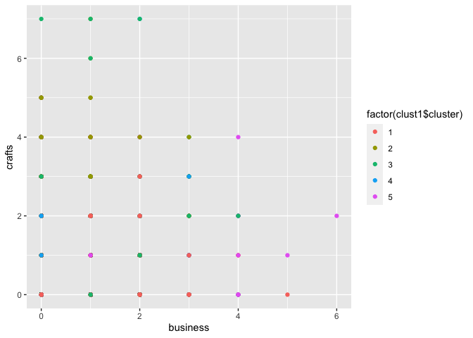

# Question 2

## Part 1 Import the data

## Part 2 Wrangle the data

In the part, chatter and uncategorized column are deleted because they
are meaningless to this research. At the same time, spam is limited to
be equal to 0 and adult is limited to be smaller than 10 so that some
kind of “bots” are excluded. As a result, the data is most useful.

## Part 3 Cluster

In this part, all people are divided into 5 groups using K-means method.
Photo\_sharing, politics, business and crafts are chosen to make the
graph, having a rough understanding of the respondents.

## Part 4 Groups

All data, followers of Twitter account of a large consumer drinks brand,
are divided into 5 categories. The number in the category from most to
least is category 4, 2, 3, 1, 5, and the number of category 4 is much
more than others. Separately, in group 1, people are more interested in
travel, politics and news. In group2, people show more passion on health
nutrition, personal fitness. In group3, individual are more concerned
about sports fandom, food, family, health nutrition and religion. For
members of group 4, photo sharing is the most frequent object they
mention while the whole number of twitter is not very high. In group 5,
photo sharing, shopping, cooking, beauty and fashion have high
frequency.

## Part 5 Report

To appeal to group1, the brand can combine the product with the trending
To appeal to group2, the brand can focus on the nutrition of the product
and describe how healthy the product is. To appeal to group3, the brand
can make the advertisement showing that family members share the product
together. As a result, the product can leave people the impression of
being together. To appeal to group4, the brand can pay more attention to
the package of the product so that it books beautiful and can be shared.
To appeal to group5, modern and fashion play important roles so that the
promotion should be young.
